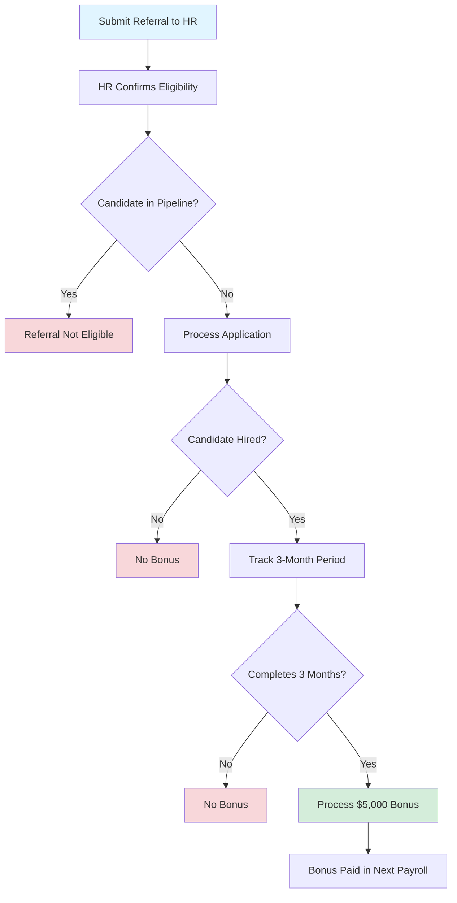

# Ultralytics Employee Referral Bonus Policy 🤝

## Overview 📌

[Ultralytics](https://www.ultralytics.com/) offers a $5,000 bonus to employees who refer qualified candidates that join our team. This program helps us grow with talented individuals from employee networks.

!!! success "Referral Bonus"

    **$5,000** paid after your referral completes 3 months of employment

## Eligibility 💰

- :material-cash-multiple: **Bonus Amount**

    ***

    **$5,000.00** per successful referral

- :material-clock-check: **Payment Timing**

    ***

    After candidate completes **3 months** of employment

- :material-briefcase: **Eligible Positions**

    ***

    All full-time positions at Ultralytics

## Requirements ✅

!!! warning "All Requirements Must Be Met"

    === "Referrer Requirements"

        - [x] Must be a current Ultralytics employee at time of referral
        - [x] Must still be employed at time of payout
        - [x] Cannot be involved in hiring decision for referred candidate

    === "Candidate Requirements"

        - [x] Must be hired for a full-time position
        - [x] Cannot already be in our recruitment pipeline
        - [x] Must successfully complete 3-month probationary period

    === "General Rules"

        - [x] Only one referral bonus per hire
        - [x] First referrer receives bonus if multiple employees refer same candidate

## Process 📋

### Step-by-Step

1. **Submit Referral** - Send candidate information to HR with your referral
2. **Eligibility Check** - HR confirms eligibility and processes application
3. **Hiring Decision** - Candidate goes through standard interview process
4. **3-Month Tracking** - If hired, track completion of probationary period
5. **Bonus Payment** - After 3 months, bonus paid in next payroll cycle

!!! info "Tax Information"

    Bonus is subject to standard payroll taxes and deductions

## Exclusions ⚠️

!!! danger "Not Eligible for Referral Bonus"

    === "Position Exclusions"

        - Executive-level positions (may have different terms on case-by-case basis)

    === "Employee Exclusions"

        - Employees involved in hiring decision for the referred candidate
        - Employees who are not current at time of referral or payout

    === "Source Exclusions"

        - Referrals from recruiting agencies
        - Referrals from external parties
        - Candidates already in recruitment pipeline

## Examples 💡

??? example "Successful Referral"

    **Scenario:** You refer a friend for a Software Engineer position in January.

    - ✅ January 15: You submit referral to HR
    - ✅ February 1: Candidate hired, starts work
    - ✅ May 1: Candidate completes 3 months
    - ✅ May 15: You receive $5,000 bonus in payroll

    **Result:** Bonus paid successfully! 🎉

??? example "Candidate Leaves Before 3 Months"

    **Scenario:** You refer a candidate who gets hired but leaves after 2 months.

    - ✅ March 1: Candidate starts work
    - ❌ April 25: Candidate resigns (only 2 months)
    - ❌ No bonus paid

    **Result:** No bonus - must complete full 3 months

??? example "Multiple Referrers"

    **Scenario:** Two employees refer the same candidate.

    - Employee A refers on March 1
    - Employee B refers on March 5
    - Candidate hired on March 15

    **Result:** Employee A receives the bonus (first referrer)

## Tips for Successful Referrals 🎯

!!! tip "Maximize Your Referral Success"

    

    -   :material-account-search: **Know the Role**

        ---

        Review job description thoroughly before referring

    -   :material-account-check: **Qualify Candidates**

        ---

        Ensure they meet minimum requirements

    -   :material-information: **Provide Context**

        ---

        Give HR detailed information about candidate's background

    -   :material-speedometer: **Act Quickly**

        ---

        Refer before candidate applies through other channels

    -   :material-handshake: **Stay Connected**

        ---

        Help candidate understand our culture and values

    

## Questions ❓

!!! question "Need Clarification?"

    Contact HR for any questions about:

    - Specific eligibility cases
    - Referral program details
    - Bonus payment status
    - Candidate pipeline status

    **Email:** Contact your HR representative
    **Slack:** `#hr` channel
