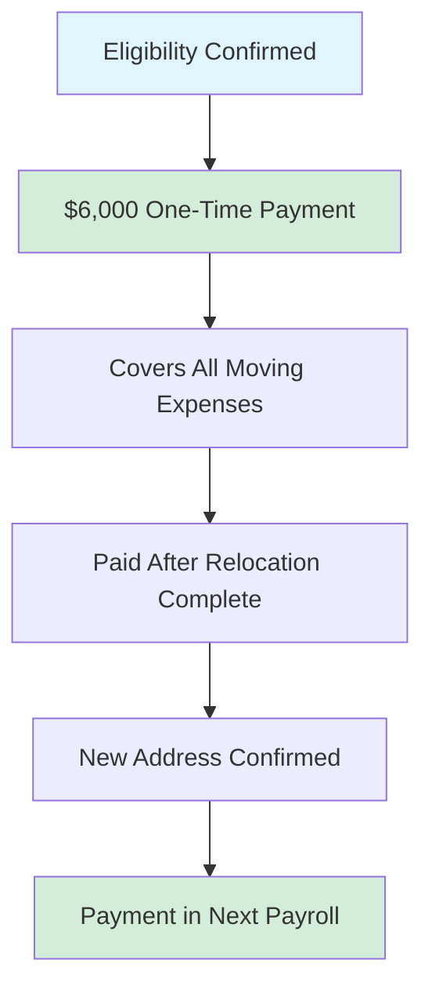

# Ultralytics Employee Relocation Policy 📍

## Purpose and Scope 📌

This policy applies to full-time employees approved for relocation to our London, Madrid, or Shenzhen offices. All relocations require pre-approval from management and HR.

!!! info "Quick Summary"

    **$6,000 one-time payment** for eligible employees relocating to hub cities with **18-month tenure commitment**

## Approved Office Locations 🌎

<div class="grid cards" markdown>

-   :flag_es: **Madrid, Spain**

    ---

    [Cra de S. Jerónimo, 15 Centro, 28014 Madrid](https://maps.app.goo.gl/nxB8YygRQeXSS9G18)

-   :flag_cn: **Shenzhen, China**

    ---

    [5F, CR Land Tower D, 91 Kefa Road, Nanshan District](https://maps.google.com/?q=5F,+CR+Land+Tower+D,+91+Kefa+Road,+Nanshan+District,+Shenzhen,+China)

-   :flag_gb: **London, UK**

    ---

    [50 York Way, London N1 9AB](https://maps.app.goo.gl/9sdE3KrQVwc2shb86)

</div>

!!! warning "Location Restrictions"

    Moves to cities not on this list are **not eligible** for reimbursement.

## Eligibility Requirements ✅

Relocation assistance is reserved for employees who meet the following criteria:

| Requirement | Details |
|------------|---------|
| **Role** | Senior positions: engineering leads, department heads, key technical contributors, or strategic roles |
| **Performance** | Consistently meeting or exceeding expectations |
| **Tenure** | Minimum **6 months** employment (waived for strategic new hires or critical roles) |
| **Business Need** | Initiated by management for business-critical reasons or strategic goals |

!!! tip "Not Sure If You Qualify?"

    Discuss with your manager to assess eligibility before starting the approval process.

## Relocation Compensation 💰



### Standard Reimbursement

Eligible employees receive a **one-time, flat-rate payment of $6,000 USD**.

=== "What's Covered"

    This payment is intended to cover:
    
    - :material-airplane: Travel costs to new location
    - :material-package-variant: Shipping of personal belongings
    - :material-home: Temporary accommodation
    - :material-cash-multiple: Other relocation-related expenses

=== "Payment Process"

    - **Timing:** Processed in first payroll cycle after relocation complete
    - **Method:** Lump sum payment
    - **Requirement:** New address confirmed in system
    - **Taxation:** Subject to applicable taxes

### Non-Reimbursable Situations

!!! danger "Not Covered"

    - Relocations to non-hub cities
    - Self-initiated moves without pre-approved business justification
    - Temporary relocations (less than 12 months)
    - Lateral moves without strategic business purpose

## Approval Process 🔄

1. **Request Submission**
   - Direct manager submits relocation request
   - Must include strong business justification
   - Proposed timeline required

2. **Management Review**
   - Reviewed by senior management
   - Decision typically within **10 business days**
   - May request additional information

3. **Confirmation**
   - HR provides written confirmation if approved
   - Formal relocation agreement issued
   - Employee signs agreement before relocating

!!! note "Business Justification Requirements"

    The business case should include:
    
    - Employee's role and responsibilities
    - Strategic importance of the move
    - How relocation serves business goals
    - Proposed timeline with key milestones

## Employee Obligations ⚖️

### Tenure Commitment

!!! warning "18-Month Commitment Required"

    Employees receiving relocation assistance must remain employed with Ultralytics for **minimum 18 months** following relocation date.

=== "Commitment Details"

    | Aspect | Requirement |
    |--------|-------------|
    | **Duration** | 18 months from relocation date |
    | **Voluntary Resignation** | Full repayment required |
    | **Involuntary Termination** | No repayment required |
    | **Amount** | Full $6,000 reimbursement |

=== "Repayment Clause"

    If you **voluntarily resign** before the 18-month period:
    
    - ❌ Must repay **full $6,000** reimbursement
    - ❌ Payment due within 30 days of departure
    - ❌ May be deducted from final paycheck where legally permitted

### Documentation Requirements

<div class="grid cards" markdown>

-   :material-home-city: **Proof of Residence**

    ---

    Must provide proof of new residence in hub city

-   :material-receipt: **Expense Records**

    ---

    Receipts not required for flat-rate, but keep for personal tax purposes

-   :material-file-sign: **Agreement**

    ---

    Sign formal relocation agreement before move

</div>

## Important Considerations ⚠️

### Tax Implications

!!! info "Tax Information"

    The $6,000 relocation payment is considered **taxable income** and will be subject to applicable taxes.
    
    - Included in W-2 or equivalent tax document
    - Subject to standard payroll tax withholding
    - May affect your overall tax bracket
    
    **Recommendation:** Consult with a tax advisor for personal tax planning

### Onsite Work Requirements

!!! warning "Office Attendance"

    **All employees work onsite 5 days per week** at their office location.
    
    - Relocated employees must work full-time from new office
    - Must comply with local office policies
    - No remote work exceptions without separate approval

## Exceptions

??? question "What About Special Cases?"

    Exceptions to this policy will be considered **case-by-case** for:
    
    - Strategic new hires
    - Unforeseen operational requirements
    - Business-critical needs
    - Executive-level positions
    
    **All exceptions require written approval from senior management.**

## Relocation Timeline Example 📅

??? example "Typical Relocation Timeline"

    ```mermaid
    gantt
        title Sample 3-Month Relocation Timeline
        dateFormat YYYY-MM-DD
        
        section Planning
        Manager Discussion           :2025-01-01, 7d
        Request Submission          :2025-01-08, 3d
        Management Review           :2025-01-11, 10d
        
        section Preparation
        Agreement Signing           :2025-01-21, 3d
        Housing Search             :2025-01-24, 21d
        Visa/Immigration (if needed):2025-01-24, 30d
        
        section Execution
        Pack & Ship Belongings     :2025-02-10, 7d
        Travel to New Location     :2025-02-17, 3d
        Setup New Residence        :2025-02-20, 7d
        
        section Completion
        Confirm New Address        :2025-02-27, 3d
        Reimbursement Payment      :2025-03-05, 5d
    ```
    
    **Total Timeline:** Approximately 2-3 months from initial discussion to payment

## Questions?

!!! question "Need Help?"

    Contact the appropriate team:
    
    | Question Type | Contact |
    |--------------|---------|
    | **Eligibility** | Your direct manager |
    | **Process** | HR team |
    | **Business case** | Your manager & senior leadership |
    | **Payment** | Finance team |
    | **Tax questions** | External tax advisor |

---

_This policy is designed to support the strategic growth of Ultralytics by placing our talent where they can make the greatest impact._
