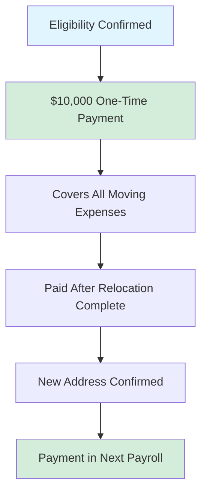

# Ultralytics Employee Relocation Policy 📍

## Purpose and Scope 📌

We want you to love where you live and work. Long commutes drain energy that could be spent on innovation (or life!). To encourage you to live near our vibrant hubs, we offer a **Proximity Relocation Package**.

This policy applies to new hires or existing employees relocating to be near our London, Madrid, or Shenzhen offices.

!!! info "Quick Summary"

    **$10,000 one-time payment** for employees moving within a **30-minute commute** of a Hub Office.

## Approved Office Locations 🌎

- :flag_es: **Madrid, Spain**

    ***

    [Cra de S. Jerónimo, 15 Centro, 28014 Madrid](https://maps.app.goo.gl/nxB8YygRQeXSS9G18)

- :flag_cn: **Shenzhen, China**

    ***

    [5F, CR Land Tower D, 91 Kefa Road, Nanshan District](https://maps.google.com/?q=5F,+CR+Land+Tower+D,+91+Kefa+Road,+Nanshan+District,+Shenzhen,+China)

- :flag_gb: **London, UK**

    ***

    [50 York Way, London N1 9AB](https://maps.app.goo.gl/9sdE3KrQVwc2shb86)

## Eligibility Requirements ✅

To qualify for the Proximity Relocation Package, you must meet the following criteria:

| Requirement | Details |
| :--- | :--- |
| **Employee Status** | New hires or existing employees. |
| **Proximity Rule** | You must move to a location within a **30-minute commute** of a Hub Office. |
| **Measurement** | Commute time is measured door-to-door via **walking, cycling, public transit, or driving** as calculated by Google Maps during standard commute hours. |

!!! tip "Check Your Commute"

    Before signing a lease, use Google Maps to verify the commute time to the office address matches the eligibility criteria.

## Relocation Compensation 💰

### Standard Flat Rate

Eligible employees receive a **one-time, flat-rate payment of $10,000 USD** (Global).

This simplifies your move by providing funds upfront or upon completion without the need to submit individual receipts to Ultralytics.

=== "What's Covered"

    The payment is intended to cover expenses such as:

    - :truck: **Moving Services:** Moving van or professional removal services.
    - :package: **Shipping:** Shipping of personal belongings.
    - :airplane: **Travel:** Travel costs for the move.
    - :hotel: **Temporary Stay:** Temporary accommodation (up to 30 days).
    - :scroll: **Legal:** Legal fees for tenancy agreements.

=== "Payment Process"

    - **Timing:** Processed in the first payroll cycle after your new address is confirmed.
    - **Method:** Lump sum payment.
    - **Receipts:** Not required by Ultralytics for payment, but **highly recommended** you keep them for tax purposes.

### UK Tax Note :flag_gb:

For employees relocating to the **London** office: The first **£8,000** of qualifying relocation expenses are currently tax-exempt by HMRC.

!!! warning "Keep Your Receipts"

    While Ultralytics pays a flat rate, to claim the HMRC tax exemption, you may need to prove you incurred "qualifying expenses" up to that amount. Please consult a tax advisor.

## Approval Process 🔄

1.  **Request Submission**
    - Inform your manager of your intent to utilize the Proximity Package.
    - Provide the proposed new address and Google Maps commute verification.

2.  **Confirmation**
    - HR verifies the distance eligibility.
    - Relocation agreement issued detailing the clawback terms.

3.  **Agreement**
    - Employee signs the relocation agreement before relocating.

## Employee Obligations & Clawback ⚖️

To ensure mutual commitment, this package includes a repayment (clawback) clause based on your tenure following the relocation.

### Repayment Schedule

If you leave Ultralytics voluntarily within 24 months of your relocation/payment date, you must repay a portion of the payment:

| Time Since Relocation | Repayment Amount |
| :--- | :--- |
| **0 - 12 Months** | **100%** of payment is repayable |
| **12 - 24 Months** | **50%** of payment is repayable |
| **24+ Months** | **0%** (No repayment required) |

!!! warning "Repayment Terms"

    - **Voluntary Resignation:** Repayment is required as per the table above.
    - **Involuntary Termination:** Typically, no repayment is required (subject to specific termination conditions).
    - **Method:** Payment is due within 30 days of departure or deducted from the final paycheck where legally permitted.

### Documentation Requirements

- :material-map-marker-radius: **Proof of Commute**

    ***

    Google Maps screenshot showing <30 min commute to office.

- :material-home-city: **Proof of Residence**

    ***

    Lease agreement or utility bill confirming new address.

- :material-file-sign: **Signed Agreement**

    ***

    Signed acceptance of the clawback terms.

## Important Considerations ⚠️

### Onsite Work Requirements

!!! warning "Office Attendance"

    **All employees work onsite 5 days per week** at their office location. The Proximity Package is specifically designed to make this daily routine easier and more enjoyable.

## Questions?

!!! question "Need Help?"

    Contact the appropriate team:

    | Question Type | Contact |
    |--------------|---------|
    | **Eligibility/Commute Check** | HR Team |
    | **Payment Status** | Finance Team |
    | **Tax Questions** | External tax advisor |

---

_This policy is designed to support the strategic growth of Ultralytics by helping our team live comfortably close to where we innovate._
