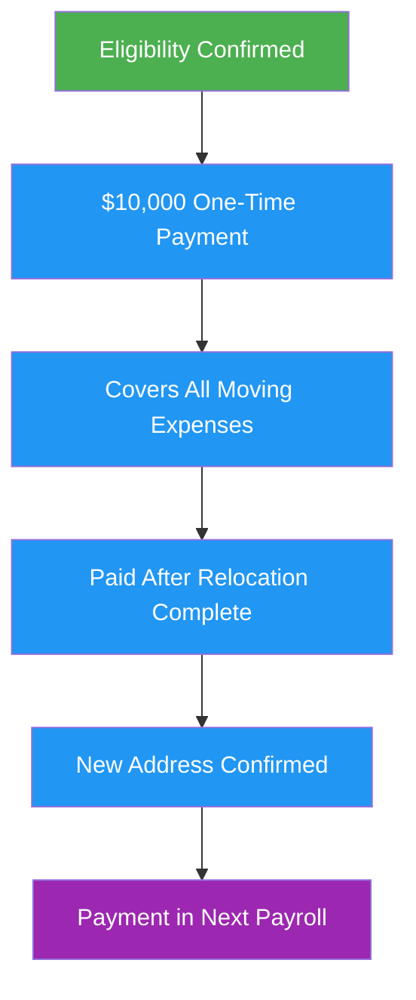

# Ultralytics Employee Relocation Policy 📍

## Purpose and Scope 📌

We want you to love where you live and work. Long commutes drain energy that could be spent on innovation (or life!). To keep our High-Resolution Hybrid model humming, we need you close enough to collaborate at full bandwidth on Anchor Days (Tue/Wed/Thu). To encourage you to live near our vibrant hubs, we offer a **Proximity Relocation Package**.

This policy applies to new hires or existing employees relocating to be near our London, Madrid, Shenzhen, or New York offices.

!!! info "Quick Summary"

    **$10,000 one-time payment** for employees moving within a **commutable distance** of a Hub Office.

## Approved Office Locations 🌎

- :flag_es: **Madrid, Spain**

    ***

    [Calle de las Huertas, 11, Centro, 28012 Madrid](https://maps.app.goo.gl/31jgUEqTkaDBhAQx6)

- :flag_cn: **Shenzhen, China**

    ***

    [Room 126, 6F, CR Land Tower D, 91 Kefa Road, Nanshan District](https://maps.google.com/maps?q=6F,+CR+Land+Tower+D,+91+Kefa+Road,+Nanshan+District,+Shenzhen,+China)

- :flag_gb: **London, UK**

    ***

    [50 York Way, London N1 9AB](https://maps.app.goo.gl/9sdE3KrQVwc2shb86)

- :flag_us: **New York, USA**

    ***

    [Industrious, 386 Park Ave S, Units 1818 + 1819, New York, NY 10016, USA](https://maps.google.com/?q=Industrious,+386+Park+Ave+S,+New+York,+NY+10016,+USA)

## Eligibility Requirements ✅

To qualify for the Proximity Relocation Package, you must meet the following criteria:

| Requirement         | Details                                                                                                                                                |
| :------------------ | :----------------------------------------------------------------------------------------------------------------------------------------------------- |
| **Employee Status** | New hires or existing employees.                                                                                                                       |
| **Proximity Rule**  | You must move to a commutable location of a Hub Office. This means you commit to working regular hours from an Ultralytics Office on our anchor days. It typically means the ‘place of work’ in your contract will change from remote to a Hub Office, or change from one Hub Office to another.|
| **Definitions**     | This policy is meant for long-distance moves that bring you within commuting distance of a hub, so you can work in the office on anchor days. It doesn't cover local or short-distance moves. |
| **Approval**     | All relocation bonuses must have manager approval and are considered discretionary. Please discuss with your manager before signing a lease. |
| **Usage**     | Multiple voluntary relocation requests are not guaranteed eligibility. Each request will be reviewed on a case by case basis.  |

## Relocation Compensation 💰

```mermaid
graph TD
    A[Eligibility Confirmed]:::start --> B[$10,000 One-Time Payment]:::proc
    B --> C[Covers All Moving Expenses]:::proc
    C --> D[Paid After Relocation Complete]:::proc
    D --> E[New Address Confirmed]:::proc
    E --> F[Payment in Next Payroll]:::out

    classDef start fill:#4CAF50,color:#fff
    classDef proc fill:#2196F3,color:#fff
    classDef out fill:#9C27B0,color:#fff
```

### Standard Flat Rate

Eligible employees receive a **one-time, flat-rate payment of $10,000 USD** (Global).

This simplifies your move by providing funds upfront or upon completion without the need to submit individual receipts to Ultralytics.

=== "What's Covered"

    The payment is intended to cover expenses such as:

    - :truck: **Moving Services:** Moving van or professional removal services.
    - :package: **Shipping:** Shipping of personal belongings.
    - :airplane: **Travel:** Travel costs for the move.
    - :hotel: **Temporary Stay:** Temporary accommodation (up to 30 days).
    - :scroll: **Legal:** Legal fees for tenancy agreements.

=== "Payment Process"

    - **Timing:** Processed in the first payroll cycle after your new address is confirmed.
    - **Method:** Lump sum payment.
    - **Receipts:** Not required by Ultralytics for payment, but **highly recommended** you keep them for tax purposes.

### UK Tax Note :flag_gb:

For employees relocating to the **London** office: The first **£8,000** of qualifying relocation expenses are currently tax-exempt by HMRC.

!!! warning "Keep Your Receipts"

    While Ultralytics pays a flat rate, to claim the HMRC tax exemption, you may need to prove you incurred "qualifying expenses" up to that amount. Please consult a tax advisor.

## Approval Process 🔄

1.  **Request Submission**
    - Inform your manager of your intent to utilize the Proximity Package.
    - Provide the proposed new address and commuting journey using Google Maps, based on weekday regular commuting times.

2.  **Confirmation**
    - People team verifies the location eligibility.
    - Relocation agreement issued detailing the clawback terms.

3.  **Agreement**
    - Employee signs the relocation agreement before relocating.

## Employee Obligations & Clawback ⚖️

To ensure mutual commitment, this package includes a repayment (clawback) clause based on your tenure following the relocation.

### Repayment Schedule

If you leave Ultralytics voluntarily within 24 months of your relocation/payment date, you must repay a portion of the payment:

| Time Since Relocation | Repayment Amount                 |
| :-------------------- | :------------------------------- |
| **0 - 12 Months**     | **100%** of payment is repayable |
| **12 - 24 Months**    | **50%** of payment is repayable  |
| **24+ Months**        | **0%** (No repayment required)   |

!!! warning "Repayment Terms"

    - **Voluntary Resignation:** Repayment is required as per the table above.
    - **Involuntary Termination:** Typically, no repayment is required (subject to specific termination conditions).
    - **Method:** Payment is due within 30 days of departure or deducted from the final paycheck where legally permitted.

### Documentation Requirements

- :material-map-marker-radius: **Proof of Commute**

    ***

    Google Maps screenshot showing a commutable distance to the local office.

- :material-home-city: **Proof of Residence**

    ***

    Lease agreement or utility bill confirming new address.

- :material-file-sign: **Signed Agreement**

    ***

    Signed acceptance of the clawback terms.

## Important Considerations ⚠️

### Onsite Work Requirements

!!! warning "Office Attendance"

    **Anchor Days (Tue/Wed/Thu) are mandatory onsite** for anyone within commutable distance. The Proximity Package ensures you can reliably badge in, collaborate in real time, and meet performance expectations tied to in-office presence.

## Questions?

!!! question "Need Help?"

    Contact the appropriate team:

    | Question Type                 | Contact              |
    | ----------------------------- | -------------------- |
    | **Eligibility/Commute Check** | People Team              |
    | **Payment Status**            | Finance Team         |
    | **Tax Questions**             | External tax advisor |
