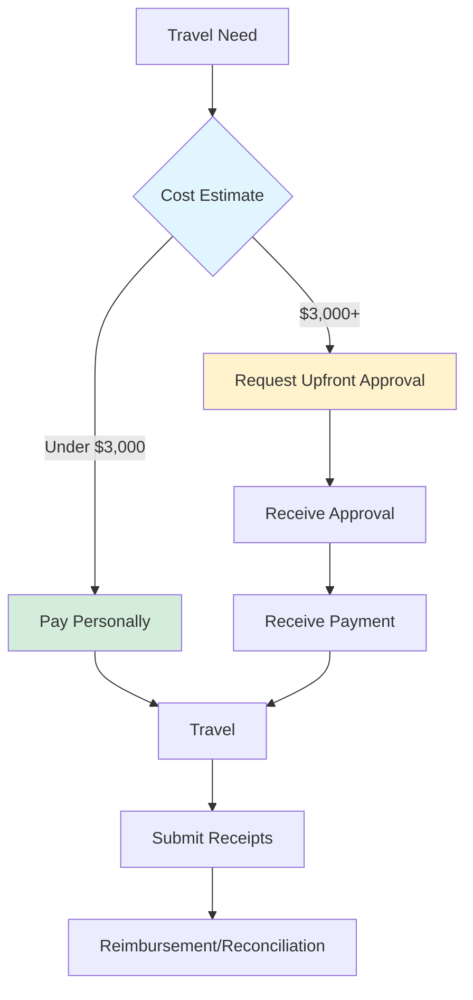

# Ultralytics Employee Travel Policy (2025) 🌐

## Scope 📌

This policy applies to all employees of [Ultralytics](https://www.ultralytics.com/) who are required to travel for business purposes. Employees are responsible for making their own travel arrangements while adhering to the guidelines outlined in this policy.

## Employee Responsibilities 📋

!!! warning "Pre-Approval Required"

    All business travel must be approved by your manager **before booking**. Unapproved travel may not be reimbursed.

- :material-cash-check: Travel must be business-critical, cost-effective, and approved by your manager prior to booking
- :material-receipt-text: Expense claims must include a clear description of the business purpose
- :material-clock-fast: Submit expenses promptly, ideally within the same fiscal quarter incurred

## Reimbursement Procedures 💰

=== "Under $3,000"

    **Standard Reimbursement Process:**

    1. Pay expenses personally during travel
    2. Submit receipts after travel for reimbursement
    3. Receive payment within 7 business days

    !!! tip "Best Practice"

        Use a personal credit card with travel benefits for better rewards and protection.

=== "$3,000+"

    **Upfront Reimbursement Process:**

    1. Submit expense request with cost estimate and business justification
    2. Receive approval and payment before incurring expenses
    3. Submit receipts after travel for reconciliation

    !!! info "Timeline"

        Allow **5 business days** for approval and payment processing.

## Per Diem Rates 💳

!!! info "What Per Diem Covers"

    **Total per diem = Lodging + M&IE (Meals, Incidentals & Expenses)**

    === "Included"
        :material-check-circle: Accommodation
        :material-check-circle: All meals (breakfast, lunch, dinner)
        :material-check-circle: Tips and gratuities
        :material-check-circle: Ground transportation (taxi, metro, bus)
        :material-check-circle: Incidental costs (laundry, parking, etc.)

    === "Not Included"
        :material-close-circle: Airfare (reimbursed separately)
        :material-close-circle: Personal expenses
        :material-close-circle: Alcohol
        :material-close-circle: Entertainment

Employees traveling for business will receive a daily per diem allowance based on their destination. The following rates apply for the full year of 2025 and will be updated on January 1st, 2026:

| Country               | City          | Lodging | M&IE   | Total Per Diem |
| --------------------- | ------------- | ------- | ------ | -------------- |
| **China 🇨🇳**          | Beijing       | $123.50 | $69.00 | $192.50        |
|                       | Shanghai      | $187.50 | $80.00 | $267.50        |
|                       | Shenzhen      | $115.00 | $71.00 | $186.00        |
|                       | Hong Kong     | $177.50 | $90.00 | $267.50        |
| **France 🇫🇷**         | Paris         | $255.50 | $86.50 | $342.00        |
| **Germany 🇩🇪**        | Berlin        | $135.50 | $72.50 | $208.00        |
|                       | Munich        | $156.00 | $77.00 | $233.00        |
| **Italy 🇮🇹**          | Rome          | $244.50 | $89.50 | $334.00        |
| **Japan 🇯🇵**          | Tokyo         | $187.50 | $65.00 | $252.50        |
| **Netherlands 🇳🇱**    | Amsterdam     | $226.50 | $96.00 | $322.50        |
|                       | Eindhoven     | $117.00 | $70.50 | $187.50        |
| **Portugal 🇵🇹**       | Lisbon        | $140.00 | $56.00 | $196.00        |
| **Singapore 🇸🇬**      | Singapore     | $152.00 | $75.00 | $227.00        |
| **Spain 🇪🇸**          | Barcelona     | $153.50 | $67.00 | $220.50        |
|                       | Madrid        | $187.50 | $68.50 | $256.00        |
|                       | Malaga        | $139.00 | $73.50 | $212.50        |
| **United Kingdom 🇬🇧** | London        | $212.00 | $87.00 | $299.00        |
| **United States 🇺🇸**  | Denver        | $161.25 | $69.00 | $230.25        |
|                       | Las Vegas     | $119.25 | $64.50 | $183.75        |
|                       | Los Angeles   | $143.25 | $64.50 | $207.75        |
|                       | New York      | $256.50 | $69.00 | $325.50        |
|                       | San Francisco | $204.00 | $69.00 | $273.00        |
|                       | San Jose      | $144.00 | $69.00 | $213.00        |

### Methodology 📚

??? info "How We Calculate Per Diem Rates"

    Ultralytics bases daily per diem rates on official U.S. government sources, adjusted to reflect our company's size and budget considerations.

    | Region | Source | Ultralytics Rate |
    |--------|--------|------------------|
    | 🇺🇸 **CONUS** | [GSA Per Diem Rates](https://www.gsa.gov/travel/plan-book/per-diem-rates) | **75%** of official |
    | 🌍 **OCONUS** | [U.S. Department of State](https://allowances.state.gov/web920/per_diem.asp) | **50%** of official |

    - **CONUS** = Continental United States
    - **OCONUS** = Outside Continental United States
    - Rates reviewed and updated annually on January 1st

## Travel Booking 🛫

- :material-airplane: **Flights**

    ***
    - Book **14 days in advance** (domestic)
    - Book **21 days in advance** (international)
    - **Economy class only** (no exceptions)
    - Reimbursed separately from per diem

- :material-bed: **Accommodation**

    ***
    - Covered by per diem lodging allowance
    - **Not reimbursed separately**
    - Book within per diem budget
    - Business-appropriate location

- :material-car: **Ground Transportation**

    ***
    - Covered by M&IE allowance
    - Use most cost-effective option
    - Taxi, metro, bus, rideshare OK
    - Rental cars require pre-approval

- :material-cash-multiple: **Cost-Effectiveness**

    ***
    - Choose efficient and economical options
    - Balance cost with convenience
    - Employees arrange their own travel
    - Manager approval required

!!! tip "Booking Tips"

    - Compare prices across multiple platforms
    - Consider alternative airports for better rates
    - Use company travel portal if available
    - Book refundable tickets when possible for flexibility

## Sustainability ♻️

!!! success "Environmental Responsibility"

    Prioritize virtual meetings whenever possible to minimize environmental impact. Consider:

    - Video conferencing for routine meetings
    - Combining multiple trips into one journey
    - Direct flights to reduce emissions
    - Public transportation when available

## Expense Reporting 🧾

!!! warning "Receipt Requirements"

    **Receipts required for ALL reimbursements**

    - Upload clear photos or PDFs
    - Include itemized details
    - Submit within same fiscal quarter
    - Use Rippling expense management system

## Exceptions ⚠️

??? question "Need an Exception?"

    Any exceptions to this policy must be **pre-approved by your line manager** prior to travel.

    **Common exception scenarios:**

    - Premium cabin for flights over 8 hours (rarely approved)
    - Higher per diem for special circumstances
    - Rental car when public transport unavailable
    - Extended stays for business reasons

    Submit exception requests with:

    1. Business justification
    2. Cost comparison
    3. Alternative options considered
    4. Expected ROI or benefit

    Requests reviewed case-by-case. Allow 5 business days for approval.
