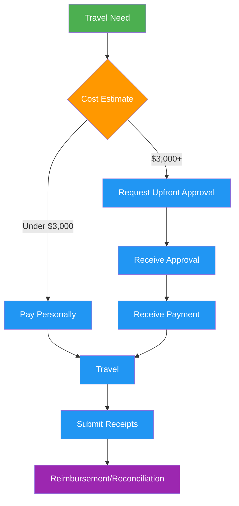

# Ultralytics Employee Travel Policy 🌐

## Scope 📌

This policy applies to all employees of [Ultralytics](https://www.ultralytics.com) who are required to travel for business purposes. Employees are responsible for making their own travel arrangements while adhering to the guidelines outlined in this policy.

## Employee Responsibilities 📋

!!! warning "Pre-Approval Required"

    All business travel must be approved by your manager **before booking**. Unapproved travel may not be reimbursed.

- :material-cash-check: Travel must be business-critical, cost-effective, and approved by your manager prior to booking
- :material-receipt-text: Expense claims must include a clear description of the business purpose
- :material-clock-fast: Submit expenses promptly and before the monthly reimbursement cutoff when possible

## Reimbursement Procedures 💰

```mermaid
graph TD
    A[Travel Need]:::start --> B{Cost Estimate}:::decide
    B -->|Under $3,000| C[Pay Personally]:::proc
    B -->|$3,000+| D[Request Upfront Approval]:::proc
    C --> E[Travel]:::proc
    D --> F[Receive Approval]:::proc
    F --> G[Receive Payment]:::proc
    G --> E
    E --> H[Submit Receipts]:::proc
    H --> I[Reimbursement/Reconciliation]:::out

    classDef start fill:#4CAF50,color:#fff
    classDef proc fill:#2196F3,color:#fff
    classDef decide fill:#FF9800,color:#fff
    classDef out fill:#9C27B0,color:#fff
```

=== "Under $3,000"

    **Standard Reimbursement Process:**

    1. Pay expenses personally during travel
    2. Submit receipts with business purpose by the monthly cutoff
    3. Receive approved travel expenses together in the next monthly reimbursement batch

    !!! tip "Best Practice"

        The monthly cutoff is the 25th calendar day, or the previous business day if the 25th falls on a weekend or company holiday.

=== "$3,000+"

    **Upfront Reimbursement Process:**

    1. Submit expense request with cost estimate and business justification
    2. Receive approval and payment before incurring expenses
    3. Submit receipts after travel for reconciliation

    !!! info "Timeline"

        Allow **5 business days** for approval and payment processing.

## Per Diem Rates 💳

!!! info "What Per Diem Covers"

    **Total per diem = Lodging + M&IE (Meals, Incidentals & Expenses)**

    === "Included"

        - Accommodation
        - All meals (breakfast, lunch, dinner)
        - Tips and gratuities
        - Ground transportation (taxi, metro, bus)
        - Incidental costs (laundry, parking, etc.)

    === "Not Included"

        - Airfare (reimbursed separately)
        - Personal expenses
        - Alcohol
        - Entertainment

Employees traveling for business will receive a daily per diem allowance based on their destination. All amounts below are in USD, verified on September 24, 2026 against the September 1, 2026 [U.S. Department of State schedule](https://allowances.state.gov/web920/per_diem.asp) and [GSA FY 2026 rates](https://www.gsa.gov/system/files/FY2026_PerDiemMasterRatesFile.xlsx) (October 1, 2025–September 30, 2026). The company adjustments below are already applied; use the season matching your travel dates for U.S. destinations.

| Country | City | Lodging | M&IE | Total Per Diem |
| --- | --- | --- | --- | --- |
| **China 🇨🇳** | Beijing | $127.50 | $71.00 | $198.50 |
|  | Shanghai | $200.50 | $85.50 | $286.00 |
|  | Shenzhen | $129.50 | $73.50 | $203.00 |
|  | Hong Kong | $177.50 | $90.00 | $267.50 |
| **France 🇫🇷** | Paris | $255.50 | $86.50 | $342.00 |
| **Germany 🇩🇪** | Berlin | $135.50 | $72.50 | $208.00 |
|  | Dusseldorf | $159.00 | $75.50 | $234.50 |
|  | Nuremberg | $114.50 | $66.50 | $181.00 |
|  | Munich | $156.00 | $77.00 | $233.00 |
|  | Stuttgart | $129.50 | $68.00 | $197.50 |
| **Italy 🇮🇹** | Rome | $244.50 | $89.50 | $334.00 |
| **Japan 🇯🇵** | Tokyo | $173.00 | $61.00 | $234.00 |
| **Kenya 🇰🇪** | Nairobi | $125.00 | $38.50 | $163.50 |
| **Netherlands 🇳🇱** | Amsterdam | $226.50 | $96.00 | $322.50 |
|  | Eindhoven | $117.00 | $70.50 | $187.50 |
| **Portugal 🇵🇹** | Lisbon | $140.00 | $56.00 | $196.00 |
| **Singapore 🇸🇬** | Singapore | $151.00 | $81.00 | $232.00 |
| **Spain 🇪🇸** | Barcelona | $153.50 | $67.00 | $220.50 |
|  | Madrid | $199.50 | $69.50 | $269.00 |
|  | Malaga | $139.00 | $73.50 | $212.50 |
| **United Kingdom 🇬🇧** | London | $212.00 | $87.00 | $299.00 |
|  | Windsor | $126.00 | $54.00 | $180.00 |

Nuremberg and Windsor use their countries’ “Other” rates. Tokyo uses the “Tokyo City” rate.

**United States 🇺🇸**

| City | Season | Lodging | M&IE | Total Per Diem |
| --- | --- | --- | --- | --- |
| Denver | Apr–Oct | $161.25 | $69.00 | $230.25 |
| Denver | Nov–Mar | $123.75 | $69.00 | $192.75 |
| Las Vegas | Jan–Mar | $119.25 | $64.50 | $183.75 |
| Las Vegas | Apr–Dec | $94.50 | $64.50 | $159.00 |
| Los Angeles | All year | $143.25 | $64.50 | $207.75 |
| Santa Clara | All year | $144.00 | $69.00 | $213.00 |
| New York | Jan–Feb | $134.25 | $69.00 | $203.25 |
| New York | Mar–Jun | $210.75 | $69.00 | $279.75 |
| New York | Jul–Aug | $177.75 | $69.00 | $246.75 |
| New York | Sep–Dec | $256.50 | $69.00 | $325.50 |
| San Francisco | Jan–Aug | $194.25 | $69.00 | $263.25 |
| San Francisco | Sep–Dec | $204.00 | $69.00 | $273.00 |
| San Jose | All year | $144.00 | $69.00 | $213.00 |

### Methodology 📚

??? info "How We Calculate Per Diem Rates"

    Ultralytics bases daily per diem rates on official U.S. government sources, adjusted to reflect our company's size and budget considerations.

    | Region        | Source                                                                       | Ultralytics Rate    |
    | ------------- | ---------------------------------------------------------------------------- | ------------------- |
    | 🇺🇸 **CONUS**  | [GSA Per Diem Rates](https://www.gsa.gov/travel/plan-book/per-diem-rates)    | **75%** of official |
    | 🌍 **OCONUS** | [U.S. Department of State](https://allowances.state.gov/web920/per_diem.asp) | **50%** of official |

    - **CONUS** = Continental United States
    - **OCONUS** = Outside Continental United States
    - Rates reviewed and updated annually on January 1st

## Travel Booking 🛫

- :material-airplane: **Flights**

    ***
    - Book **14 days in advance** (domestic)
    - Book **21 days in advance** (international)
    - **Economy class only** (no exceptions)
    - Reimbursed separately from per diem

- :material-bed: **Accommodation**

    ***
    - Covered by per diem lodging allowance
    - **Not reimbursed separately**
    - Book within per diem budget
    - Business-appropriate location

- :material-car: **Ground Transportation**

    ***
    - Covered by M&IE allowance
    - Use most cost-effective option
    - Taxi, metro, bus, rideshare OK
    - Rental cars require pre-approval

- :material-cash-multiple: **Cost-Effectiveness**

    ***
    - Choose efficient and economical options
    - Balance cost with convenience
    - Employees arrange their own travel
    - Manager approval required

!!! tip "Booking Tips"

    - Compare prices across multiple platforms
    - Consider alternative airports for better rates
    - Use company travel portal if available
    - Book refundable tickets when possible for flexibility

## Sustainability ♻️

!!! success "Environmental Responsibility"

    Prioritize virtual meetings whenever possible to minimize environmental impact. Consider:

    - Video conferencing for routine meetings
    - Combining multiple trips into one journey
    - Direct flights to reduce emissions
    - Public transportation when available

## Expense Reporting 🧾

!!! warning "Receipt Requirements"

    **Receipts required for ALL reimbursements**

    - Upload clear photos or PDFs
    - Include itemized details
    - Submit before the monthly reimbursement cutoff when possible
    - Once manager-approved, submit by email to the finance team

## Exceptions ⚠️

??? question "Need an Exception?"

    Any exceptions to this policy must be **pre-approved by your line manager** prior to travel.

    **Common exception scenarios:**

    - Premium cabin for flights over 8 hours (rarely approved)
    - Higher per diem for special circumstances
    - Rental car when public transport unavailable
    - Extended stays for business reasons

    Submit exception requests with:

    1. Business justification
    2. Cost comparison
    3. Alternative options considered
    4. Expected ROI or benefit

    Requests reviewed case-by-case. Allow 5 business days for approval.
