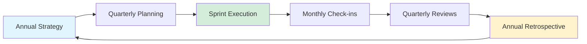

# Company Goals 🎯

## Overview

!!! success "Annual Strategic Goals"

    Ultralytics sets annual goals aligned with our mission to democratize AI and advance computer vision. Goals span product excellence, community growth, business development, and technical infrastructure — all reviewed quarterly against measurable targets.

## Strategic Priorities

- :material-speedometer: **Product Excellence**

    ***
    - Maintain YOLO model leadership in accuracy, speed, and ease of use
    - Expand capabilities across detection, segmentation, tracking, and classification
    - Achieve sub-30ms latency on standard hardware for edge deployment
    - Deliver best-in-class developer experience with intuitive APIs and comprehensive docs

- :material-account-group: **Community Growth & Engagement**

    ***
    - Reach 1M+ monthly PyPI downloads
    - Grow Discord community to 50K+ active members
    - Maintain sub-24-hour average response time on GitHub issues
    - Cultivate 100+ active open-source contributors per quarter
    - Achieve 90%+ satisfaction in community surveys

- :material-chart-line: **Revenue Growth & Market Expansion**

    ***
    - Scale ARR through accelerated enterprise adoption
    - Expand into key verticals: automotive, manufacturing, agriculture, security, healthcare
    - Build strategic partnerships with cloud providers and hardware manufacturers
    - Achieve 120%+ net dollar retention rate
    - Grow enterprise customer base by 200% YoY

- :material-cloud: **Platform & Infrastructure**

    ***
    - Launch Platform with enhanced training and deployment capabilities
    - Achieve 99.9% uptime SLA for production services
    - Support inference across CPU, GPU, NPU, and specialized AI accelerators
    - Deliver <100ms API response times at scale
    - Enable seamless deployment to cloud, edge, and mobile environments

!!! warning "Security, Compliance & Trust"

    | Goal | Target | Status |
    | ---- | ------ | ------ |
    | SOC 2 Type I certification | Q1 2026 | In progress |
    | ISO 27001:2022 certification | Q1 2026 | In progress |
    | GDPR, CCPA & global privacy compliance | Ongoing | Active |
    | Critical security incidents | Zero | Target |
    | Annual security audits & vulnerability assessments | Annually | Scheduled |

## Goal Setting Process

| Step                     | Cadence        | Description                                                    |
| ------------------------ | -------------- | -------------------------------------------------------------- |
| **Annual Strategy**      | Yearly         | Leadership defines company-level OKRs and strategic priorities |
| **Quarterly Planning**   | Every 13 weeks | Teams cascade objectives and define key results                |
| **Sprint Execution**     | Every 2 weeks  | 2-week sprints with weekly progress reviews                    |
| **Monthly Check-ins**    | Monthly        | Cross-functional syncs to ensure alignment                     |
| **Quarterly Reviews**    | Every 13 weeks | Assess progress, grade OKRs, adjust strategy                   |
| **Annual Retrospective** | Yearly         | Evaluate the year, celebrate wins, plan next year              |

## Measurement & Tracking

!!! info "Transparent Metrics Drive Accountability"

    | Mechanism | Audience | Cadence |
    | --------- | -------- | ------- |
    | **Real-Time Dashboards** | All teams | Live |
    | **Weekly Metrics Reviews** | Team leads | Weekly |
    | **Monthly Business Reviews** | Leadership | Monthly |
    | **Quarterly Board Updates** | Investors & advisors | Quarterly |
    | **Public Metrics** | Community | Ongoing |

---

_Detailed goals and metrics are reviewed internally. See [OKRs](okrs.md) for our goal-setting framework._
