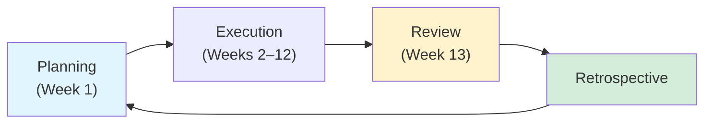

# Objectives and Key Results (OKRs) 🎯

## What Are OKRs?

!!! info "Goal-Setting Framework"

    OKRs (Objectives and Key Results) are our framework for aligning teams and measuring progress. Used by Google, Intel, and leading startups, OKRs keep everyone focused on what matters most.

    | Component | Description |
    | --------- | ----------- |
    | **Objectives** | Qualitative, ambitious goals describing *what* we want to achieve |
    | **Key Results** | 3–5 quantitative, time-bound metrics measuring progress toward objectives |
    | **Initiatives** | The specific projects and tasks executed to achieve key results |

## OKR Structure

- :material-office-building: **Company OKRs**

    ***

    Set by leadership, defining strategic priorities for the quarter or year. Company OKRs cascade down to teams and individuals.

- :material-account-multiple: **Team OKRs**

    ***

    Each team develops OKRs aligned with company objectives, focusing on their domain's contribution to overall goals.

- :material-account: **Individual OKRs**

    ***

    Team members set personal OKRs in collaboration with their managers, supporting both team and company objectives.

## OKR Cycle

| Phase | Timing | Actions |
| ----- | ------ | ------- |
| **Planning** | Week 1 | Set OKRs for the upcoming quarter |
| **Execution** | Weeks 2–12 | Track progress with weekly check-ins |
| **Review** | Week 13 | Grade OKRs and analyze outcomes |
| **Retrospective** | After review | Learn, adjust, and carry insights forward |

**Annual Strategy**: Company-level goals inform quarterly OKRs → Year-end review evaluates annual progress → Strategic planning for next year.

## OKR Best Practices

### Setting Effective OKRs

!!! tip "OKR Design Principles"

    | Principle | Guidance |
    | --------- | -------- |
    | **Ambitious but Achievable** | Target 70–80% achievement — hitting 100% means targets weren't bold enough |
    | **Measurable** | Clear numeric targets (e.g., "Increase PyPI downloads from 500K to 1M/month") or binary outcomes |
    | **Time-bound** | Specific deadlines within the quarter (typically 13 weeks) |
    | **Aligned** | Cascade from company → team → individual goals |
    | **Focused** | 3–5 objectives per level maximum, with 3–5 key results each |
    | **Inspiring** | Everyone should understand *why* the OKR matters |
    | **Transparent** | All OKRs visible company-wide for cross-functional alignment |

### Grading Scale

| Score | Status | Interpretation |
| ----- | ------ | -------------- |
| **0.0–0.3** | :octicons-x-circle-fill-16: Missed | Fell significantly short of target |
| **0.4–0.6** | :material-minus-circle: Progress | Made meaningful progress but fell short |
| **0.7–0.9** | :material-check-circle: Success | Achieved or nearly achieved — this is the goal |
| **1.0** | :material-star: Exceeded | May need more ambitious targets next cycle |

!!! note "Grading Philosophy"

    A score of 0.7 is a success, not a failure. If your team consistently scores 1.0, the OKRs were not ambitious enough.

### Common Pitfalls to Avoid

!!! warning "OKR Anti-Patterns"

    | Pitfall | Why It Fails |
    | ------- | ------------ |
    | **Too Many OKRs** | More than 5 objectives dilutes focus — prioritize ruthlessly |
    | **Sandbagging** | Setting easily achievable targets to guarantee success |
    | **Task Lists** | Confusing OKRs with project plans ("Launch feature X" vs. "Increase user engagement by 50%") |
    | **Infrequent Check-ins** | Waiting until quarter-end to review progress |
    | **Lack of Ownership** | OKRs without clear owners and accountability |
    | **No Mid-Quarter Adjustments** | Being too rigid when priorities shift |
    | **OKRs as Performance Reviews** | OKRs measure team progress, not individual performance |

## Transparency & Visibility

!!! success "OKRs Are Visible Company-Wide"

    | Level | Where | Cadence |
    | ----- | ----- | ------- |
    | **Company OKRs** | All-hands, Slack | Monthly review |
    | **Team OKRs** | Notion/Linear workspace | Standups |
    | **Individual OKRs** | 1:1s with manager | Weekly |
    | **Real-Time Progress** | Live dashboards | Continuous |
    | **Public Metrics** | GitHub stars, PyPI downloads | Ongoing |

    Transparency drives accountability and enables cross-functional collaboration.

## Tools & Resources

OKRs are managed through:

- Quarterly planning sessions
- Weekly team standups
- Progress tracking dashboards
- Leadership review meetings

---

_For questions about OKRs, contact your manager or see [Company Goals](company-goals.md) for strategic priorities._
