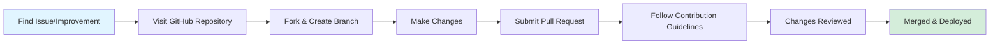

# Welcome to the Ultralytics Handbook 🚀

Welcome to the [Ultralytics](https://www.ultralytics.com/) Handbook - your comprehensive guide to our company's mission, vision, values, and operational practices. This handbook provides essential insights and resources for team members, collaborators, and our global community.

!!! info "Living Document"

    This handbook evolves with our company, serving as both a practical resource and a philosophical guide to our culture and operations.

## New to Ultralytics? Start Here ✨

=== "Essential Reading"

    

    -   :material-book-open-variant: **[Introduction](introduction.md)**

        ---

        Overview of this handbook and how to use it

    -   :material-rocket-launch: **[Onboarding](people/onboarding.md)**

        ---

        Your first 90 days at Ultralytics

    -   :material-target: **[Mission & Values](mission-vision-values/index.md)**

        ---

        What drives us forward

    -   :material-laptop: **[Hardware Policy](tools/hardware.md)**

        ---

        Equipment setup and refresh cycles

    -   :material-application: **[Software Policy](tools/software.md)**

        ---

        Approved tools and request process

    

=== "Getting Set Up"

    

    -   :material-email: **[Email Signatures](tools/email-signatures.md)**

        ---

        Automated signature setup

    -   :material-source-branch: **[Development Workflow](workflows/development.md)**

        ---

        PR process and code standards

    -   :material-hand-wave: **[How to Contribute](contributions/how-to-contribute.md)**

        ---

        Getting started with the codebase

    

## Quick Reference 🔗

### People & Benefits 💰

- :material-account-star: **[Onboarding Guide](people/onboarding.md)**

    ***

    First 90 days roadmap

- :material-beach: **[PTO Policy](people/pto-policy.md)**

    ***

    25 days annual leave + unlimited sick

- :material-cash-multiple: **[Finance Overview](finance/index.md)**

    ***

    Reimbursements and expenses

- :material-airplane: **[Travel Policy](finance/travel.md)**

    ***

    Per diem rates and booking

- :material-home-import-outline: **[Relocation Policy](finance/relocation.md)**

    ***

    $10K for onsite collaboration moves

- :material-account-plus: **[Referral Bonus](finance/referral-bonus.md)**

    ***

    $5K for successful referrals

### Development & Workflows ⚙️

- :material-code-braces: **[Development Guide](workflows/development.md)**

    ***

    PR process, CLA, coding standards

- :material-test-tube: **[CI/Testing](workflows/ci-testing.md)**

    ***

    Running tests and quality checks

- :material-file-document: **[Documentation](workflows/documentation.md)**

    ***

    Writing and maintaining docs

- :material-package-variant: **[Product Development](workflows/product-development.md)**

    ***

    Feature planning and releases

### Community & Support 🌍

- :material-account-group: **[Community Engagement](contributions/community-engagement.md)**

    ***

    Discord, GitHub, social media

- :material-hand-heart: **[How to Contribute](contributions/how-to-contribute.md)**

    ***

    Complete contribution guide

- :material-account-multiple: **[Development Team](contributions/how-to-contribute.md#our-development-team)**

    ***

    Contact directory

- :material-help-circle: **[FAQ](faq/index.md)**

    ***

    Common questions answered

### Goals & Strategy 🎯

- :material-target-account: **[Company Goals](goals/company-goals.md)**

    ***

    Strategic priorities and KPIs

- :material-chart-timeline-variant: **[OKRs](goals/okrs.md)**

    ***

    Quarterly objectives framework

- :material-map: **[Product Roadmap](https://docs.ultralytics.com/)**

    ***

    Public feature roadmap

### Legal & Compliance ⚖️

- :material-scale-balance: **[Legal Team](legal/team.md)**

    ***

    Services and contact info

- :material-gavel: **[Code of Conduct](legal/code-of-business-conduct-and-ethics.md)**

    ***

    Ethics and standards

- :material-shield-check: **[Security Team](security/team.md)**

    ***

    Security and compliance

- :material-lock: **[ISMS](security/isms.md)**

    ***

    Information security management

- :material-account-lock: **[Security Requirements](security/employee-security-compliance-requirements.md)**

    ***

    Employee obligations

## Contact Information 📞

!!! question "Need Help?"

    === "Technical Support"

        - **Email:** [helpdesk@ultralytics.com](mailto:helpdesk@ultralytics.com)
        - **Slack:** `#it-support`

    === "Finance"

        - **Slack:** `#finance`
        - **Questions:** Contact Finance team

    === "Legal"

        - **Email:** [legal@ultralytics.com](mailto:legal@ultralytics.com)
        - **Slack:** `#compliance`

    === "Security"

        - **Email:** [security@ultralytics.com](mailto:security@ultralytics.com)
        - **Slack:** `#security`

    === "HR"

        - **Contact:** Your manager or HR team
        - **Slack:** `#hr`

### Important Resources

- :material-shield-star: **[Trust Center](https://trust.ultralytics.com/)**

    ***

    Security documentation and certifications

- :material-web: **[Ultralytics Website](https://www.ultralytics.com/)**

    ***

    Company information

- :material-book: **[YOLO Documentation](https://docs.ultralytics.com/)**

    ***

    Technical documentation

- :material-github: **[GitHub Repository](https://github.com/ultralytics/handbook)**

    ***

    This handbook's source

## Contributing to This Handbook 📝

This handbook is maintained as an open resource. If you find errors, have suggestions, or want to improve content:

1. Visit our [GitHub repository](https://github.com/ultralytics/handbook)
2. Submit a pull request with your improvements
3. Follow the contribution guidelines in the repository

!!! tip "Make an Impact"

    Your contributions help improve the experience for everyone at Ultralytics. Whether it's fixing a typo or adding a new section, every improvement counts!

---

**Happy reading and contributing!** Together, we're building the future of AI. Explore [career opportunities](https://www.ultralytics.com/careers) or read about [our latest updates](https://www.ultralytics.com/blog). 🌟
