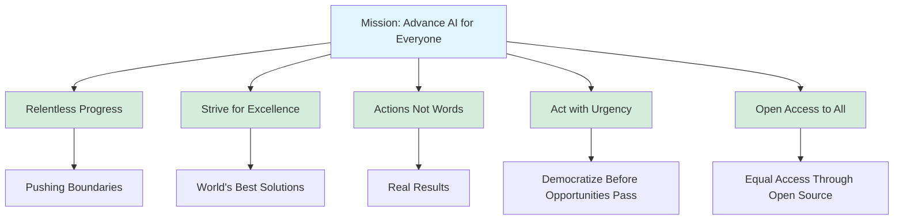

# Ultralytics Mission, Vision, & Values

!!! success "Our Purpose"

    We're on a mission to democratize AI and empower everyone, everywhere with transformative technology.

## Mission

To move the world forward by first moving ourselves, continuously pushing the boundaries of AI through relentless execution, creating the world's best open-source solutions that benefit everyone equally and empower individuals to improve their lives and the lives of those around them.

## Vision

To create a future where every person, regardless of means or background, has equal access to transformative AI, enabling them to seize opportunities and shape their own path. Aware that our time is finite, we strive to make a lasting impact that benefits future generations.

## Values

### 1. Relentless Progress 🚀

We are constantly evolving and improving. Just as life is ever-changing, we never rest at the middle - we aim for continuous progress in everything we do. We rise after every fall, knowing that lasting success is built through consistency.

!!! example "In Practice"

    === "Development"
        - Ship features quickly and iterate based on feedback
        - Learn from failures and adapt rapidly

    === "Culture"
        - Never settle for "good enough" when better is possible
        - Maintain momentum even during challenges

### 2. Strive for Excellence ⭐

True excellence is achieved through perseverance. We believe that even the smallest details matter, and through steady refinement, we create great things.

!!! example "In Practice"

    === "Code Quality"
        - Obsess over code quality and performance
        - Review PRs thoroughly for correctness and clarity

    === "Documentation"
        - Write comprehensive tests and documentation
        - Take pride in craftsmanship at every level

### 3. Actions, Not Words 💪

We are defined by what we do, not what we say we will do. We focus on delivering results that truly matter, action by action.

!!! example "In Practice"

    === "Delivery"
        - Deliver working code over lengthy proposals
        - Measure impact by shipped features, not activity

    === "Communication"
        - Show progress through demos and metrics
        - Let our work speak for itself

### 4. Act with Urgency ⚡

Our time is finite, and we do not know how finite. Opportunities are fleeting, and we move swiftly to capture them in a competitive world.

!!! example "In Practice"

    === "Responsiveness"
        - Respond to issues and PRs within 24 hours
        - Make decisions quickly with available information

    === "Execution"
        - Ship MVPs to gather feedback early
        - Prioritize ruthlessly to focus on what matters most

### 5. Open Access to All 🌍

We value open, honest, and transparent communication, where everyone's voice is heard and respected. We believe that sharing information openly and constructively empowers our team to collaborate effectively and innovate.

!!! example "In Practice"

    === "Open Source"
        - Open-source by default for maximum community benefit
        - Share knowledge freely through documentation and examples

    === "Collaboration"
        - Maintain transparent decision-making processes
        - Welcome contributions from all skill levels and backgrounds
        - Communicate clearly and proactively with stakeholders

## Living Our Values 🤝

- :material-code-braces: **In Development**

    ***

    **Relentless Progress:** Regular releases with continuous improvements

    **Excellence:** Rigorous testing and code review standards

    **Actions:** Working demos over extensive specifications

    **Urgency:** Fast iteration cycles, sub-24-hour PR reviews

    **Open Access:** Public development, welcoming all contributors

- :material-account-group: **In Community**

    ***

    **Relentless Progress:** Regularly update documentation

    **Excellence:** High-quality support and thorough answers

    **Actions:** Show solutions through working code

    **Urgency:** Respond promptly to issues and questions

    **Open Access:** Free tools and knowledge for everyone

- :material-briefcase: **In Operations**

    ***

    **Relentless Progress:** Continuous process improvement

    **Excellence:** Professionalism in all communications

    **Actions:** Clear accountability and ownership

    **Urgency:** Efficient decision-making, minimal bureaucracy

    **Open Access:** Transparent policies and accessible information

## Alignment with Mission 🎯

Our values directly support our mission to advance AI for everyone:

| Value                     | Mission Alignment                                          |
| ------------------------- | ---------------------------------------------------------- |
| **Relentless Progress**   | Continuously pushing boundaries through constant iteration |
| **Strive for Excellence** | Creating world's best solutions through quality focus      |
| **Actions, Not Words**    | Delivering real results that benefit users                 |
| **Act with Urgency**      | Moving quickly to democratize AI before opportunities pass |
| **Open Access to All**    | Ensuring equal access through open-source distribution     |

## Cultural Expectations 🌱

=== "Team Members"

    **Your role in living our values:**

    - [x] Embody these values in daily work
    - [x] Hold yourself and others accountable to high standards
    - [x] Speak up when you see values-aligned opportunities
    - [x] Lead by example in demonstrating our culture

=== "Leaders"

    **Your responsibility in reinforcing culture:**

    - [x] Model values consistently in decisions and actions
    - [x] Recognize and reward values-aligned behavior
    - [x] Address conflicts between actions and stated values
    - [x] Continuously reinforce culture through communication

=== "Community"

    **How you can contribute:**

    - [x] Respect our commitment to open-source principles
    - [x] Contribute constructively following our guidelines
    - [x] Help others in alignment with our inclusive values
    - [x] Build on our work in ways that benefit all

## Decision-Making Framework 🤔

When facing difficult choices, ask:

1. **Does this advance our mission?** Will it democratize AI or improve access?
2. **Does it align with our values?** Specifically which values does it support or conflict with?
3. **Does it serve the community?** Will it benefit users and contributors?
4. **Can we execute with urgency?** Is the timeline appropriate for the opportunity?
5. **Does it reflect excellence?** Are we proud of the quality?

## Measuring Success 📊

We evaluate success through the lens of our values:

- :material-star: **Community Growth**

    ***
    - GitHub Stars & Recognition
    - Global AI community engagement

- :material-download: **Adoption**

    ***
    - PyPI Downloads
    - Active Users & Sustained Usage

- :material-source-pull: **Contributors**

    ***
    - Diversity & Growth
    - Open-source contributions

- :material-speedometer: **Performance**

    ***
    - Speed, Accuracy Improvements
    - Efficiency gains over time

- :material-clock-fast: **Response Times**

    ***
    - Sub-24-hour issue responses
    - Fast PR review cycles

- :material-rocket-launch: **Innovation**

    ***
    - Features shipped per quarter
    - Release frequency

- :material-check-circle: **Customer Success**

    ***
    - Deployment success rates
    - Production reliability metrics

## Living Document 📖

!!! info "Continuous Evolution"

    These values evolve as we grow. We regularly:

    - Review values alignment in quarterly reflections
    - Gather feedback on cultural health
    - Update practices to better embody values
    - Celebrate examples of values in action

## Questions? 💬

!!! question "Unsure How to Apply These Values?"

    If you're unsure how to apply these values in a specific situation:

    1. Discuss with your manager
    2. Raise in team meetings
    3. Reference decision-making framework above
    4. Ask yourself: "What would best serve our mission?"

_Our values aren't just words on a page - they're the foundation of how we work, innovate, and succeed together. Live them daily! 🚀_
