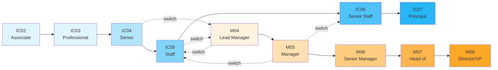
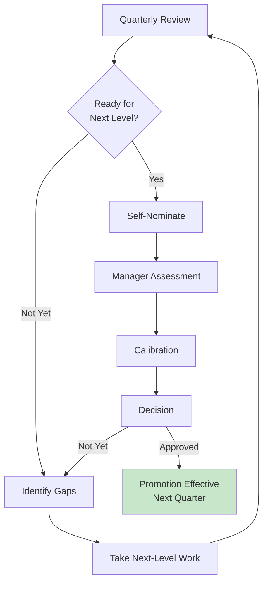

# Career Progression Framework

Ultralytics' career framework provides clear expectations for each level and guides professional development. We maintain two career tracks—Individual Contributor (IC) and Management—allowing team members to advance based on their strengths and interests.

!!! info "Equal Value"

    Both IC and Management tracks are valued equally and offer equivalent compensation and growth potential at similar scope levels. Choose the track that best aligns with your strengths and career goals.

## Career Progression Paths

### Track Comparison

| Aspect              | Individual Contributor (IC)                           | Management                                                        |
| ------------------- | ----------------------------------------------------- | ----------------------------------------------------------------- |
| **Impact Through**  | Technical expertise and individual work               | Building and leading teams                                        |
| **Key Skills**      | Deep technical knowledge, problem-solving, innovation | People development, strategic planning, organizational leadership |
| **Influence**       | Technical decisions, architecture, best practices     | Team performance, culture, organizational direction               |
| **Scope Growth**    | Project → Team → Multi-team → Organization            | Team → Department → Function → Division                           |
| **Focus Evolution** | 100% Ops → 60% Ops / 40% Strategic                    | 80% Ops → 40% Ops / 60% Strategic                                 |

**Full expectations**: [IC Levels (IC02-IC07)](levels-ic.md) | [Management Levels (M04-M08)](levels-management.md)

## Switching Career Tracks

Track switches are normal and supported—discuss with your manager during quarterly reviews.

| Direction           | Typical Path  | Key Requirements                                                                                                 |
| ------------------- | ------------- | ---------------------------------------------------------------------------------------------------------------- |
| **IC → Management** | IC04/IC05→M04 | Technical excellence + leadership examples (mentoring, project leadership) + manager endorsement + 12+ months    |
| **Management → IC** | M04/M05→IC05+ | Maintain technical currency + manager discussion + business need + smooth team transition                        |

**When to switch IC→Management**: Passionate about people development, organizational dynamics, influencing through teams  
**When to switch Management→IC**: Miss hands-on technical work, prefer expertise-based influence, want deeper specialization

---

## Promotion Process

### Promotion Criteria

Promotions require **sustained demonstration** of next-level performance across all dimensions:

1. **Performance** - Meeting/exceeding current level for 6+ months
2. **Next-Level Work** - Consistently operating at next level for 6-12 months  
3. **Scope** - Expanded scope and complexity appropriate to next level
4. **Impact** - Demonstrated impact on team, function, or company
5. **Readiness** - Manager and skip-level agreement

**Strong promotion cases include**: 3-5 specific examples with next-level impact, peer feedback, growth trajectory, and quantified business results.

!!! tip "Self-Advocacy"

    Document wins continuously • Seek feedback regularly • Proactively take next-level work • Build visibility through demos and docs • Be patient—promotions reward sustained performance

---

## Compensation

Compensation reflects scope, impact, and market rates—not tenure. Both tracks offer equivalent pay at similar scope levels.

**Components**: Base salary (market-competitive) • Equity (stock options) • Performance bonuses • Comprehensive benefits

**Leveling factors**: Geographic location • Role specialization (ML/AI, Security) • Performance • Prior experience

!!! info "Reviews"

    Compensation reviewed quarterly during performance reviews. Adjustments consider performance, promotion eligibility, market changes, and company performance.

---

## Growth & Development

**Learning Budget**: Annual allocation for courses, books, conferences, certifications (contact HR for amounts)

**Resources**: Quarterly 1:1s for career planning • Mentorship programs • Internal tech talks and workshops • 10% time for exploration • Conference attendance • Online courses • Certifications • Technical publications

**Quarterly Growth Plan**: (1) Self-assess against level criteria → (2) Choose 2-3 skills to develop → (3) Find next-level opportunities with manager → (4) Get regular feedback → (5) Document impact for promotion discussions

---

## Typical Promotion Timelines

| Level Transition | Typical Timeline | Key Demonstration                           |
| ---------------- | ---------------- | ------------------------------------------- |
| IC02 → IC03      | 12-18 months     | Independent feature delivery                |
| IC03 → IC04      | 18-24 months     | Consistent senior-level impact              |
| IC04 → IC05      | 24-36 months     | Cross-team technical leadership             |
| IC05 → IC06      | 36+ months       | Department-level strategic impact           |
| IC06 → IC07      | 36+ months       | Organization-wide strategic impact          |
| M04 → M05        | 18-24 months     | Multi-team coordination excellence          |
| M05 → M06        | 24-36 months     | Functional leadership and strategic impact  |
| M06 → M07        | 36+ months       | Executive-level influence                   |
| M07 → M08        | 48+ months       | Senior executive leadership                 |

!!! warning "Sustained Performance Required"

    Timelines reflect typical progression. Exceptional contributions may accelerate, but promotions always require demonstrating readiness across **all dimensions**.

---

## Using This Framework

**For ICs/Managers**: Read your [level guide](levels-ic.md) → Self-assess against dimensions → Identify 1-2 gaps → Study next level → Discuss with manager to create development plan

**For Hiring Managers**: Use criteria for job leveling • Share expectations with candidates • Reference during onboarding • Apply consistently in reviews • Guide promotions with evidence

---

## Questions & Support

### Career Development Questions

- **Manager**: Primary resource for career discussions and promotion readiness
- **HR Team**: Questions about levels, compensation, or promotion process
- **Senior ICs/Managers**: Seek mentorship from those in roles you aspire to
- **Skip-Level**: Discuss career with manager's manager for additional perspective

### Additional Resources

- **[IC Levels (IC02-IC07)](levels-ic.md)** - Detailed Individual Contributor expectations
- **[Management Levels (M04-M08)](levels-management.md)** - Detailed Management expectations
- **[People & Benefits](../index.md)** - Comprehensive people policies and resources
- **[Onboarding](../onboarding.md)** - Level expectations for new team members

---

_Your career at Ultralytics is a journey, not a destination. We're committed to supporting your growth whether you aspire to deep technical expertise or organizational leadership. Let's build amazing things together! 🚀_
