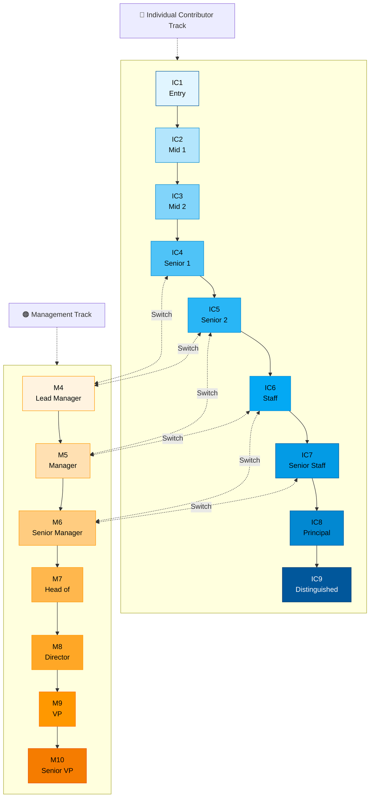

# Career Progression Framework

Ultralytics' career framework provides clear expectations for each level and guides professional development. We maintain two career tracks—Individual Contributor (IC) and Management—allowing team members to advance based on their strengths and interests.

!!! info "Equal Value"

    Both IC and Management tracks are valued equally and offer equivalent compensation and growth potential at similar scope levels. Choose the track that best aligns with your strengths and career goals.

## Career Tracks

**Individual Contributor (IC)**: [IC1](levels-ic.md#ic1-entry) → [IC2](levels-ic.md#ic2-mid-1-developing) → [IC3](levels-ic.md#ic3-mid-2-proficient) → [IC4](levels-ic.md#ic4-senior-1-skilled) → [IC5](levels-ic.md#ic5-senior-2-advanced) → [IC6](levels-ic.md#ic6-staff-expert) → [IC7](levels-ic.md#ic7-senior-staff-advisor) → [IC8](levels-ic.md#ic8-principal-strategist) → [IC9](levels-ic.md#ic9-distinguished-thought-leader)  
**Management**: [M4](levels-management.md#m4-lead-manager) → [M5](levels-management.md#m5-manager) → [M6](levels-management.md#m6-senior-manager) → [M7](levels-management.md#m7-head-of) → [M8](levels-management.md#m8-director) → [M9](levels-management.md#m9-vp) → [M10](levels-management.md#m10-senior-vice-president)

**Track switching**: IC4/IC5 ↔ M4 | M4/M5 ↔ IC5/IC6 | M6 ↔ IC6/IC7

```mermaid
flowchart TB
    IC_TITLE["🔵 Individual Contributor Track"]
    MGMT_TITLE["🟠 Management Track"]

    subgraph IC [" "]
        direction LR
        IC1["IC1<br/>Entry"] --> IC2["IC2<br/>Mid 1"]
        IC2 --> IC3["IC3<br/>Mid 2"]
        IC3 --> IC4["IC4<br/>Senior 1"]
        IC4 --> IC5["IC5<br/>Senior 2"]
        IC5 --> IC6["IC6<br/>Staff"]
        IC6 --> IC7["IC7<br/>Senior Staff"]
        IC7 --> IC8["IC8<br/>Principal"]
        IC8 --> IC9["IC9<br/>Distinguished"]
    end

    subgraph MGMT [" "]
        direction LR
        M4["M4<br/>Lead Manager"] --> M5["M5<br/>Manager"]
        M5 --> M6["M6<br/>Senior Manager"]
        M6 --> M7["M7<br/>Head of"]
        M7 --> M8["M8<br/>Director"]
        M8 --> M9["M9<br/>VP"]
        M9 --> M10["M10<br/>Senior VP"]
    end

    IC_TITLE -.-> IC
    MGMT_TITLE -.-> MGMT

    IC4 <-.->|Switch| M4
    IC5 <-.->|Switch| M4
    IC5 <-.->|Switch| M5
    IC6 <-.->|Switch| M5
    IC6 <-.->|Switch| M6
    IC7 <-.->|Switch| M6

    classDef ic1 fill:#e1f5ff,stroke:#01579b,color:#000;
    classDef ic2 fill:#b3e5fc,stroke:#0288d1,color:#000;
    classDef ic3 fill:#81d4fa,stroke:#0288d1,color:#000;
    classDef ic4 fill:#4fc3f7,stroke:#0288d1,color:#000;
    classDef ic5 fill:#29b6f6,stroke:#0288d1,color:#000;
    classDef ic6 fill:#03a9f4,stroke:#0288d1,color:#000;
    classDef ic7 fill:#039be5,stroke:#01579b,color:#000;
    classDef ic8 fill:#0288d1,stroke:#01579b,color:#000;
    classDef ic9 fill:#01579b,stroke:#013b70,color:#fff;
    classDef m04 fill:#fff3e0,stroke:#ff9800,color:#000;
    classDef m05 fill:#ffe0b2,stroke:#ff9800,color:#000;
    classDef m06 fill:#ffcc80,stroke:#ff9800,color:#000;
    classDef m07 fill:#ffb74d,stroke:#ff9800,color:#000;
    classDef m08 fill:#ffa726,stroke:#ff9800,color:#000;
    classDef m09 fill:#ff9800,stroke:#ff6f00,color:#000;
    classDef m10 fill:#f57c00,stroke:#e65100,color:#000;
    class IC1 ic1;
    class IC2 ic2;
    class IC3 ic3;
    class IC4 ic4;
    class IC5 ic5;
    class IC6 ic6;
    class IC7 ic7;
    class IC8 ic8;
    class IC9 ic9;
    class M4 m04;
    class M5 m05;
    class M6 m06;
    class M7 m07;
    class M8 m08;
    class M9 m09;
    class M10 m10;
```

### Track Comparison

| Aspect              | Individual Contributor (IC)                                      | Management                                                        |
| ------------------- | ---------------------------------------------------------------- | ----------------------------------------------------------------- |
| **Impact Through**  | Deep expertise and individual contributions                      | Building and leading teams to achieve collective goals            |
| **Key Skills**      | Domain knowledge, problem-solving, innovation, execution         | People development, strategic planning, organizational leadership |
| **Influence**       | Guiding decisions, setting standards, and sharing best practices | Team performance, culture, and organizational direction           |
| **Scope Growth**    | Project → Team → Multi-team → Organization                       | Team → Department → Function → Division                           |
| **Focus Evolution** | 100% Operational → 50% Ops / 50% Strategic                       | 80% Ops → 20% Ops / 80% Strategic                                 |

**Full expectations**: [IC Levels (IC1-IC9)](levels-ic.md) | [Management Levels (M4-M10)](levels-management.md)

## Switching Career Tracks

Track switches are normal and supported—discuss with your manager during quarterly reviews.

| Direction           | Typical Path | Key Requirements                                                                                            |
| ------------------- | ------------ | ----------------------------------------------------------------------------------------------------------- |
| **IC → Management** | IC4/IC5→M4   | Excellence in role + leadership examples (mentoring, project leadership) + manager endorsement + 12+ months |
| **Management → IC** | M4/M5→IC5+   | Maintained domain currency + manager discussion + business need + smooth team transition                    |

**When to switch IC→Management**: Passionate about people development, organizational dynamics, and influencing through teams.
**When to switch Management→IC**: Miss hands-on work, prefer expertise-based influence, and want deeper specialization in your field.

---

## Promotion Process

Promotions require **sustained demonstration** of next-level performance across all dimensions:

1. **Performance** - Meeting/exceeding current level for 6+ months
2. **Next-Level Work** - Consistently operating at next level for 6-12 months
3. **Scope** - Expanded scope and complexity appropriate to next level
4. **Impact** - Demonstrated impact on team, function, or company
5. **Readiness** - Manager and skip-level agreement
6. **Presence** - Consistent Anchor Day participation (Tue/Wed/Thu) with badge data aligning to expectations keeps you promotion-ready.

**Strong promotion cases include**: 3-5 specific examples with next-level impact, peer feedback, growth trajectory, and quantified business results.

!!! tip "Self-Advocacy"

    Document wins continuously • Seek feedback regularly • Proactively take next-level work • Build visibility through demos and docs • Be patient—promotions reward sustained performance

---

## Compensation

Compensation reflects scope, impact, and market rates—not tenure. Both tracks offer equivalent pay at similar scope levels.

**Components**: Base salary (market-competitive) • Equity (stock options) • Performance bonuses • Comprehensive benefits

**Leveling factors**: Geographic location • Role specialization (i.e. ML/AI, Sales, Marketing) • Performance • Prior experience

!!! info "Reviews"

    Compensation reviewed annually at year-end and applied in Q1 (January paycheck). Adjustments consider performance, promotion eligibility, market changes, and company performance.

---

## Growth & Development

**Learning Budget**: Annual allocation for courses, books, conferences, certifications (contact HR for amounts)

**Resources**: Quarterly 1:1s for career planning • Mentorship programs • Internal workshops • 10% time for exploration • Conference attendance • Online courses • Certifications • Publications

**Quarterly Growth Plan**: (1) Self-assess against level criteria → (2) Choose 2-3 skills to develop → (3) Find next-level opportunities with manager → (4) Get regular feedback → (5) Document impact for promotion discussions

---

## Typical Promotion Timelines

| Level Transition | Typical Timeline | Key Demonstration                                 |
| ---------------- | ---------------- | ------------------------------------------------- |
| IC1 → IC2        | 12-18 months     | Independent task delivery                         |
| IC2 → IC3        | 18-24 months     | Consistent mid-level impact                       |
| IC3 → IC4        | 24-30 months     | Senior-level ownership and reliability            |
| IC4 → IC5        | 24-36 months     | Cross-team leadership                             |
| IC5 → IC6        | 36+ months       | Department-level strategic impact                 |
| IC6 → IC7        | 36+ months       | Organization-wide strategic impact                |
| IC7 → IC8        | 48+ months       | Company-level strategy and influence              |
| IC8 → IC9        | Special appoint. | Industry impact and business-critical leadership  |
| M4 → M5          | 18-24 months     | Multi-team coordination excellence                |
| M5 → M6          | 24-36 months     | Functional leadership and strategic impact        |
| M6 → M7          | 36+ months       | Executive-level influence                         |
| M7 → M8          | 36+ months       | Director-level functional leadership              |
| M8 → M9          | 48+ months       | Senior executive leadership                       |
| M9 → M10         | 60+ months       | Enterprise leadership and board-level stewardship |

!!! warning "Sustained Performance Required"

    Timelines reflect typical progression. Exceptional contributions may accelerate, but promotions always require demonstrating readiness across **all dimensions**.

---

## Using This Framework

**For ICs/Managers**: Read your [level guide](levels-ic.md) → Self-assess against dimensions → Identify 1-2 gaps → Study next level → Discuss with manager to create development plan

**For Hiring Managers**: Use criteria for job leveling • Share expectations with candidates • Reference during onboarding • Apply consistently in reviews • Guide promotions with evidence

---

## Questions & Support

### Career Development Questions

- **Manager**: Primary resource for career discussions and promotion readiness
- **HR Team**: Questions about levels, compensation, or promotion process
- **Senior ICs/Managers**: Seek mentorship from those in roles you aspire to
- **Skip-Level**: Discuss career with manager's manager for additional perspective

### Additional Resources

- **[IC Levels (IC1-IC9)](levels-ic.md)** - Detailed Individual Contributor expectations
- **[Management Levels (M4-M10)](levels-management.md)** - Detailed Management expectations
- **[People & Benefits](../index.md)** - Comprehensive people policies and resources
- **[Onboarding](../onboarding.md)** - Level expectations for new team members
