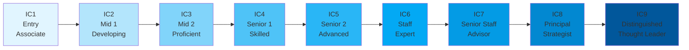

# Individual Contributor Levels (IC1-IC9)

Comprehensive career framework for Individual Contributors at Ultralytics, defining expectations from entry-level through distinguished leadership. Use these descriptions for self-assessment, development planning, and promotion decisions.

!!! info "Career Framework Overview"

    Individual Contributors achieve impact through deep expertise and individual work. Both IC and [Management tracks](levels-management.md) offer equal advancement potential and compensation at equivalent scope levels. See [Career Progression](index.md) for the complete framework.

!!! tip "Presence & Collaboration"

    High-Resolution Hybrid is foundational: if you're within commutable distance, **Anchor Days (Tue/Wed/Thu) onsite** are mandatory. Badge consistency and in-person collaboration are baseline expectations at every IC level; reliable Anchor Day participation keeps you promotion-ready.

## Career Progression

## Level Overview

| Level                                    | Title         | Career Stage   | Ops/Strategic Focus     |
| ---------------------------------------- | ------------- | -------------- | ----------------------- |
| [IC1](#ic1-entry)                        | Entry         | Entry          | 100% Operational        |
| [IC2](#ic2-mid-1-developing)             | Mid 1         | Developing     | 100% Operational        |
| [IC3](#ic3-mid-2-proficient)             | Mid 2         | Proficient     | 100% Operational        |
| [IC4](#ic4-senior-1-skilled)             | Senior 1      | Skilled        | 100% Operational        |
| [IC5](#ic5-senior-2-advanced)            | Senior 2      | Advanced       | 90% Ops / 10% Strategic |
| [IC6](#ic6-staff-expert)                 | Staff         | Expert         | 80% Ops / 20% Strategic |
| [IC7](#ic7-senior-staff-advisor)         | Senior Staff  | Advisor        | 70% Ops / 30% Strategic |
| [IC8](#ic8-principal-strategist)         | Principal     | Strategist     | 60% Ops / 40% Strategic |
| [IC9](#ic9-distinguished-thought-leader) | Distinguished | Thought Leader | 50% Ops / 50% Strategic |

---

## IC1: Entry

- **Career Stage**: Entry
- **Typical Roles**: Junior Engineer, Associate Product Manager, Junior Designer, Marketing Coordinator, Sales Development Rep
- **Focus**: 100% Operational - Learning fundamentals under close supervision

### Core Expectations

| Dimension                            | IC1 Requirements                                                                                                                                                                                                                                                                                                                               |
| ------------------------------------ | ---------------------------------------------------------------------------------------------------------------------------------------------------------------------------------------------------------------------------------------------------------------------------------------------------------------------------------------------- |
| **Expertise & Domain Knowledge**  | • Applies basic principles and concepts in a specialized area • Learns and applies primary techniques and tools relevant to the role • Continuously expands skill sets, including company policies and industry knowledge • Grows competency through structured tasks and mentorship                                                  |
| **Scope & Responsibility**        | • Works on routine and basic tasks with clearly defined parameters • Responsible for one or more project components, following general directions • Plans daily tasks with guidance from senior team members • Contributions focus on repeatable, task-driven activities • Impacts own work primarily, learning team collaboration |
| **Decision Making & Impact**      | • Makes decisions about own work guided by well-defined options • Work is closely supervised with frequent check-ins and review • Refers non-standard or complex matters to senior team members • Seeks guidance when facing ambiguity or uncertainty • Supports team decisions through research and inputs                        |
| **Leadership & Influence**        | • Works with well-defined stakeholders within the immediate team • Learns principles of effective communication and collaboration • Influences through research and providing inputs to discussions • Responsible for individual assignments and deliverables • Participates actively in team meetings and reviews                 |
| **Complexity & Problem Solving**  | • Solves defined problems using established methods and documentation • Problems require analysis of identifiable factors with clear solutions • Follows documented procedures and best practices • Applies knowledge and basic techniques to resolve routine issues • Conveys straightforward information to the team             |
| **Collaboration & Communication** | • Works closely with immediate team members daily • Learns to communicate concepts clearly • Participates in team meetings, project reviews, and design critiques • Asks thoughtful questions and seeks clarification when needed • Documents work following established templates and standards                                   |

### Typical Background

- **Bachelor's degree + 0-1 year experience** OR **Master's degree**
- Foundational knowledge in a relevant field (i.e. CS, Design, Business, Marketing)
- Demonstrated eagerness to learn and grow through internships or projects
- Strong academic background or relevant internship/project experience

### Success Indicators

!!! success "Key Performance Signals"

    - ✅ Completes assigned tasks on time with quality that meets team standards
    - ✅ Actively seeks feedback and applies it to improve work quality
    - ✅ Demonstrates a steady learning curve and skill development
    - ✅ Collaborates effectively with immediate team members
    - ✅ Asks thoughtful questions and escalates issues appropriately

### Common Development Areas

- Deepen fundamentals in core domain tools and practices
- Grow confidence operating with lighter guidance and checkpoints
- Connect individual tasks to team goals and user outcomes
- Build repeatable problem-solving habits for routine issues
- Improve basic scoping and estimation for small tasks

---

## IC2: Mid 1 (Developing)

- **Career Stage**: Developing
- **Typical Roles**: Engineer I, Product Manager I, Designer I, Marketing Specialist, Business Development Rep
- **Focus**: 100% Operational - Developing autonomy with general supervision

### Core Expectations

| Dimension                            | IC2 Requirements                                                                                                                                                                                                                                                                                                                           |
| ------------------------------------ | ------------------------------------------------------------------------------------------------------------------------------------------------------------------------------------------------------------------------------------------------------------------------------------------------------------------------------------------ |
| **Expertise & Domain Knowledge**  | • Develops and applies growing advanced techniques and principles • Standard application of principles, theories, and concepts • Expanding knowledge across related specialty areas • Demonstrates increasing competency and autonomy in work • Good grasp of relevant tools and methodologies                                 |
| **Scope & Responsibility**        | • Handles moderate complexity work with opportunity for review • Responsible for project aspects, determining methods to achieve results • Plans and schedules own work across multiple days • Contributes to fulfillment of significant project portions • Work impacts own deliverables and begins affecting team outcomes   |
| **Decision Making & Impact**      | • Makes decisions about own work and occasionally others' within documented parameters • Independently resolves routine issues • Works under general supervision with independent judgment • Seeks guidance on complex or ambiguous situations • Begins recommending approaches to solve problems                              |
| **Leadership & Influence**        | • Begins working with more varied and changing stakeholders • Gains cooperation from others, exchanges information effectively • Influences through recommending approaches and solutions • Responsible for individual project aspects and their coordination • Participates actively in team planning and design discussions  |
| **Complexity & Problem Solving**  | • Problems require analysis of identifiable factors and tradeoffs • Determines course of action based on guidelines, modifies based on experience • Handles basic escalations from entry-level team members • Applies growing problem-solving sophistication and techniques • Conveys information clearly to diverse audiences |
| **Collaboration & Communication** | • Works effectively with team members across different functions • Communicates progress, challenges, and decisions proactively • Contributes meaningfully to discussions and planning • Helps onboard IC1 team members • Documents work clearly for broader team consumption                                                  |

### Typical Background

- **Bachelor's degree + 1-3 years experience** OR **Master's degree + 1 year**
- Demonstrated growth in functional skills and independent contributions
- Track record of delivering tasks or projects with guidance
- Comfortable working with moderate complexity

### Success Indicators

!!! success "Key Performance Signals"

    - ✅ Delivers work with minimal guidance
    - ✅ Proactively identifies and resolves routine issues
    - ✅ Makes sound decisions on own tasks
    - ✅ Effectively communicates with immediate stakeholders
    - ✅ Demonstrates growing ownership of work quality

### Common Development Areas

- Expand depth in the primary domain and adjacent tools
- Increase comfort working through ambiguity with partial requirements
- Strengthen understanding of team's role and dependencies
- Improve estimation accuracy and proactive risk surfacing
- Build early mentorship habits with IC1 teammates

---

## IC3: Mid 2 (Proficient)

- **Career Stage**: Proficient
- **Typical Roles**: Engineer II, Product Manager II, Designer II, Senior Marketing Specialist, Account Executive
- **Focus**: 100% Operational - Fully autonomous execution on complex tasks

### Core Expectations

| Dimension                            | IC3 Requirements                                                                                                                                                                                                                                                                                                                                      |
| ------------------------------------ | ----------------------------------------------------------------------------------------------------------------------------------------------------------------------------------------------------------------------------------------------------------------------------------------------------------------------------------------------------- |
| **Expertise & Domain Knowledge**  | • Applies complete and practical knowledge of their domain • Near-complete use of standard principles, theories, and concepts • Capable of troubleshooting complex issues within own domain • High competency and autonomy; rarely needs assistance on standard tasks • Full application of relevant tools, acts as a resource for others |
| **Scope & Responsibility**        | • Handles moderate to high complexity work with minimal review • Responsible for multiple project aspects or small initiatives end-to-end • Plans and schedules own work across weeks • Contributes to fulfillment of major project portions • Work directly impacts team outcomes and timeline reliability                               |
| **Decision Making & Impact**      | • Independently resolves non-routine issues • Determines methods and procedures on new assignments • Decisions have a lasting impact on the maintainability of the team's work • Identifies risks in own work and proposes mitigation strategies • Recommends improvements to team processes                                              |
| **Leadership & Influence**        | • Collaborates with stakeholders outside immediate team occasionally • Mentors IC1 and IC2 peers on best practices • Influences discussions by leveraging past experience • Responsible for multiple project aspects and their coordination • Leads small sub-projects or feature implementations                                         |
| **Complexity & Problem Solving**  | • Solves difficult problems with ambiguous factors • Analyzes tradeoffs between different implementations • Handles escalated issues from junior team members regularly • Optimizes existing solutions for performance or scalability • Translates business requirements into functional specifications                                   |
| **Collaboration & Communication** | • Proactively communicates blocking issues and proposes solutions • Participates in hiring and interviewing (shadowing) • Conducts thorough reviews for peers • Documents complex workflows and system behaviors • Bridges gaps between business requirements and implementation                                                          |

### Typical Background

- **Bachelor's degree + 3-5 years experience** OR **Master's degree + 2 years** OR **PhD + 1 year**
- Track record of delivering work end-to-end independently
- Strong knowledge of best practices in their field
- Ability to mentor junior team members on specific tasks

### Success Indicators

!!! success "Key Performance Signals"

    - ✅ Consistently delivers complex work with high quality and autonomy
    - ✅ Recognized as a reliable owner of specific domains or components
    - ✅ Mentors junior team members effectively on tasks
    - ✅ Proactively improves quality and documentation
    - ✅ Estimates work accurately and manages own timeline effectively

### Common Development Areas

- Grow influence beyond immediate tasks to adjacent components
- Elevate strategic thinking and long-term maintainability
- Strengthen ambiguity handling and tradeoff communication
- Develop more deliberate mentoring and review practices
- Improve stakeholder updates that translate choices to impact

---

## IC4: Senior 1 (Skilled)

- **Career Stage**: Career / Fully Functioning
- **Typical Roles**: Senior Engineer, Senior Product Manager, Senior Designer, Senior Analyst, Senior Marketing Manager
- **Focus**: 100% Operational - Independent expert with cross-team influence

### Core Expectations

| Dimension                            | IC4 Requirements                                                                                                                                                                                                                                                                                                                                                                   |
| ------------------------------------ | ---------------------------------------------------------------------------------------------------------------------------------------------------------------------------------------------------------------------------------------------------------------------------------------------------------------------------------------------------------------------------------- |
| **Expertise & Domain Knowledge**  | • Applies complete and practical knowledge across multiple specializations • Demonstrates full competence and gains exposure to more complex work • Understands interrelationships between different disciplines • Deep application of principles, theories, and concepts in domain • May be gaining exposure to adjacent functional areas                             |
| **Scope & Responsibility**        | • Handles moderate complexity with diverse issues requiring minimal review • Contributes to significant project components, impacting own and others' work • Plans own work within scheduled guidelines across multiple projects • Often recommends integration approaches across team projects • Work affects team outcomes and cross-team deliverables significantly |
| **Decision Making & Impact**      | • Makes independent decisions guided by experience and learned knowledge • Makes decisions on own work methods, occasionally in ambiguous situations • Regularly resolves routine and non-routine issues independently • Works under broad guidelines with regular independent judgment application • Influences work team products, processes, and results            |
| **Leadership & Influence**        | • Identifies and actively manages diverse stakeholders across teams • Presents results and recommendations across discipline effectively • Begins influencing team products, features, processes, and results • Serves as Recommender and occasional Activator on team decisions • May lead small projects or significant initiative components                        |
| **Complexity & Problem Solving**  | • Problems are somewhat varied, require analysis of multiple factors and data conflicts • Assesses unusual circumstances using sophisticated problem-solving techniques • Identifies root causes and builds solutions independently • Provides creative and effective solutions to complex issues • Breaks down complex problems into manageable components            |
| **Collaboration & Communication** | • Works effectively across multiple teams and functional areas • Communicates complex concepts to non-technical audiences • Mentors IC2 and IC3 team members regularly on functional topics • Participates in hiring and interviewing processes • Represents team effectively in cross-functional forums                                                               |

### Typical Background

- **Bachelor's degree + 5-7 years experience** OR **Master's degree + 4 years** OR **PhD + 2 years**
- Proven track record of independent complex project delivery
- Strong expertise and domain knowledge
- Demonstrated ability to influence team direction

### Success Indicators

!!! success "Key Performance Signals"

    - ✅ Owns and delivers complex projects independently with high quality
    - ✅ Provides effective mentorship to junior/mid team members
    - ✅ Makes consistently high-quality decisions
    - ✅ Proactively identifies and addresses risks and debts
    - ✅ Contributes to team direction and standards

### Common Development Areas

- Extend influence from team-level to multi-team integrations
- Strengthen product and business context in decisions
- Improve navigation of cross-team dependencies and conflict resolution
- Balance delivery pace with sustainable solutions and debt payoff
- Lead reviews that drive alignment and quality

---

## IC5: Senior 2 (Advanced)

- **Career Stage**: Advanced Senior
- **Typical Roles**: Senior Engineer II, Lead Product Manager, Lead Designer, Lead Marketing Manager, Principal Account Executive
- **Focus**: 90% Operational / 10% Strategic - Functional Lead for the team

### Core Expectations

| Dimension                            | IC5 Requirements                                                                                                                                                                                                                                                                                                                                                 |
| ------------------------------------ | ---------------------------------------------------------------------------------------------------------------------------------------------------------------------------------------------------------------------------------------------------------------------------------------------------------------------------------------------------------------- |
| **Expertise & Domain Knowledge**  | • Recognized as the "go-to" expert for the team's core domain • Broad knowledge of the entire system and deep knowledge of specific areas • Evaluates and introduces new tools or technologies to the team • Capable of solving the most difficult challenges within the team scope • Sets the bar for quality and design patterns                   |
| **Scope & Responsibility**        | • Responsible for the success of major projects or entire features • Identifies and mitigates risks across the project lifecycle • Self-directed; identifies work that needs to be done for the team's success • Coordinates dependencies with other teams • Work creates leverage for the entire team (tooling, frameworks, core libraries)         |
| **Decision Making & Impact**      | • Trusted to make decisions that affect the entire team's velocity • Balances ideal solutions with business speed effectively • Resolves disputes within the team • Defines the "how" for complex initiatives where the "what" is defined by Product • Impact is visible in improved team metrics (performance, reliability, velocity)               |
| **Leadership & Influence**        | • Often acts as the functional lead for the team • Influences the roadmap by identifying opportunities • Drives consensus on design and architecture within the team • Active participant in hiring; defines bar for Senior candidates • Effectively manages up, keeping management informed of risks                                                |
| **Complexity & Problem Solving**  | • Solves systemic problems that affect multiple team members • Refactors legacy systems to improve maintainability without stopping new work • Anticipates scaling issues before they become incidents • Troubleshoots complex interactions between services or components • Creates frameworks or patterns that simplify problem-solving for others |
| **Collaboration & Communication** | • Bridges the gap between their function and product/design at a high level • Mentors Senior 1 contributors towards Staff level thinking • Runs post-mortems and drives action items to completion • Articulates strategy to non-technical stakeholders • Represents the team in architecture reviews with Staff-level contributors                  |

### Typical Background

- **Bachelor's degree + 7-9 years experience** OR **Master's degree + 6 years** OR **PhD + 4 years**
- Consistent history of delivering high-impact projects
- Experience leading design for a team
- Strong reputation for excellence and reliability

### Success Indicators

!!! success "Key Performance Signals"

    - ✅ Acts as the anchor for the team
    - ✅ Successfully delegates work while maintaining quality
    - ✅ Improves team velocity through tooling or process improvements
    - ✅ Mentors other Seniors to help them grow
    - ✅ Prevents major incidents through foresight and robust design

### Common Development Areas

- Practice structured delegation while preserving quality bar
- Strengthen cross-team alignment with product, design, and other partners
- Balance speed vs. quality and make tradeoffs explicit to stakeholders
- Reduce bus factor through documentation, reviews, and knowledge sharing
- Build toward Staff influence by shaping team-level strategy

---

## IC6: Staff (Expert)

- **Career Stage**: Senior/Seasoned
- **Typical Roles**: Staff Engineer, Staff Product Manager, Staff Designer, Staff Analyst, Staff Marketing Manager
- **Focus**: 80% Operational / 20% Strategic - Cross-team leadership

### Core Expectations

| Dimension                            | IC6 Requirements                                                                                                                                                                                                                                                                                                                                                                                       |
| ------------------------------------ | ------------------------------------------------------------------------------------------------------------------------------------------------------------------------------------------------------------------------------------------------------------------------------------------------------------------------------------------------------------------------------------------------------ |
| **Expertise & Domain Knowledge**  | • Applies advanced and wide-ranging knowledge across entire domain • Combines emerging business acumen with deep functional expertise • Understands interrelationships between disciplines, serves as a functional advisor • Deep application of principles across most areas of specialization • Beginning to build reputation as an organizational expert                                |
| **Scope & Responsibility**        | • Handles complex work and issues with significant interdependencies • Contributes to and often drives achievement of critical functional goals • Plans, schedules, and integrates tasks with limited direction across projects • Work impacts department outcomes and cross-functional initiatives • Influences quarterly and semi-annual strategic planning                              |
| **Decision Making & Impact**      | • Makes decisions on functional approaches, processes, occasionally ambiguous situations • Independently resolves most complex issues, teams to solve ambiguous challenges • Collaborates as Recommender for systemic issues, occasionally Activator • Works from broad goals, determines and develops approach to solutions • Provides direction affecting multiple teams and initiatives |
| **Leadership & Influence**        | • Plans, schedules, and integrates own work with others across teams • Begins directing application of existing principles to new contexts • Contributes to stakeholder management plans, develops relationships across organization • Influences work team and multiple teams, serves as Recommender and Activator • Often regarded as in-house expert on specific areas or domains       |
| **Complexity & Problem Solving**  | • Problems are varied, diverse, often "hidden" or systemic in nature • Provides solutions to complex issues with sophisticated creative insights • Works on high-impact projects and challenging problems • Regularly guides others in solving highly complex issues • Significant contributor and recommender for far-reaching challenges                                                 |
| **Collaboration & Communication** | • Influences stakeholders across multiple teams and functional areas • Communicates effectively with senior leadership on functional matters • Mentors IC4 and IC5 contributors on growth and career development • Leads design reviews and architecture discussions • May represent company at external forums and conferences                                                            |

### Typical Background

- **Bachelor's degree + 9-11 years experience** OR **Master's degree + 7 years** OR **PhD + 5 years**
- Recognized expert in specific domain or technology area
- Track record of leading complex projects affecting multiple teams
- Demonstrated ability to influence direction beyond own team

### Success Indicators

!!! success "Key Performance Signals"

    - ✅ Drives initiatives affecting multiple teams successfully
    - ✅ Recognized as a functional authority within organization
    - ✅ Makes strategic decisions with lasting impact
    - ✅ Mentors and develops senior contributors effectively
    - ✅ Identifies and addresses systemic challenges proactively

### Common Development Areas

- Expand influence from department-level to organization-wide outcomes
- Develop executive-ready communication on risk and strategy
- Build broader cross-functional networks that unlock delivery velocity
- Strengthen ability to drive consensus on complex architectural decisions
- Grow voice in product strategy and prioritization

!!! warning "Critical Transition Point"

    IC6 marks the shift from senior expert to organizational leader. Success means balancing hands-on delivery (80%) with higher-leverage strategic influence (20%) and learning to scale impact through others.

---

## IC7: Senior Staff (Advisor)

- **Career Stage**: Expert Advisor
- **Typical Roles**: Senior Staff Engineer, Senior Staff Product Manager, Senior Staff Designer, Senior Staff Analyst
- **Focus**: 70% Operational / 30% Strategic - Cross-team leadership with broadening scope

### Core Expectations

| Dimension                            | IC7 Requirements                                                                                                                                                                                                                                                                                                                                                                                                                             |
| ------------------------------------ | -------------------------------------------------------------------------------------------------------------------------------------------------------------------------------------------------------------------------------------------------------------------------------------------------------------------------------------------------------------------------------------------------------------------------------------------- |
| **Expertise & Domain Knowledge**  | • Applies advanced business acumen directly to domain expertise • Combines highly specialized field knowledge with broad expertise in related areas • Deep expertise across multiple specializations and interdependent areas • Builds reputation as in-house expert across entire organization • Often consulted on most critical and strategic decisions                                                                       |
| **Scope & Responsibility**        | • Handles highly complex work with significant interdependencies across organization • Directs work contributing to achievement of critical functional and organizational goals • Influences planning of others, regularly plans and coordinates work of team members • Work impacts organizational strategy and influences multi-quarter planning cycles • Drives initiatives affecting company-wide direction and architecture |
| **Decision Making & Impact**      | • Makes decisions regarding approaches that influence entire organization • Advises multiple functional areas on decision making in highly ambiguous situations • Often serves as Recommender, occasionally Activator for systemic organizational issues • Works under consultative direction towards mid-term strategic goals (6+ months) • Decisions set precedents and standards affecting multiple teams                     |
| **Leadership & Influence**        | • Regularly plans and influences work of others across multiple teams • Directs application of existing principles, actively participates in developing new practices • Owns portions of stakeholder management plans across entire organization • Influences department offerings and creates function-level impact • Applies flexible leadership styles to influence results across organization                               |
| **Complexity & Problem Solving**  | • Problems are novel with limited precedent, require significant ingenuity and creativity • Provides, guides, and uses innovative methods to solve unusual and complex problems • Leads teams in solving complex, cross-discipline issues critical to company success • Provides deep insight and leadership promoting innovative new ideas • Leads and guides implementation strategies for complex solutions                   |
| **Collaboration & Communication** | • Influences senior leadership and executives regularly on strategy • Communicates vision effectively to diverse audiences across organization • Builds and leverages strong cross-functional networks for collaboration • Represents company at major industry conferences as a functional authority • Mentors staff-level contributors and emerging leaders effectively                                                        |

### Typical Background

- **Bachelor's degree + 11-13 years experience** OR **Master's degree + 9 years** OR **PhD + 7 years**
- Recognized authority internally as domain expert across organization
- Proven impact across multiple teams, functions, and strategic initiatives
- Strong executive communication and influence skills

### Success Indicators

!!! success "Key Performance Signals"

    - ✅ Drives strategy with measurable company-wide impact
    - ✅ Influences product and business strategy through functional insights
    - ✅ Recognized as authority within industry, not just within company
    - ✅ Successfully leads most complex and ambiguous initiatives
    - ✅ Makes bets that significantly impact company success

### Common Development Areas

- Extend influence from organization to industry conversations and standards
- Publish, speak, or share thought leadership externally with credibility
- Strengthen ability to influence executive-level strategic decisions
- Build industry-wide networks and partnerships that expand leverage
- Grow impact on long-term vision and multi-quarter bets

!!! note "Strategic Balance"

    IC7 requires balancing deep execution (70%) with strategic influence (30%). Success means driving both immediate outcomes and the emerging strategy across teams.

---

## IC8: Principal (Strategist)

- **Career Stage**: Lead / Strategist
- **Typical Roles**: Principal Engineer, Principal Product Manager, Principal Designer, Principal Analyst
- **Focus**: 60% Operational / 40% Strategic - Strategic leadership across the organization

### Core Expectations

| Dimension                            | IC8 Requirements                                                                                                                                                                                                                                                                                                                                                                                                                                                   |
| ------------------------------------ | ------------------------------------------------------------------------------------------------------------------------------------------------------------------------------------------------------------------------------------------------------------------------------------------------------------------------------------------------------------------------------------------------------------------------------------------------------------------ |
| **Expertise & Domain Knowledge**  | • Applies extensive depth of knowledge across theories, practices, and design principles • Serves as specialized expert in field and primary advisor across entire organization • Maintains highest external affiliations, often pioneer in technology or domain area • Recognized authority internally and externally in profession and industry • Actively shapes direction at both company and industry level                                       |
| **Scope & Responsibility**        | • Handles most complex work with minimum precedent or established patterns • Directs work contributing directly to organizational success and industry reputation • Contributes actively to strategic planning, influences annual plans for entire function • Work impacts company strategy, competitive positioning, and multi-year planning • Drives initiatives with potential to transform company or entire industry                              |
| **Decision Making & Impact**      | • Advises on most novel, strategic business and functional issues company-wide • Often serves as Activator and major contributor to most far-reaching decisions • Influences company-wide strategy and long-term multi-year planning cycles • Determines and pursues courses of action to meet long-term strategic goals (3+ years) • Decisions directly affect company's competitive positioning in market                                            |
| **Leadership & Influence**        | • Contributes to strategic planning at highest levels, influences multi-year planning • Leads application of existing principles and active development of new innovative ideas • Owns stakeholder management plans, develops relationships across entire organization • Recognized as highly influential leader partnering directly with executive team • Often serves as the Decider for most complex and strategic issues                           |
| **Complexity & Problem Solving**  | • Challenges are novel with multiple stakeholders, highly ambiguous, require significant ingenuity • Applies deep expertise and emerging technologies to drive breakthrough innovation • Leads teams in solving most highly complex challenges with limited or no precedent • Pioneers development and personally sponsors implementation of strategic solutions • Solutions require exceptional strategic judgment with limited information available |
| **Collaboration & Communication** | • Partners directly with executive team on company strategy and vision • Influences industry through publications, keynotes, and standards work • Builds and maintains significant external professional networks and partnerships • Mentors principal-level contributors and senior leaders across organization • Represents company as primary authority to customers, partners, analysts                                                            |

### Typical Background

- **Bachelor's degree + 13-15 years experience** OR **Master's degree + 11 years** OR **PhD + 9 years**
- Recognized authority externally in field with industry-wide reputation
- Proven track record of company-wide and industry-level impact
- Extensive network of industry relationships and influence

### Success Indicators

!!! success "Key Performance Signals"

    - ✅ Directly shapes company strategy and long-term vision
    - ✅ Recognized as thought leader and authority in industry
    - ✅ Influences decisions at executive and board level
    - ✅ Develops other principal-level leaders successfully
    - ✅ Makes strategic bets that define company's future

### Common Development Areas

- Expand influence on company business strategy beyond functional scope
- Build deeper executive and board relationships to advocate for direction
- Develop the next generation of Staff and Principal contributors
- Increase industry leadership through standards work and public platforms
- Grow impact on long-term company positioning and multi-year vision

!!! note "Strategic Leadership"

    IC8 represents specialized leadership with broad impact. Success requires balancing deep execution (60%) with strategic influence (40%) while steering company-level direction.

---

## IC9: Distinguished (Thought Leader)

- **Career Stage**: Industry Leader
- **Typical Roles**: Distinguished Engineer, Fellow, Research Scientist
- **Focus**: 50% Operational / 50% Strategic - Industry-defining leadership

### Core Expectations

| Dimension                            | IC9 Requirements                                                                                                                                                                                                                                                                                                                                                                                                                         |
| ------------------------------------ | ---------------------------------------------------------------------------------------------------------------------------------------------------------------------------------------------------------------------------------------------------------------------------------------------------------------------------------------------------------------------------------------------------------------------------------------- |
| **Expertise & Domain Knowledge**  | • Defines the state of the art for the industry; inventions may be patented or become industry standards • Visionary understanding of trends 5-10 years out • Depth is unmatched; capable of rebuilding core business technologies from first principles • Mastery of the intersection between technology, business model, and market forces • Serves as the ultimate arbiter for the company                                |
| **Scope & Responsibility**        | • Operates with complete autonomy; defines their own scope based on company survival and growth • Accountable for risks that could pose existential threats to the company • Drives transformations that open entirely new lines of business • Work influences the entire industry ecosystem, not just the company • Responsible for the long-term soul and culture of the organization                                      |
| **Decision Making & Impact**      | • Decisions fundamentally alter the trajectory of the company • Selects the technologies and architectures that will define the company for the next decade • Acts as a trusted advisor to the CEO and Board of Directors • Validates or invalidates potential M&A targets based on diligence • Impact is measured in years or decades, often shifting the market landscape                                                  |
| **Leadership & Influence**        | • A magnet for talent; top-tier contributors join the company specifically to work with this person • Represents the company in global standards bodies, consortiums, and government panels • Influences the roadmap of external partners and vendors • Sets the ethical and cultural standards for their function across the organization • Operates without organizational boundaries; influence permeates all departments |
| **Complexity & Problem Solving**  | • Solves "unsolvable" problems where no prior solution exists in the world • Synthesizes vast amounts of disparate information to find simple solutions to complex reality • Identifies non-obvious opportunities that others miss entirely • Navigates extreme ambiguity where business goals and possibility are both undefined • Creates new algorithms, methodologies, or paradigms that advance the field               |
| **Collaboration & Communication** | • Communicates vision to the entire company, inspiring confidence in the future • Publishes seminal papers, books, or open-source projects that define the field • Mentors the company's Principal and Senior Staff contributors • Negotiates high-stakes partnerships with other industry giants • Translates the most complex realities into clear business strategy for investors and board members                       |

### Typical Background

- **15+ years of experience** with a history of industry-shifting impact
- Significant external recognition (patents, books, keynotes, open source leadership)
- Track record of creating successful technologies or platforms from scratch
- Experience guiding companies through major pivots

### Success Indicators

!!! success "Key Performance Signals"

    - ✅ Creates technology that becomes a competitive moat for the company
    - ✅ Attracts world-class talent to the organization
    - ✅ Prevents existential failures through foresight
    - ✅ Defines the industry standard for the company's domain
    - ✅ Pivots the company's strategy to capture new markets
    - ✅ Respected globally as a pioneer in the field

---

## Level Comparison Matrix

| Dimension       | IC1-IC3      | IC4-IC5      | IC6-IC7    | IC8-IC9      |
| --------------- | ------------ | ------------ | ---------- | ------------ |
| **Focus**       | 100% Ops     | 90-100% Ops  | 70-80% Ops | 50-60% Ops   |
| **Supervision** | Close/Gen    | Minimal      | Limited    | Consultative |
| **Scope**       | Task/Project | Project/Team | Cross-Team | Org/Industry |
| **Planning**    | Days/Weeks   | Months       | Quarters   | Years        |
| **Decisions**   | Defined      | Independent  | Strategic  | Existential  |
| **Influence**   | Team         | Cross-Team   | Department | Industry     |

## Using This Guide

### For Individual Contributors

!!! tip "Self-Assessment Process"

    1. **Read your current level thoroughly** - Understand all dimensions of expectations
    2. **Evaluate honestly** against each dimension - Identify consistent strengths
    3. **Identify development areas** - Find 1-2 gaps to address this quarter
    4. **Review next level** - Understand the path forward clearly
    5. **Discuss with manager** - Align on assessment and create development plan

### For Development Planning

Create targeted growth plans:

1. **Compare current vs. next level** across all dimensions systematically
2. **Identify specific gaps** in expertise, scope, or organizational impact
3. **Find opportunities** to demonstrate next-level work with manager support
4. **Set quarterly goals** targeting specific next-level criteria explicitly
5. **Document examples** of next-level performance for promotion discussions

### For Managers

!!! info "Manager Responsibilities"

    - **Performance Reviews**: Use these criteria to calibrate expectations consistently
    - **Specific Feedback**: Provide concrete examples mapped to level dimensions
    - **Opportunity Creation**: Help team members find next-level work opportunities
    - **Consistent Evaluation**: Ensure fairness across all team members
    - **Promotion Preparation**: Build evidence-based cases using these criteria

## Promotion Readiness

### Typical Timeline

- **IC1 → IC2**: 12-18 months
- **IC2 → IC3**: 18-24 months
- **IC3 → IC4**: 24-30 months
- **IC4 → IC5**: 24-36 months
- **IC5 → IC6**: 36+ months
- **IC6 → IC7**: 36+ months
- **IC7 → IC8**: 48+ months
- **IC8 → IC9**: Special appointment based on business need and industry impact

!!! warning "Promotion Requirements"

    Promotions require **sustained demonstration** of next-level performance across **all dimensions**, not just functional expertise. Discuss readiness quarterly with your manager and document specific examples.

## Related Resources

- **[Management Levels](levels-management.md)** - Detailed leadership track expectations
- **[Career Progression](../index.md)** - Complete framework, promotion process, track switching
- **[People & Benefits](../../index.md)** - Comprehensive people policies and resources
- **[Onboarding](../onboarding.md)** - Level expectations for new team members

---

_These level descriptions are living documents that evolve as Ultralytics grows. Feedback and improvements welcome through PRs or discussions with your manager._
