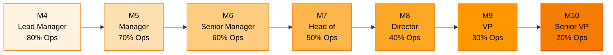

# Management Levels (M4-M10)

Comprehensive career framework for Management roles at Ultralytics, defining expectations from first-line management through executive leadership. Use these descriptions for leadership development, hiring decisions, and promotion planning.

!!! info "Management Track Overview"

    Management roles achieve results through building and leading teams. All management positions include direct reports and HR responsibilities. Both [IC](levels-ic.md) and Management tracks offer equal advancement potential and compensation at equivalent scope levels. See [Career Progression](index.md) for complete framework.

## Career Progression

## Level Overview

| Level                             | Title          | Career Stage                           | Ops/Strategic Focus     |
| --------------------------------- | -------------- | -------------------------------------- | ----------------------- |
| [M4](#m04-lead-manager)          | Lead Manager   | Lead Supervisory / Manager Supervisory | 80% Ops / 20% Strategic |
| [M5](#m05-manager)               | Manager        | Management                             | 70% Ops / 30% Strategic |
| [M6](#m06-senior-manager)        | Senior Manager | Senior Manager                         | 60% Ops / 40% Strategic |
| [M7](#m07-head-of)               | Head of        | Head of Middle Management              | 50% Ops / 50% Strategic |
| [M8](#m08-director)              | Director       | Director Management                    | 40% Ops / 60% Strategic |
| [M9](#m09-vp)                    | VP             | Senior Executive Management            | 30% Ops / 70% Strategic |
| [M10](#m10-senior-vice-president) | Senior VP      | Enterprise Executive Leadership        | 20% Ops / 80% Strategic |

---

## M4: Lead Manager

**Career Stage**: Lead Supervisory / Manager Supervisory  
**Typical Roles**: Engineering Manager, Product Manager (with reports), Design Manager  
**Focus**: 80% Operational / 20% Strategic - Day-to-day team management with hands-on involvement

### Core Expectations

| Dimension                            | M4 Requirements                                                                                                                                                                                                                                                                                                                                                                                                                            |
| ------------------------------------ | ------------------------------------------------------------------------------------------------------------------------------------------------------------------------------------------------------------------------------------------------------------------------------------------------------------------------------------------------------------------------------------------------------------------------------------------- |
| **Leadership & Scope**            | • Supervises team/group performing singular or closely related tasks • Provides HR management responsibilities (hire, promote, assess, performance manage) • Directs day-to-day operations with weekly planning horizon • Often collaborates with other functional areas, management, and outside vendors • Assigns tasks, monitors work, exercises discretion in planning team workload and schedules                          |
| **People Management**             | • Documents results and metrics, provides ongoing coaching and feedback • Provides input to HR actions (hiring decisions, job changes, promotions) for area • Acts as guide, oversees established/standardized operations and activities • May manage mix of entry-level and junior individual contributors (IC1-IC3) • Routinely exercises discretion and independent judgment in workload management                          |
| **Expertise & Technical Skills**  | • Demonstrates mastery of work supervised and broad knowledge of related areas • May become actively involved to meet schedules and resolve critical problems • Applies advanced principles and strategies to multiple specialty areas • Often serves as technical and process coach to build team bench strength • Advises team effectively on moderately complex technical matters                                            |
| **Decision Making & Impact**      | • Makes independent decisions on matters of diverse scope affecting team delivery • Decisions guided by established policies, procedures, and business plans • Regularly interprets policies and makes daily decisions within defined guidelines • Implements plans to manage financials, business planning, and resource management • Regularly makes significant decisions directly impacting success of one or more projects |
| **Stakeholder Management**        | • Leads teams to engage and monitor needs of well-defined stakeholders • Sets priorities for team including occasionally non-routine situations • Monitors needs of well-defined stakeholders, may set priorities for non-routine cases • Influences through coaching and motivating team to action and results within department • Sets goals and reviews with focus on monthly priorities and tactical execution              |
| **Complexity & Problem Solving**  | • Leads teams to find solutions following established technical methodologies • Interprets and resolves moderately complex issues requiring data analysis • Follows established practices and procedures with basic analytical approaches • Begins providing fresh and practical solutions to persistent operational challenges • Regularly faces unusual situations requiring policy interpretation and judgment               |
| **Collaboration & Communication** | • Gains cooperation from others, frequently exchanges technical information • Conveys straightforward information to team and stakeholders clearly • Provides ongoing performance feedback and work guidance to direct reports • Communicates team progress, blockers, and needs to management effectively • Represents team in departmental meetings and cross-functional discussions                                          |

### Span & Team Structure

- **Typical Direct Reports**: 2-4 individual contributors (primarily IC1-IC3)
- **Organizational Depth**: Single layer - manages ICs directly
- **Team Scope**: Single discipline or closely related tasks within one function
- **Budget Responsibility**: Typically $100K-$250K annually, primarily team operational costs
- **Time Horizon**: Day-to-day and weekly planning, monthly goal setting

### Typical Background

- **Bachelor's degree + 4 years experience** OR **Master's degree + 3 years** OR **PhD + 2 years**
- Proven track record of technical excellence as individual contributor (typically IC4+)
- Demonstrated ability to lead, mentor, and develop people effectively
- Strong communication skills and emotional intelligence
- Experience with project coordination and cross-functional collaboration

### Success Indicators

!!! success "Key Performance Signals"

    - ✅ Team consistently meets delivery commitments and quality standards
    - ✅ Direct reports demonstrate measurable growth and skill development over time
    - ✅ Proactively identifies and resolves team blockers and dependencies
    - ✅ Maintains high team morale, engagement, and low attrition rates
    - ✅ Makes sound hiring decisions that strengthen team capability
    - ✅ Effectively balances hands-on technical work with people management
    - ✅ Communicates team progress and needs clearly to leadership

### Common Development Areas

- Transitioning from individual contributor mindset to management thinking
- Learning to achieve results through others rather than doing work directly
- Developing coaching and feedback skills for different personality types
- Building confidence in making difficult people decisions and conversations
- Improving time management across competing people and technical priorities
- Growing comfort with ambiguity and incomplete information in decisions

!!! warning "Common First-Time Manager Challenges"

    - **Over-indexing on technical work**: Difficulty delegating and trusting team with technical decisions
    - **Avoiding difficult conversations**: Hesitating to address performance issues directly
    - **Micromanagement**: Struggling to let go of detailed control over work execution
    - **Insufficient 1:1 time**: Underinvesting in people development and relationship building
    - **Poor upward communication**: Failing to keep leadership informed of team challenges

---

## M5: Manager

**Career Stage**: Management  
**Typical Roles**: Senior Engineering Manager, Senior Product Manager (large team), Head of Design  
**Focus**: 70% Operational / 30% Strategic - Multi-team coordination with strategic planning

### Core Expectations

| Dimension                            | M5 Requirements                                                                                                                                                                                                                                                                                                                                                                                                                                                           |
| ------------------------------------ | -------------------------------------------------------------------------------------------------------------------------------------------------------------------------------------------------------------------------------------------------------------------------------------------------------------------------------------------------------------------------------------------------------------------------------------------------------------------------- |
| **Leadership & Scope**            | • Manages activities of multiple sections, complex work area, or sub-department • Work managed is varied and may cross disciplines or include non-related work groups • Provides input to HR actions and department structure changes • Guides staff by established function/department practices and well-defined procedures • Monitors 6-12 month projects and programs, contributes to longer-term planning                                                 |
| **People Management**             | • Accountable for HR actions (hiring, promotions, comp changes) for area of responsibility • Provides ongoing performance feedback and substantive work guidance to managers/leads • Routinely exercises independent judgment managing budgets, timelines, workload, performance • May manage other managers, senior ICs, or mix of leads and individual contributors • Develops management capability in team leads or first-level managers reporting to them |
| **Expertise & Technical Skills**  | • Demonstrates expertise in work managed with considerable business acumen • Maintains broad knowledge of related areas and cross-functional understanding • Widely applies advanced principles, strategies, theories, and concepts across areas • May perform escalated and more complex duties directly when critical • Leads teams to develop new methods, products, processes, and solutions                                                               |
| **Decision Making & Impact**      | • Leads teams in exploring options and making recommendations on large projects/programs • Makes independent decisions around diverse scope impacting delivery, services, resourcing • Influences decisions in related areas and across department/function boundaries • Implements plans on complex matters for financials, business planning, resource management • Accountable for financials, schedules, resource usage with broad organizational impact   |
| **Stakeholder Management**        | • Manages teams to assess stakeholder needs and contributes to management tactics • Monitors and assesses results, resetting stakeholder approaches as needed • Influences through motivating within and across organization to drive action and results • Provides input to building highly adaptable teams that influence outcomes • Relates effectively to variety of stakeholders, begins influencing top management                                       |
| **Complexity & Problem Solving**  | • Begins managing teams solving problems with limited precedent in the organization • Exposes and resolves moderately to complex issues that often cross disciplines • Presents results and recommendations across discipline and to senior leadership • Develops persuasive and easy-to-understand cases to educate and persuade stakeholders • Works on issues requiring conceptual thinking balanced with practical solutions                               |
| **Collaboration & Communication** | • Gains cooperation and support from others through influence and persuasion • Develops persuasive cases and recommendations for senior leadership • Effectively represents function in cross-organizational forums and meetings • Builds collaborative relationships across multiple departments and functions • Communicates complex information clearly to diverse technical and non-technical audiences                                                    |

### Span & Team Structure

- **Typical Direct Reports**: 4-8 people (mix of ICs, leads, or 2-3 first-level managers)
- **Organizational Depth**: May have 2 layers if managing other managers
- **Team Scope**: Multiple teams or disciplines, possibly cross-functional
- **Budget Responsibility**: Typically $250K-$750K annually including salaries and operational costs
- **Time Horizon**: Weekly and monthly operations, quarterly planning and goal setting

### Typical Background

- **Bachelor's degree + 6 years experience** OR **Master's degree + 4 years** OR **PhD + 4 years**
- Proven success as first-level manager or managing large individual contributor teams
- Track record of cross-functional leadership and stakeholder management
- Demonstrated ability to develop other managers or senior technical leaders
- Strong strategic thinking and business acumen beyond immediate function

### Success Indicators

!!! success "Key Performance Signals"

    - ✅ Department/function consistently achieves quarterly and annual objectives
    - ✅ Multiple teams under leadership coordinate effectively with minimal friction
    - ✅ Develops high-performing managers, leads, or senior ICs who get promoted
    - ✅ Successfully navigates complex cross-functional dependencies and conflicts
    - ✅ Makes strategic resource allocation decisions balancing priorities effectively
    - ✅ Proactively identifies and addresses organizational challenges before escalation
    - ✅ Represents function effectively in leadership forums and strategic discussions

### Common Development Areas

- Transitioning from managing ICs to managing through other managers
- Developing strategic thinking and longer-term planning capabilities (6-12 months)
- Building influence without direct authority across organizational boundaries
- Learning to delegate operational decisions while maintaining oversight
- Improving ability to develop and coach other managers effectively
- Growing comfort with organizational politics and senior stakeholder management

!!! note "Management Through Others"

    M5 represents critical shift from direct people management to achieving results through other managers or leads. Success requires developing others' management capabilities rather than managing all individuals directly.

---

## M6: Senior Manager

**Career Stage**: Senior Manager  
**Typical Roles**: Director of Engineering, Director of Product, Head of Design  
**Focus**: 60% Operational / 40% Strategic - Functional leadership with strategic planning

### Core Expectations

| Dimension                            | M6 Requirements                                                                                                                                                                                                                                                                                                                                                                                                                                                                                   |
| ------------------------------------ | -------------------------------------------------------------------------------------------------------------------------------------------------------------------------------------------------------------------------------------------------------------------------------------------------------------------------------------------------------------------------------------------------------------------------------------------------------------------------------------------------- |
| **Leadership & Scope**            | • Manages activities of two or more sections, disciplines, or major processes/programs • Directs activities of sub-function or small functional area through lower-level management • Often includes variety of work groups across disciplines/specializations with regional/global reach • Provides input to department strategy and large visible projects (1-3 year planning horizon) • Accountable for HR actions and substantive changes to department structure and organization |
| **People Management**             | • Accountable for HR actions and changes to department structure across function • Manages through other managers, rarely has individual contributors as direct reports • Provides input to department structure decisions and organizational design initiatives • Develops management bench strength through coaching, mentoring, and succession planning • Creates culture and sets performance standards for entire function under leadership                                       |
| **Expertise & Technical Skills**  | • Demonstrates expertise in several specialized areas/disciplines within domain • Recognized authority for executives, plays key role in improving organizational intellectual capital • Performs portions of more complex, novel work directly with team assistance when critical • Builds organizational knowledge through combination of strategic hires, skill building, and methodology • Leads teams to develop new methods and solve company-wide matters and challenges        |
| **Decision Making & Impact**      | • Makes independent decisions around design/implementation of strategy for new/updated programs • Works with senior management to establish strategic plans and objectives for function • Makes final decisions on approach to achievement and implementation within function • Accountable for financials, schedules, resource usage with far-reaching business segment impact • Establishes plans for major projects and programs, fully accountable for budget execution            |
| **Stakeholder Management**        | • Manages teams to anticipate advanced/systemically challenging stakeholder needs proactively • Contributes to development and regular updating of strategy and associated stakeholder plans • Expands, strengthens, develops stakeholder relationships coaching team to grow networks • Influences actions and results through collaboration down management chain effectively • Often advocates, educates, gains support for major projects and ideas with top management            |
| **Complexity & Problem Solving**  | • Leads teams in solving complex, cross-discipline issues critical to company success • Translates business and technical strategy into actionable functional plans and execution • Guides teams in execution to solve persistent, systemic organizational challenges • Works on issues where analysis requires conceptual thinking balanced with practical solutions • Develops highly persuasive and easy-to-understand cases for executive decision making                          |
| **Collaboration & Communication** | • Presents results and recommendations effectively to executive leadership and stakeholders • Develops persuasive business cases for executive decision making on strategic matters • Influences senior management through advocacy, education, and building support for initiatives • Represents function as key voice in company-wide strategic discussions and planning • Builds strong cross-functional executive relationships to drive organizational outcomes                   |

### Span & Team Structure

- **Typical Direct Reports**: 7-13 people through 2-3 managers
- **Organizational Depth**: May have 2-3 layers of management reporting through hierarchy
- **Team Scope**: Multiple related functions, large single function, or cross-functional organization
- **Budget Responsibility**: Typically $750K-$2M annually including full department P&L
- **Time Horizon**: Monthly operations, quarterly execution, annual strategic planning

### Typical Background

- **Bachelor's degree + 9 years experience** OR **Master's degree + 6 years** OR **PhD + 6 years**
- Proven track record leading multiple teams and delivering significant business outcomes
- Strong business acumen and strategic thinking capabilities
- Demonstrated executive presence and ability to influence senior leadership
- Experience managing through multiple layers of organizational hierarchy

### Success Indicators

!!! success "Key Performance Signals"

    - ✅ Function consistently achieves annual objectives and strategic milestones
    - ✅ Successfully executes multi-quarter strategic initiatives with measurable business impact
    - ✅ Develops multiple high-performing management teams and future leaders
    - ✅ Influences company strategy and successfully advocates for cross-functional priorities
    - ✅ Makes high-stakes decisions on resource allocation and strategic direction effectively
    - ✅ Builds significant organizational capability, talent pipeline, and bench strength
    - ✅ Recognized as functional leader by executive team and peer directors

### Common Development Areas

- Transitioning from operational execution to strategic leadership and vision setting
- Developing executive presence and communication style for board and C-suite
- Building deeper business acumen connecting functional work to business outcomes
- Learning to influence company strategy beyond immediate functional responsibility
- Growing comfort operating through multiple layers of organizational hierarchy
- Strengthening ability to make strategic decisions with incomplete information

!!! warning "Strategic Balance Challenge"

    M6 requires equal focus on operational excellence (60%) and strategic leadership (40%). Many senior managers struggle balancing immediate execution pressures with long-term strategic thinking and organizational capability building.

---

## M7: Head of

**Career Stage**: Head of Middle Management  
**Typical Roles**: VP of Engineering, VP of Product, VP of Design  
**Focus**: 50% Operational / 50% Strategic - Executive partnership on company strategy

### Core Expectations

| Dimension                            | M7 Requirements                                                                                                                                                                                                                                                                                                                                                                                                                                                                                     |
| ------------------------------------ | ---------------------------------------------------------------------------------------------------------------------------------------------------------------------------------------------------------------------------------------------------------------------------------------------------------------------------------------------------------------------------------------------------------------------------------------------------------------------------------------------------- |
| **Leadership & Scope**            | • Leads activities of one or more sub-functions/divisions with regional and/or global reach • Directs through subordinate directors and senior managers across entire organization • Oversees multi-year strategies and plans in close partnership with executive leadership team • Cascades company strategy to detailed functional plans and execution across organization • Often has direct P&L responsibility or significant budget authority for major business segment            |
| **People Management**             | • Accountable for HR actions and major organizational structure changes company-wide • Manages exclusively through senior managers and directors, no individual contributors • Sets organizational culture, leadership standards, and talent strategy for entire function • Drives succession planning and executive development at senior leadership levels • Accountable for function-wide talent strategy, capability building, and organizational design                             |
| **Expertise & Technical Skills**  | • Demonstrates expertise in several specialized areas/disciplines with broad business knowledge • Recognized authority that plays critical key role in intellectual capital for organization • Performs complex novel work when strategically critical, builds organizational knowledge • Well-versed in internal and external methodologies, best practices, and emerging trends • Oversees teams to develop innovative new methods and solve most critical company-wide matters        |
| **Decision Making & Impact**      | • Develops and provides strategy, vision, and direction to multiple functions organization-wide • Implements company-wide policies and practices with broad organizational impact • Leads teams to provide critical information and input to executive management and board • Accountable for function financial results that directly impact overall company performance • Outcomes and decisions have far-reaching impact to business segments, products, and strategic goals          |
| **Stakeholder Management**        | • Persuades others in bringing closure to sensitive, multi-faceted organizational challenges • Manages relationships with complex, cross-domain/functional stakeholder groups company-wide • Removes and remedies significant impediments to meeting business and technology strategic goals • Influences through building strong cross-functional networks and organizational followership • Serves as top influencer and advocate for new, transformative ideas and strategic projects |
| **Complexity & Problem Solving**  | • Builds and guides teams in solving company's most highly complex strategic challenges • Builds and actively nurtures environment of innovation and creative problem solving • Works with senior leadership to identify and assemble talent to solve critical problems • Through assessment of intangible variables, identifies and addresses fundamental strategic issues • Anticipates factors that could influence strategies and company's competitive position in market           |
| **Collaboration & Communication** | • Communicates vision and strategy effectively to board, executive team, and entire organization • Represents company as executive voice to customers, partners, investors, and industry • Influences company strategy through thought leadership and strategic recommendations • Builds and maintains executive-level relationships across industry and ecosystem • Partners directly with CEO and executive team on overall company strategy and direction                             |

### Span & Team Structure

- **Typical Direct Reports**: 10-20 people through 2-4 senior managers/directors
- **Organizational Depth**: Has 3-4 levels of management reporting through organizational hierarchy
- **Team Scope**: Multiple related functions, very large single function, or division-level responsibility
- **Budget Responsibility**: Typically $2M-$4M annually with full P&L accountability for business segment
- **Time Horizon**: Quarterly operations, annual execution, multi-year strategic vision and planning

### Typical Background

- **Bachelor's degree + 12 years experience** OR **Master's degree + 8 years** OR **PhD + 6 years**
- Proven track record of organizational leadership at director level or equivalent
- Strong strategic vision, business acumen, and executive presence
- Demonstrated ability to influence at C-suite and board level
- Experience building and leading large organizations through significant growth or transformation

### Success Indicators

!!! success "Key Performance Signals"

    - ✅ Function drives significant measurable company value and competitive market advantage
    - ✅ Successfully executes multi-year strategic transformations with company-wide impact
    - ✅ Develops organizational leaders and future executives through effective succession planning
    - ✅ Influences company strategy and contributes meaningfully to board-level strategic decisions
    - ✅ Represents company effectively and credibly to customers, partners, investors, and industry
    - ✅ Builds world-class organizational capability that becomes competitive differentiator
    - ✅ Makes strategic bets and decisions that significantly influence company trajectory

### Common Development Areas

- Developing deeper business acumen connecting functional excellence to shareholder value
- Strengthening board-level communication and executive presence in high-stakes forums
- Building stronger peer relationships with other executives and C-suite leaders
- Growing influence on overall company strategy beyond immediate functional area
- Developing next generation of executive leaders through deliberate succession planning
- Strengthening ability to drive organizational change and transformation at scale

!!! note "Executive Partnership"

    M7 represents full executive partnership with CEO and board on company strategy. Success requires perfect balance between operational execution (50%) and strategic leadership (50%), operating as key member of executive leadership team.

---

## M8: Director

**Career Stage**: Director Management  
**Typical Roles**: Director of Engineering, Director of Product, Director of Operations  
**Focus**: 40% Operational / 60% Strategic - Functional director with executive influence

### Core Expectations

| Dimension                            | M8 Requirements                                                                                                                                                                                                                                                                                                                                                                                                                                             |
| ------------------------------------ | ------------------------------------------------------------------------------------------------------------------------------------------------------------------------------------------------------------------------------------------------------------------------------------------------------------------------------------------------------------------------------------------------------------------------------------------------------------ |
| **Leadership & Scope**            | • Leads large functional area or multiple sub-functions with company-wide impact • Directs through senior managers and directors, builds strong management bench • Drives multi-year strategic initiatives in partnership with executive team • Influences company strategy through functional expertise and leadership • P&L accountability for major functional area affecting company performance                                             |
| **People Management**             | • Accountable for functional talent strategy and leadership development • Manages through senior managers and directors with multiple organizational layers • Sets functional culture and performance standards across organization • Drives succession planning and leadership pipeline development • Builds world-class functional capability and organizational bench strength                                                                |
| **Expertise & Technical Skills**  | • Demonstrates deep expertise across functional domain with strong business acumen • Recognized functional authority playing key role in organizational capability • Drives innovation and best practices that improve organizational effectiveness • Well-versed in industry methodologies and emerging functional trends • Builds functional knowledge through strategic hiring, development, and process improvement                          |
| **Decision Making & Impact**      | • Makes strategic decisions on functional direction with company-wide implications • Works with executive team to align functional strategy with company objectives • Accountable for functional financial results directly impacting company performance • Influences executive decisions through functional expertise and data-driven recommendations • Outcomes significantly affect company capability, efficiency, and competitive position |
| **Stakeholder Management**        | • Manages complex stakeholder relationships across functional and executive levels • Contributes to executive strategy development and company planning processes • Builds strong relationships with peer directors and executive leadership • Influences through data, functional expertise, and collaborative problem solving • Represents function effectively in company-wide strategic discussions                                          |
| **Complexity & Problem Solving**  | • Solves highly complex functional challenges with company-wide implications • Translates business strategy into functional plans and measurable outcomes • Guides teams in solving systemic organizational challenges effectively • Works on issues requiring sophisticated analysis and strategic thinking • Develops innovative solutions to persistent functional and organizational challenges                                              |
| **Collaboration & Communication** | • Communicates functional strategy effectively to executive team and organization • Represents function in executive forums and company-wide strategic planning • Influences executive leadership through effective advocacy and data-driven insights • Builds collaborative relationships with peer directors and cross-functional leaders • Communicates complex functional matters clearly to diverse audiences                               |

### Span & Team Structure

- **Typical Direct Reports**: 15-25 people through 3-4 senior managers/directors
- **Organizational Depth**: Has 3-4 levels of management reporting through hierarchy
- **Team Scope**: Large functional area or multiple related sub-functions
- **Budget Responsibility**: Typically $3M-$5M annually with full functional P&L
- **Time Horizon**: Quarterly execution, annual strategic planning, multi-year vision

### Typical Background

- **Bachelor's degree + 12 years experience** OR **Master's degree + 9 years** OR **PhD + 7 years**
- Proven track record of functional leadership at senior management level
- Strong strategic thinking and executive presence
- Demonstrated ability to influence at executive level
- Experience building high-performing functional organizations

### Success Indicators

!!! success "Key Performance Signals"

    - ✅ Function consistently achieves strategic objectives with measurable impact
    - ✅ Successfully drives multi-year functional transformations
    - ✅ Develops strong management bench and future functional leaders
    - ✅ Influences company strategy through functional expertise
    - ✅ Makes high-impact decisions on functional direction and resource allocation
    - ✅ Builds organizational capability recognized as competitive advantage
    - ✅ Recognized as functional authority by executive team

### Common Development Areas

- Expanding influence from functional to company-wide strategic impact
- Developing executive communication and board-level presence
- Building stronger peer relationships across executive leadership
- Growing influence on overall company strategy and direction
- Strengthening ability to drive cross-functional transformation
- Developing next generation of functional executives

!!! note "Director Leadership"

    M8 represents senior functional leadership with significant company influence. Success requires balancing functional execution (40%) with strategic leadership (60%) while developing strong organizational capability.

---

## M9: VP

**Career Stage**: Senior Executive Management  
**Typical Roles**: VP of Engineering, VP of Product, VP/GM for major business unit  
**Focus**: 30% Operational / 70% Strategic - Senior executive leadership with board-level partnership and division/accountable P&L

### Core Expectations

| Dimension                            | M9 Requirements                                                                                                                                                                                                                                                                                                                                                                                                                                                        |
| ------------------------------------ | ----------------------------------------------------------------------------------------------------------------------------------------------------------------------------------------------------------------------------------------------------------------------------------------------------------------------------------------------------------------------------------------------------------------------------------------------------------------------- |
| **Leadership & Scope**            | • Leads multiple functions/divisions with global reach and major business segment accountability • Directs through multiple directors and senior managers with extensive organizational hierarchy • Translates enterprise vision into segment strategy and multi-year transformation • Partners with executive team on competitive positioning and growth bets • Full P&L accountability for major business segments or global functions                    |
| **People Management**             | • Accountable for talent strategy and executive leader development within segment • Manages through directors and senior managers across multiple organizational layers • Sets culture standards and operating mechanisms for divisions under scope • Leads succession planning for vice presidents and critical leadership roles • Builds leadership bench to support expansion, acquisitions, and scaling                                                 |
| **Expertise & Technical Skills**  | • Deep expertise across domains with strong commercial and strategic acumen • Shapes organizational intellectual capital and competitive advantage for segment • Drives innovation and strategic initiatives that strengthen market position • Maintains industry networks and best practices to inform strategy • Builds capability via strategic partnerships, hiring, and development                                                                    |
| **Decision Making & Impact**      | • Shapes strategy and long-term vision for business segments with executive team • Makes strategic decisions that materially impact revenue, margin, and market position • Accountable for segment performance directly affecting shareholder value • Influences board-level decisions through data-driven recommendations • Leads cross-segment prioritization and resource allocation                                                                     |
| **Stakeholder Management**        | • Manages critical external relationships with strategic customers, partners, and investor counterparts • Represents segment in board updates and market conversations with CEO/CFO partnership • Builds executive networks across industry and global business community • Aligns organization on most critical strategic initiatives • Serves as primary executive voice for segment strategy externally                                                  |
| **Complexity & Problem Solving**  | • Solves highly complex strategic challenges within scope requiring transformative thinking • Navigates significant uncertainty in markets and competitive dynamics • Builds capacity to address emerging opportunities and risks • Makes strategic bets on technology, markets, and organizational direction • Anticipates industry trends and positions segment for long-term advantage                                                                   |
| **Collaboration & Communication** | • Partners with CEO and executive team on vision, strategy, and transformation initiatives • Represents company as senior executive voice to customers, partners, and analysts • Influences industry direction through thought leadership and strategic partnerships • Builds and maintains significant executive relationships across global business community • Communicates segment vision and strategy with exceptional clarity and executive presence |

### Span & Team Structure

- **Typical Direct Reports**: 20+ leaders through multiple directors and senior managers
- **Organizational Depth**: Has 4+ levels of management reporting through organizational hierarchy
- **Team Scope**: Multiple major functions or a global business unit with board-visible outcomes
- **Budget Responsibility**: Typically $5M+ annually with full P&L accountability for major segments
- **Time Horizon**: Annual execution, multi-year growth strategy, and portfolio scaling

### Typical Background

- **Bachelor's degree + 15+ years experience** OR **Master's degree + 12+ years** OR **PhD + 10+ years**
- Proven track record of executive leadership with measurable business impact at director level
- Recognized industry authority with extensive executive networks and influence
- Demonstrated ability to drive organizational transformation and growth at scale
- Strong board-level presence and strategic partnership capabilities

### Success Indicators

!!! success "Key Performance Signals"

    - ✅ Business segment exceeds revenue, margin, and growth targets with clear attribution
    - ✅ Executes transformations that improve efficiency, quality, or market share at scale
    - ✅ Builds a strong VP/director bench with visible promotions and successors
    - ✅ Earns board and executive confidence in segment strategy and forecasts
    - ✅ Strategic customers and partners deepen commitments under leadership
    - ✅ Capital and resource allocation decisions produce high ROI across initiatives
    - ✅ Represents company with credibility to investors, partners, and industry forums

### Common Development Areas

- Expanding influence on global technology trends and industry-wide innovation
- Building deeper relationships with board members and major investors
- Developing C-suite successors and future executive leadership
- Strengthening ability to drive company-wide transformation at scale
- Growing influence on long-term market positioning and competitive strategy
- Building industry partnerships that create strategic advantage

!!! note "Senior Executive Leadership"

    M9 represents senior executive leadership for major business segments with board engagement. Success requires prioritizing strategic leadership (70%) over operational execution (30%) while maintaining organizational excellence and preparing for enterprise-level scope.

---

## M10: Senior Vice President

**Career Stage**: Enterprise Executive Leadership  
**Typical Roles**: Senior/Executive Vice President, President of major business unit, Chief Officers (CTO, CPO, CDO)  
**Focus**: 20% Operational / 80% Strategic - Enterprise stewardship with board/investor partnership and market shaping

### Core Expectations

| Dimension                            | M10 Requirements                                                                                                                                                                                                                                                                                                                                                                                                                                            |
| ------------------------------------ | ----------------------------------------------------------------------------------------------------------------------------------------------------------------------------------------------------------------------------------------------------------------------------------------------------------------------------------------------------------------------------------------------------------------------------------------------------------- |
| **Leadership & Scope**            | • Leads enterprise portfolio of global functions or multiple business units with company-wide accountability • Sets enterprise strategy with CEO and board, directing through VPs and EVPs • Guides multi-year transformations, M&A integration, and major capital investments • Owns cross-portfolio results, risk posture, and long-term value creation • Establishes governance mechanisms and executive operating rhythm across the company |
| **People Management**             | • Accountable for executive team performance, culture, and succession across the company • Manages through vice presidents and executive staff across deep organizational layers • Sets cultural guardrails and leadership standards for the enterprise • Ensures CEO and board succession pipeline; mentors C-suite successors • Builds executive cohesion and resolves conflict across top leadership                                         |
| **Expertise & Technical Skills**  | • Recognized industry thought leader with multi-domain expertise and macro-level business insight • Sets enterprise bets on technology, product, market, and operating model evolution • Evaluates build/buy/partner/M&A approaches to accelerate strategy and capabilities • Anticipates disruptive trends and positions company to capitalize on them • Shapes intellectual capital and brand to reinforce market leadership                  |
| **Decision Making & Impact**      | • Defines enterprise priorities, capital allocation, and portfolio strategy with board oversight • Makes decisions with company- and market-level impact on valuation and positioning • Leads risk management, governance, and crisis response for the enterprise • Balances growth, profitability, and resilience across business units • Drives investments that expand TAM, enter new markets, or reshape the business model                 |
| **Stakeholder Management**        | • Primary executive interface to board, investors, regulators, and most strategic customers • Crafts and tells the enterprise story to markets, media, and industry forums • Builds enduring relationships with global partners, alliances, and policy groups • Oversees investor relations narratives with CFO/CEO; manages activist and regulatory risk • Leads complex negotiations and strategic partnerships at enterprise scale           |
| **Complexity & Problem Solving**  | • Resolves ambiguous, systemic issues spanning markets, geographies, and regulatory environments • Uses scenario planning and portfolio management to navigate uncertainty • Designs organizational structures enabling rapid adaptation and resilience • Guides company through crises, market shifts, and disruptive competition • Balances near-term execution with long-term strategic optionality                                          |
| **Collaboration & Communication** | • Aligns executive team and board around vision, priorities, and strategic trade-offs • Communicates strategy with clarity to global organization and external stakeholders • Advocates for company position shaping industry standards and policy • Models transparent, decisive communication during high-stakes moments • Builds trust across diverse cultures, regions, and investor bases                                                  |

### Span & Team Structure

- **Typical Direct Reports**: 25+ leaders through VPs/EVPs and executive staff
- **Organizational Depth**: Has 5+ layers of leadership across global organization
- **Team Scope**: Multiple global business units or full enterprise portfolio
- **Budget Responsibility**: Typically $10M+ multi-P&L with capital allocation authority
- **Time Horizon**: Multi-year strategic cycles, market positioning, succession planning

### Typical Background

- **Bachelor's degree + 18+ years experience** OR **Master's degree + 15+ years** OR **PhD + 12+ years**
- Proven track record leading enterprise-scale organizations with sustained business impact
- Recognized industry executive with deep board and investor exposure
- Demonstrated success driving large-scale transformations and portfolio shifts
- Extensive experience building cohesive executive teams and successors

### Success Indicators

!!! success "Key Performance Signals"

    - ✅ Drives enterprise-level strategic initiatives with measurable impact on valuation and market position
    - ✅ Earns sustained confidence of board, investors, and regulators
    - ✅ Establishes resilient executive team with clear succession plans for critical roles
    - ✅ Expands markets, TAM, or business model in ways that meaningfully grow the company
    - ✅ Navigates crises effectively while preserving culture and performance
    - ✅ Shapes industry direction and policy in ways that benefit the company
    - ✅ Builds enduring strategic partnerships that unlock step-function growth

### Common Development Areas

- Balancing multi-horizon investments across portfolio while maintaining focus
- Deepening global regulatory, policy, and geopolitical awareness
- Strengthening board/investor relationship management in volatile markets
- Building diverse, globally capable executive benches and successors
- Anticipating disruptive trends and pivoting enterprise strategy decisively
- Sustaining culture and cohesion through rapid scale and transformation

!!! note "Enterprise Stewardship"

    M10 represents enterprise executive leadership with primary board and market stewardship. Success requires prioritizing strategic leadership (80%) while ensuring disciplined operations and resilience across the global portfolio.

---

## Level Comparison Matrix

| Dimension        | M4         | M5       | M6        | M7        | M8        | M9       | M10               |
| ---------------- | ----------- | --------- | ---------- | ---------- | ---------- | --------- | ----------------- |
| **Focus**        | 80/20       | 70/30     | 60/40      | 50/50      | 40/60      | 30/70     | 20/80             |
| **Span**         | 2-4 ICs     | 4-8       | 7-13       | 10-20      | 15-25      | 20+       | 25+ execs         |
| **Layers**       | 1 layer     | 1-2       | 2-3        | 3-4        | 3-4        | 4+        | 5+                |
| **Scope**        | Team        | Multi-tm  | Function   | Multi-func | Division   | Company   | Enterprise        |
| **Planning**     | Monthly     | Quarterly | Annual     | Multi-year | Multi-year | Long-term | Market-cycle      |
| **Budget**       | $100K-$250K | $250-750K | $750K-$2M  | $2M-$4M    | $3M-$5M    | $5M+      | $10M+ / multi-P&L |
| **Stakeholders** | Defined     | Varied    | Cross-org  | Exec/Board | Exec/Board | Board/Inv | Board/Markets     |
| **Problems**     | Moderate    | Complex   | Cross-disc | Strategic  | Strategic  | Transform | Systemic/Market   |

## Core Management Competencies

!!! note "Universal Management Skills"

    Regardless of level, all Ultralytics managers demonstrate excellence in:

    - **Hiring**: Build strong teams through effective recruiting, interviewing, and selection
    - **Performance Management**: Set clear expectations, provide regular feedback, manage performance
    - **Development**: Coach and mentor direct reports for continuous growth and advancement
    - **Communication**: Clearly communicate vision, priorities, decisions, and rationale
    - **Accountability**: Take ownership of team results and individual management actions
    - **Inclusion**: Build diverse teams and create genuinely inclusive work environment
    - **Strategic Thinking**: Connect team/function work to company goals and business strategy

## Using This Guide

### For Managers

**Self-Assessment Process**:

1. **Review current level expectations** thoroughly across all dimensions
2. **Evaluate performance honestly** against each criterion and dimension
3. **Identify development areas** - 2-3 specific areas for improvement
4. **Compare to next level** - Understand clearly the path forward
5. **Discuss with manager/skip-level** - Align on assessment and create growth plan

**Development Planning**:

- Identify specific gaps in leadership capability relative to next level expectations
- Find opportunities to practice next-level work with support from leadership
- Set quarterly development goals targeting specific next-level management criteria
- Document concrete examples of next-level performance for promotion discussions
- Seek regular feedback from manager, peers, and direct reports on progress

### For Hiring Managers

**Interviewing & Leveling**:

- Use these criteria during job leveling and compensation offer determination
- Share relevant level expectations with candidates to set clear role expectations
- Reference during onboarding to align on goals, priorities, and success metrics
- Use in performance reviews for consistent, fair evaluation across organization
- Guide promotion discussions with concrete, evidence-based criteria

## Promotion Readiness

### Typical Timeline

- **M4 → M5**: 18-24 months demonstrating multi-team coordination and management excellence
- **M5 → M6**: 24-36 months demonstrating functional leadership and strategic impact
- **M6 → M7**: 36+ months demonstrating executive-level influence and organizational transformation
- **M7 → M8**: 36+ months demonstrating director-level functional leadership and execution
- **M8 → M9**: 48+ months demonstrating senior executive leadership and board-level partnership
- **M9 → M10**: 60+ months demonstrating enterprise leadership, investor stewardship, and market-shaping impact

!!! warning "Promotion Requirements"

    Management promotions require **sustained demonstration** of next-level performance across **all dimensions**, particularly people development, strategic thinking, and organizational impact. Discuss readiness quarterly with your manager and skip-level, and document specific examples of next-level leadership.

### Building a Promotion Case

Strong promotion cases include:

- **Leadership Examples**: 3-5 specific examples demonstrating next-level management impact
- **Team Development**: Evidence of developing high-performing teams and future leaders
- **Strategic Impact**: Quantified business results from strategic initiatives and decisions
- **Stakeholder Feedback**: Input from peers, skip-level, and cross-functional partners
- **Growth Trajectory**: Clear pattern of increasing scope, impact, and responsibility over time

## Related Resources

- **[IC Levels](levels-ic.md)** - Detailed IC1-IC9 expectations for technical track
- **[Career Progression](index.md)** - Complete framework, promotion process, track switching
- **[People & Benefits](../index.md)** - Comprehensive people policies and resources
- **[Onboarding](../onboarding.md)** - Management expectations for new managers

---

_Great management empowers teams to do their best work. These frameworks ensure we develop leaders who build high-performing, engaged, and growing teams. Leadership is a skill learned through practice, feedback, and continuous improvement._
