# New Team Member Onboarding 🚀

Welcome to Ultralytics! This guide will help you navigate your first 90 days and set you up for success.

## Before Your First Day 📋

!!! info "Pre-Start Timeline"

    Expect to receive your onboarding materials **5-7 business days** before your start date. Contact HR immediately if you haven't received everything by this time.

### Pre-Start Checklist

<div class="grid cards" markdown>

-   :material-file-document-outline: **Documents**

    ---

    Employment contract and required paperwork

-   :material-laptop: **Equipment**

    ---

    Hardware specs and delivery details

-   :material-account-key: **Access**

    ---

    Google Workspace, Slack, GitHub credentials

-   :material-book-open-page-variant: **Reading**

    ---

    [Introduction](../introduction.md) and [Mission & Values](../mission-vision-values/index.md)

</div>

### What to Prepare

| Item | Purpose | When Needed |
|------|---------|-------------|
| **Government-issued ID** | Background check verification | Day 1 |
| **Bank details** | Payroll setup | First week |
| **Emergency contact** | Update in [Rippling](https://www.rippling.com) | Day 1 |
| **Questions list** | Reference during onboarding | Day 1 |

## First Day 🎉



```mermaid
gantt
    title First Day Schedule
    dateFormat HH:mm
    axisFormat %H:%M
    
    section Morning
    Welcome Meeting (Manager)     :a1, 09:00, 30m
    IT Setup                      :a2, after a1, 60m
    HR Onboarding                 :a3, after a2, 45m
    
    section Afternoon
    Lunch with Team               :b1, 13:00, 60m
    Security Training             :b2, after b1, 60m
    Dev Environment Setup         :b3, after b2, 90m
    First Assignment              :b4, after b3, 60m
```

### Morning Session (9:00 AM - 12:00 PM)

=== "Welcome Meeting (30 min)"

    **With your manager:**
    
    - Office tour (onsite at our dog-friendly office 🐶) or virtual workspace overview
    - Team introductions
    - First week schedule review

=== "IT Setup (60 min)"

    **Getting your workspace ready:**
    
    - Unbox and configure hardware
    - Install Rippling MDM on all devices
    - Set up Google Workspace, Slack, GitHub
    - Configure email signature (automated)
    
    Contact [helpdesk@ultralytics.com](mailto:helpdesk@ultralytics.com) or `#it-support` on Slack if you need help.

=== "HR Onboarding (45 min)"

    **Administrative setup:**
    
    - Complete Rippling profile
    - Review benefits and PTO policy
    - Sign any remaining documents
    - Set up direct deposit

### Afternoon Session (1:00 PM - 5:00 PM)

=== "Team Lunch (60 min)"

    **Onsite:** Join team at local restaurant or office kitchen  
    **Remote:** Virtual coffee chat

=== "Security Training (60 min)"

    !!! warning "Required Compliance"
        Must be completed on Day 1
    
    - Complete GDPR, CCPA, and security awareness training via [Vanta](https://app.vanta.com/)
    - Review [Security Requirements](../security/employee-security-compliance-requirements.md)
    - Understand [Code of Conduct](../legal/code-of-business-conduct-and-ethics.md)
    - Review [Social Media Policy](../contributions/social-media-policy.md)

=== "Dev Environment (90 min)"

    **For engineering roles:**
    
    ```bash
    # Clone repositories
    git clone https://github.com/ultralytics/ultralytics.git
    cd ultralytics
    
    # Install dependencies
    pip install -e .
    
    # Verify installation
    yolo checks
    ```
    
    - Set up IDE and tools per [Software Policy](../tools/software.md)

=== "First Assignment"

    **Quick win:**
    
    - Small starter task or documentation review
    - Submit your first PR (even a typo fix counts!)

## First Week 📚

### Key Objectives

- **Understand the company**: Mission, values, products, and market position
- **Meet the team**: Schedule 30-min coffee chats with key collaborators
- **Learn the tech stack**: Read documentation, explore codebase
- **Complete required training**: All compliance modules in Vanta
- **Ship your first contribution**: Submit a small PR (documentation fix, test addition, or bug fix)

### Daily Schedule

**Monday - Friday**:

- **Morning standup** (15 min): Team sync on progress and blockers
- **Focus time** (4-6 hours): Deep work on your first project
- **Lunch break**: Join team or explore office area
- **1:1 with manager** (Friday, 30 min): Review first week, answer questions, plan next week

### Week 1 Checklist

- [x] Complete all compliance training in Vanta
- [x] Read handbook: Introduction, Mission & Values, Hardware/Software policies, Development workflow
- [x] Set up development environment and run tests successfully
- [x] Meet your immediate team (5-10 people)
- [x] Join key Slack channels: #general, #it-support, #your-team
- [x] Submit first PR (even if just fixing a typo in docs)
- [x] Schedule coffee chats with 3-5 people from other teams

## First Month 🎯

### Key Objectives

- **Contribute meaningfully**: Ship features or fixes that provide real value
- **Build relationships**: Know most people on your direct team and key collaborators
- **Understand workflows**: Git, CI/CD, PR reviews, deployment process
- **Take ownership**: Own a small project or feature area
- **Provide feedback**: Share onboarding improvement ideas

### Month 1 Milestones

**Week 2**:

- Ship your first significant PR (feature, optimization, or meaningful fix)
- Present in engineering standup or demo session
- Attend company all-hands meeting
- Complete coffee chats with 5+ team members across different functions

**Week 3**:

- Take on project ownership with defined scope and timeline
- Participate in code reviews for teammates
- Attend product planning or sprint planning session
- Read [Product Development](../workflows/product-development.md) guide

**Week 4**:

- Ship project or major milestone
- Present work in team demo or all-hands
- Provide onboarding feedback to manager
- Set 90-day goals with manager

### Learning Resources

**Technical**:

- [YOLO Documentation](https://docs.ultralytics.com/) - Complete technical guide
- [Development Workflow](../workflows/development.md) - PR process and standards
- [CI/Testing](../workflows/ci-testing.md) - Quality and testing practices
- Internal tech talks (recordings in shared drive)

**Company & Culture**:

- [Company Goals](../goals/company-goals.md) - Strategic priorities
- [OKRs Guide](../goals/okrs.md) - Goal-setting framework
- Previous all-hands presentations
- [Blog](https://www.ultralytics.com/blog) - Company updates and tutorials

## First 90 Days 🚀

### Key Objectives

<div class="grid cards" markdown>

-   :material-account-star: **Own Your Domain**

    ---

    Be the go-to person for your area of expertise

-   :material-rocket-launch: **Drive Independently**

    ---

    Lead features from design to deployment

-   :material-school: **Mentor Others**

    ---

    Help onboard the next new team member

-   :material-lightbulb-on: **Shape Direction**

    ---

    Contribute ideas to roadmap and planning

-   :material-party-popper: **Celebrate Wins**

    ---

    Ship meaningful improvements users notice

</div>

### 90-Day Goals Framework

Work with your manager to define specific, measurable goals:

=== "Technical Impact"

    - [x] Ship X features or Y bug fixes
    - [x] Improve performance metric by Z%
    - [x] Complete certification or learning objective
    - [x] Contribute to open-source beyond assigned work

=== "Collaboration"

    - [x] Present at team meeting or external event
    - [x] Mentor junior team member or new hire
    - [x] Lead cross-functional project
    - [x] Contribute to documentation or tooling improvements

=== "Personal Growth"

    - [x] Identify development areas and create learning plan
    - [x] Seek feedback from peers and manager
    - [x] Participate in hiring (interview candidates)
    - [x] Propose process or workflow improvements

### End of 90 Days

- **Quarterly performance review** in [Rippling](https://www.rippling.com/) with manager (60 min)
    - Review accomplishments against 90-day goals
    - Discuss what's working well and areas for growth
    - Set next quarter goals and development plan
    - Review [career progression framework](careers/index.md) and level expectations
    - Address any concerns or questions
- **Celebrate**: You're now a full-fledged Ultralytics team member! 🎉

## Role-Specific Onboarding

### Engineering Roles

- **Week 1-2**: Ship first PR, understand CI/CD pipeline, complete test suite
- **Week 3-4**: Own small feature, participate in design reviews
- **Month 2**: Lead feature development, mentor on code reviews
- **Month 3**: Drive architecture decisions, contribute to technical roadmap

### Product/Design Roles

- **Week 1-2**: Shadow customer calls, review product analytics, understand user personas
- **Week 3-4**: Contribute to roadmap planning, create first design/spec
- **Month 2**: Own feature from concept to launch
- **Month 3**: Lead product initiative, influence quarterly planning

### Operations/Business Roles

- **Week 1-2**: Shadow processes, understand workflows, meet key stakeholders
- **Week 3-4**: Take ownership of specific processes or accounts
- **Month 2**: Drive process improvements, automate workflows
- **Month 3**: Lead cross-functional initiative, influence strategy

## Onboarding Resources

### Tools & Access

- **[Rippling](https://app.rippling.com/)**: HR, PTO, equipment, compliance training
- **[Google Workspace](https://workspace.google.com/)**: Email, calendar, drive, docs
- **[Slack](https://ultralytics-work.slack.com/)**: Team communication and collaboration
- **[GitHub](https://github.com/ultralytics/)**: Code repositories and issues
- **[Notion](https://www.notion.so)** or **Linear**: Project management and documentation
- **[Vanta](https://app.vanta.com/)**: Security and compliance training

### Key Slack Channels

- **#general**: Company-wide announcements and updates
- **#it-support**: Technical issues and hardware requests
- **#compliance**: Security and legal questions
- **#engineering** or **#your-team**: Your team's channel
- **#random**: Casual conversation and team building

### Who to Contact

- **Manager**: Day-to-day questions, project guidance, career development
- **HR Team**: Benefits, PTO, policies, personal matters
- **IT Support**: [helpdesk@ultralytics.com](mailto:helpdesk@ultralytics.com) or `#it-support`
- **Legal**: [legal@ultralytics.com](mailto:legal@ultralytics.com) for contracts and compliance
- **Security**: [security@ultralytics.com](mailto:security@ultralytics.com) for incidents

## Tips for Success 💡

!!! tip "First 30 Days"

    === "Ask Questions"
        No question is too small - everyone was new once. Use Slack, schedule 1:1s, and ask during meetings.
    
    === "Take Notes"
        Document processes, shortcuts, and learnings. Create a personal wiki or notebook.
    
    === "Be Proactive"
        Don't wait to be told what to do - suggest ideas and volunteer for tasks.
    
    === "Ship Early, Ship Often"
        Bias toward action and rapid iteration. Perfect is the enemy of done.
    
    === "Build Relationships"
        Coffee chats are high-value. Schedule 3-5 per week in your first month.
    
    === "Seek Feedback"
        Ask manager and peers how you're doing weekly. Make adjustments quickly.

!!! success "Long-Term Success"

    | Principle | Practice |
    |-----------|----------|
    | **Own Outcomes** | Focus on impact, not just activity |
    | **Communicate Clearly** | Over-communicate early, especially async |
    | **Embrace Feedback** | View critiques as growth opportunities |
    | **Stay Curious** | Always be learning and experimenting |
    | **Help Others** | Best way to learn is teaching |
    | **Have Fun** | We're building the future of AI - enjoy the journey! |

## Feedback & Questions

Have onboarding feedback or questions?

- **Slack DM your manager**: For immediate questions or concerns
- **Submit PR to handbook**: Help us improve onboarding for future team members
- **Email HR**: For sensitive or personal matters

We're constantly improving onboarding based on new team member feedback. Your input makes the next person's experience better!

---

_Welcome to the team! We're excited to have you here. Let's build something amazing together! 🚀_
