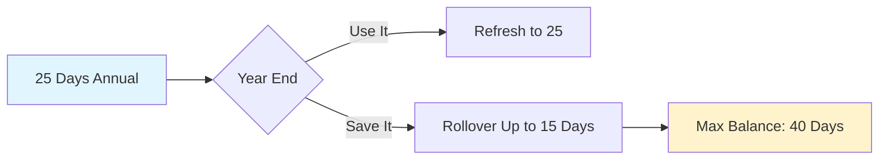
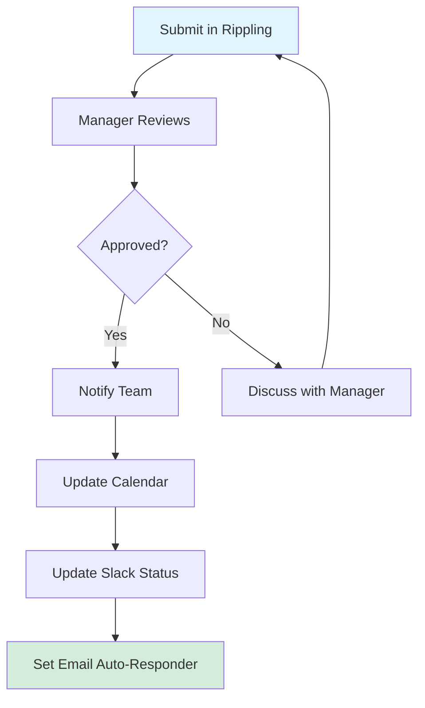

# Paid Time Off (PTO) Policy

## Overview 📋

!!! success "PTO Benefits"

    **25 days PTO annually** (24 days + 1 birthday) + public holidays + unlimited sick leave
    
    Full allocation available from **day one** - no waiting period!

**All time off requests are submitted and approved through [Rippling](https://www.rippling.com/).**

**Policy Effective Dates:**

- PTO Salaried policy: Active from 01/01/2024
- Paid Sick Leave: Active from 07/01/2025

## PTO Entitlement 📅

### Annual Allocation

<div class="grid cards" markdown>

-   :material-calendar-blank: **24 Flexible Days**

    ---

    Use for vacation, personal time, or any reason

-   :material-cake-variant: **1 Birthday Day**

    ---

    Your birthday off as a paid day

-   :material-calendar-star: **Public Holidays**

    ---

    All official holidays in your country

-   :material-medical-bag: **Sick Leave**

    ---

    Unlimited sick days as needed

</div>

!!! info "No Accrual Period"

    Full allocation available **immediately upon hire** - use your PTO from day one!

### Balance Limits



| Limit Type | Amount |
|-----------|--------|
| **Maximum balance** | 40 days total |
| **Annual carryover** | Up to 15 days |
| **Excess days** | Forfeited (use it or lose it!) |

### Tenure Milestones 🎉

Employees earn additional PTO days based on length of service:

| Years of Service | Additional Days | Total Annual PTO |
| ---------------- | --------------- | ---------------- |
| 0-2 years        | +0              | 25 days          |
| 2-4 years        | +1              | 26 days          |
| 4-6 years        | +2              | 27 days          |
| 6-8 years        | +3              | 28 days          |
| 8-10 years       | +4              | 29 days          |
| 10+ years        | +5              | 30 days          |

!!! tip "Automatic Increase"

    Additional days are automatically added to your annual allocation and accrue monthly along with your base PTO.

### Prorated Allocations

!!! info "Mid-Year Hires"

    Mid-year hires receive prorated PTO for the 24 flexible days based on start date.
    
    **Birthday day is always included** regardless of start date!

## Types of Leave 🏖️

=== "Vacation Leave"

    **For planned time off**
    
    - :material-calendar-clock: Submit requests **2 weeks in advance**
    - :material-account-group: Coordinate with your team for coverage
    - :material-calendar-check: Update calendar and Slack status
    
    !!! warning "Longer Trips"
        Provide **1 month notice** for vacations exceeding 2 weeks

=== "Sick Leave"

    **When you're feeling unwell**
    
    - :material-bell-alert: Notify your manager **ASAP**
    - :material-clipboard-check: Update Rippling when able
    - :material-file-document-remove: **No medical documentation** required for short absences
    
    !!! success "Unlimited Policy"
        Take the time you need to recover - no tracking or limits

=== "Public Holidays"

    **Official holidays in your country**
    
    - :material-calendar-star: All official government holidays
    - :material-calendar-today: Holiday calendar published annually
    - :material-home: Automatically included in PTO system

=== "Birthday Leave"

    **Celebrate your special day!**
    
    - :material-cake: Schedule on or near your birthday
    - :material-check-circle: No formal approval needed
    - :material-account-voice: Just inform your team

### Official Holiday Calendars

!!! info "Country-Specific Holiday Calendars"

    === "🇬🇧 United Kingdom"
        [GOV.UK Bank Holidays](https://www.gov.uk/bank-holidays) - Official government bank holidays
    
    === "🇪🇸 Spain"
        [BOE Calendar](https://www.boe.es/diario_boe/calendarios.php) - Official State Gazette (Boletín Official del Estado)
        
        **Madrid:** [City Holidays](https://app.powerbi.com/view?r=eyJrIjoiMWE4ZGU0ZmMtNTI1NC00NWRjLTk3NWYtNTAyMzAwZTI3NDdmIiwidCI6ImI0NTMyYWE2LTE4OTUtNDk2NC1iOWMwLTIyYjE0NDQ0MjcxYiIsImMiOjl9) - Official Madrid city holidays
    
    === "🇨🇳 China"
        [State Council Public Holidays](https://english.www.gov.cn/policies/latestreleases/202411/12/content_WS67331db5c6d0868f4e8ecd92.html) - Official government announcement
    
    === "🇺🇸 United States"
        [OPM Federal Holidays](https://www.opm.gov/policy-data-oversight/pay-leave/federal-holidays/) - Office of Personnel Management

## Requesting Time Off 📝



### Request Process

1. **Submit in Rippling** - All requests go through [Rippling](https://www.rippling.com/)
2. **Manager approval** - Your direct manager approves in Rippling
3. **Update team** - Notify colleagues and update calendar/Slack

### Minimum Notice Requirements

| Leave Type       | Notice Required | Example |
| ---------------- | --------------- | ------- |
| **Planned vacation** | 2 weeks | Submit by May 1 for May 15 trip |
| **Short breaks** | 1 week | Submit by Monday for next Monday |
| **Sick leave** | ASAP | Same-day notification |
| **Birthday leave** | 1 week | Casual team notification |

!!! warning "Longer Vacations"

    **Provide 1 month notice** for vacations exceeding 2 weeks to ensure proper coverage planning.

## Coordination and Coverage 🤝

**Before taking PTO:**

<div class="grid cards" markdown>

-   :material-account-group: **Notify Your Team**

    ---

    Give advance notice and discuss coverage

-   :material-file-document: **Document Work**

    ---

    Record ongoing tasks and handoffs

-   :material-calendar-sync: **Update Systems**

    ---

    Calendar, Slack status, email auto-responder

-   :material-account-switch: **Identify Backup**

    ---

    Designate backup contacts for urgent issues

</div>

!!! tip "Pro Tips for Smooth PTO"

    - Set up email auto-responder with backup contact
    - Document all in-progress work before leaving
    - Have a handoff meeting with your backup
    - Turn on Slack "away" status with return date
    - Set calendar as "Out of Office"

## Unused PTO 📊

!!! warning "Use It or Lose It (Partially)"

    === "Rollover Policy"
    
        - **Up to 15 days** roll over to next calendar year
        - Days beyond 15 are **forfeited**
        - Maximum balance cannot exceed **40 days**
    
    === "No Payout"
    
        - PTO does **not pay out** upon termination
        - Use your time throughout the year!

### Exceptions to Rollover Limits

Exceptions may be considered for:

!!! info "Special Circumstances"

    - Extended illness preventing PTO use
    - Business-critical projects requiring deferral
    - Other exceptional situations
    
    **Manager pre-approval required** - discuss with your manager if you anticipate needing an exception.

## International Considerations 🌍

!!! info "Local Labor Laws"

    Some countries require additional leave benefits beyond this policy.
    
    **When local law provides greater benefits, those requirements apply.**
    
    Contact HR if you have questions about your specific location.

## PTO Examples 💡

??? example "Standard Vacation Request"

    **Scenario:** 2-week vacation in August
    
    ```
    1. June 15: Submit request in Rippling for Aug 1-14
    2. June 16: Manager approves in Rippling
    3. June 20: Notify team in standup
    4. July 25: Document handoffs and set up coverage
    5. July 31: Enable auto-responder, update Slack/calendar
    6. Aug 1-14: Enjoy vacation! 🏖️
    ```

??? example "Sick Day"

    **Scenario:** Wake up feeling ill
    
    ```
    1. 8:00 AM: Slack/email manager: "Feeling unwell, taking sick day"
    2. When able: Submit sick day in Rippling
    3. Next day: Return to work or extend sick leave
    ```

??? example "Birthday Leave"

    **Scenario:** Birthday on Thursday, July 10
    
    ```
    1. July 3: Mention to team: "Taking July 10 off for birthday"
    2. July 8: Submit in Rippling for July 10
    3. July 9: Set auto-responder, update status
    4. July 10: Enjoy your day! 🎂
    ```

??? example "Year-End Rollover"

    **Scenario:** 30 unused days at year-end
    
    ```
    Starting balance: 30 days
    Rollover limit: 15 days
    Forfeited: 15 days
    
    Jan 1 balance: 15 (rollover) + 25 (new allocation) = 40 days
    ```
    
    !!! warning "Use Your Time"
        This employee lost 15 days! Plan vacations throughout the year.

## Questions?

!!! question "Need Help with PTO?"

    | Question Type | Contact |
    |--------------|---------|
    | **Policy questions** | Your manager or HR team |
    | **Rippling issues** | IT Support: [helpdesk@ultralytics.com](mailto:helpdesk@ultralytics.com) |
    | **Special requests** | Your direct manager |
    | **Country-specific rules** | HR team |
