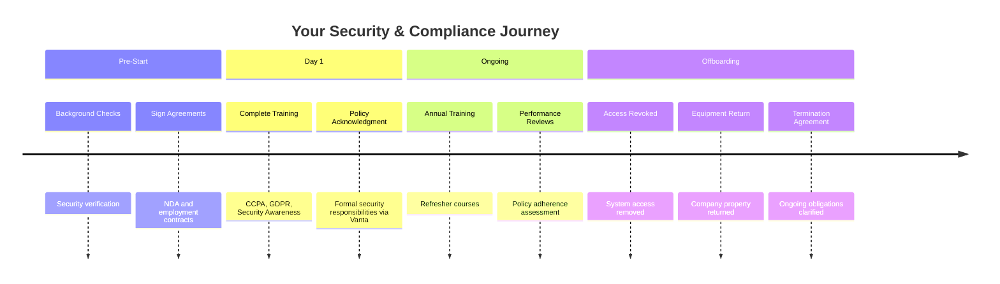
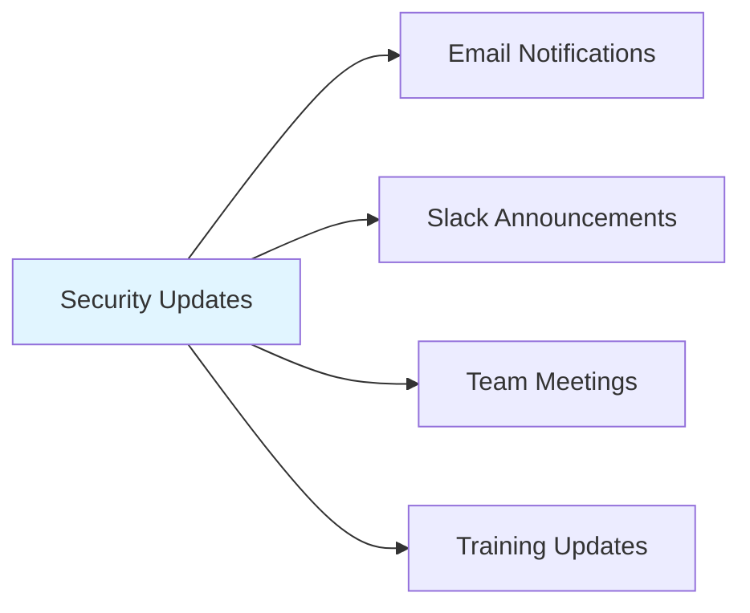

# What to Expect: Security & Compliance Requirements for Employees

Welcome to Ultralytics! This guide explains what you can expect regarding security and compliance requirements during your journey with us.

## Overview

## Before You Start

- :material-account-search: **Background Checks**

    ***

    Standard background verification for all new team members as required by local law. This protects everyone on our team.

- :material-file-sign: **Security Agreements**

    ***
    - **NDA**: Protects confidential information
    - **Employment Contract**: References Code of Business Conduct
    - **Policy Acknowledgment**: Via Vanta compliance system

### Key Documents

!!! info "What You'll Sign"

    === "Non-Disclosure Agreement (NDA)"

        Protects our confidential information, intellectual property, and sensitive business data.

    === "Employment/Contractor Agreement"

        References our [Code of Business Conduct](../legal/code-of-business-conduct-and-ethics.md), outlining values, compliance expectations, and security practices.

    === "Policy Acknowledgment"

        Formal acknowledgment of security responsibilities through [Vanta](https://app.vanta.com/), our compliance management system.

## Required Training

!!! warning "Mandatory Training - Complete During Onboarding"

    All new team members complete these training modules to gain practical knowledge for their role:

=== "General (All Employees)"

    | Training Module | Duration | Platform |
    |----------------|----------|----------|
    | **CCPA Training** | 30 min | Vanta |
    | **GDPR Training** | 30 min | Vanta |
    | **General Security Awareness** | 45 min | Vanta |

    *California privacy law basics and European data protection requirements*

=== "Engineering Teams"

    | Training Module | Duration | Platform |
    |----------------|----------|----------|
    | **Secure Code Training** | 60 min | Vanta |

    *YOLO and Platform teams only: Identifying and preventing security vulnerabilities using OWASP standards*

!!! tip "Training Access"

    Login to [Vanta](https://app.vanta.com/c/ultralytics/employee/onboarding) with your Ultralytics email to access all training modules.

## Ongoing Expectations

### Annual Training

- :material-calendar-refresh: **Annual Refreshers**

    ***

    Complete annual refresher training to stay current on security practices and regulatory requirements.

- :material-bell-ring: **Reminders**

    ***

    Automatic reminders sent when training is due via email and Slack.

- :material-chart-line: **Compliance Tracking**

    ***

    Security & Compliance Team monitors completion to ensure every team remains compliant.

### Performance Reviews

!!! info "What's Assessed"

    Your regular performance reviews include:

    - [x] Job performance and role competence
    - [x] Adherence to company policies and code of conduct
    - [x] Achievement of specific role objectives
    - [x] Security awareness and compliance

### Staying Informed

Security regulations and threats evolve constantly. We'll keep you updated through multiple channels so you're always aware of new requirements and emerging risks.

!!! success "Stay Alert"

    Follow our `#security` and `#compliance` Slack channels for real-time updates.

## When Employment Ends

### Offboarding Process

!!! warning "Timeline & Responsibilities"

    === "Access Revocation"

        - All system access revoked on agreed termination date
        - Immediate removal from all platforms and tools
        - No exceptions for personal data access

    === "Equipment Return"

        - Return all company equipment promptly after last day
        - Includes: laptops, monitors, phones, security keys
        - Ultralytics coordinates pickup or shipping logistics
        - Clean personal data before return

    === "Termination Agreement"

        - Sign agreement clarifying ongoing obligations
        - Confidentiality requirements continue post-employment
        - Non-compete and non-solicitation terms (if applicable)
        - Clear understanding of expectations after departure

### Offboarding Checklist

| Task                       | When          | Owner |
| -------------------------- | ------------- | ----- |
| Sign termination agreement | Last day      | You   |
| Return equipment           | Within 3 days | You   |
| System access revoked      | Last day      | IT    |
| Final expense submission   | Within 7 days | You   |
| Exit interview             | Last week     | HR    |

## Contact & Support

!!! question "Need Help?"

    

    -   :material-security: **Security Issues**

        ---

        [security@ultralytics.com](mailto:security@ultralytics.com)

    -   :material-lifebuoy: **IT Support**

        ---

        [helpdesk@ultralytics.com](mailto:helpdesk@ultralytics.com)
        `#it-support` on Slack

    -   :material-scale-balance: **Legal/Compliance**

        ---

        [legal@ultralytics.com](mailto:legal@ultralytics.com)
        `#compliance` on Slack

    -   :material-account-group: **HR Questions**

        ---

        Contact your manager or HR team

    

## Related Resources

- [Security & Compliance Team](team.md) - Overview of our security team
- [Information Security Management System (ISMS)](isms.md) - Our security framework
- [Code of Business Conduct and Ethics](../legal/code-of-business-conduct-and-ethics.md) - Company standards
- [Social Media Policy](../contributions/social-media-policy.md) - Professional conduct guidelines
