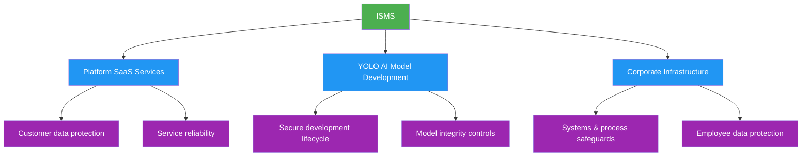

# Information Security Management System (ISMS) 🔐

## Building Trust Through Security Excellence

!!! success "Our Commitment"

    Ultralytics maintains a comprehensive ISMS to protect our customers, partners, and stakeholders. Our security program reflects our commitment to safeguarding data and upholding the highest standards of information security in AI and computer vision technology.

## Our Security Standards

- :material-certificate: **ISO/IEC 27001:2022**

    ***

    Our ISMS follows the internationally recognized ISO/IEC 27001:2022 framework, ensuring systematic and comprehensive security management across all business operations.

- :material-shield-check: **SOC 2 Compliance**

    ***

    Working toward SOC 2 Type I (Q1 2026) and Type II (Q1 2027) compliance, providing independent verification of our security controls for service organizations.

- :material-refresh: **Continuous Improvement**

    ***

    Our security program is based on the **Plan-Do-Check-Act (PDCA)** cycle, driving continuous adaptation to emerging threats and evolving business needs.

## Core Security Objectives

| Objective                               | Description                                                                                                   |
| --------------------------------------- | ------------------------------------------------------------------------------------------------------------- |
| :material-eye-off: **Confidentiality**  | Prevent unauthorized access or disclosure through strict controls on customer and personal information        |
| :material-check-decagram: **Integrity** | Ensure completeness, accuracy, and reliability of data and systems through robust validation and protection   |
| :material-clock-check: **Availability** | Maintain system readiness and uptime backed by defined recovery objectives and business continuity procedures |

## Security Program Coverage

## Governance Structure

- :material-gavel: **ISMS Governance Council**

    ***

    Leaders from Legal, Security, and Engineering oversee ISMS performance and approve key security decisions.

- :material-shield-account: **Security & Compliance Team**

    ***

    A dedicated team operationalizes the ISMS, manages controls, monitors threats, and coordinates audits.

- :material-account-group: **Organization-Wide Responsibility**

    ***

    Every team member has defined security responsibilities, ensuring accountability across all business functions.

## Security Control Framework

| Domain                       | Controls                                                          |
| ---------------------------- | ----------------------------------------------------------------- |
| **Access Management**        | Role-based access with least-privilege principles                 |
| **Data Protection**          | Classification, handling, and protection of sensitive information |
| **Asset Management**         | Lifecycle management of physical and virtual assets               |
| **Third-Party Risk**         | Vendor security assessments and ongoing monitoring                |
| **Incident Response**        | Rapid detection, containment, and resolution procedures           |
| **Business Continuity**      | Disaster recovery and operational resilience planning             |
| **Secure Development**       | Security integrated throughout the software development lifecycle |
| **Vulnerability Management** | Continuous identification and remediation of security weaknesses  |

## Compliance & Audit Program

!!! info "Audit Schedule"

    | Activity | Target |
    | -------- | ------ |
    | Regular risk assessments & internal reviews | Ongoing |
    | SOC 2 Type I & ISO 27001 audit (independent) | Q1 2026 |
    | SOC 2 Type II & ISO 27001 surveillance audit | Q1 2027 |

Our GRC platform (**[Vanta](https://app.vanta.com/)**) provides real-time compliance monitoring and evidence collection across all security controls.

## Transparency & Trust

!!! success "Public Commitment"

    - **[Trust Center](https://trust.ultralytics.com/)**: Key security policies and procedures publicly available
    - **Compliance Attestations**: Certifications and audit reports published post-Q1 2026 audits
    - **Customer Security Reviews**: Detailed security information provided for customer due diligence

## Contact & Resources

!!! question "Security Inquiries"

    | Channel | Details |
    | ------- | ------- |
    | **Email** | [security@ultralytics.com](mailto:security@ultralytics.com) |
    | **Trust Center** | [trust.ultralytics.com](https://trust.ultralytics.com/) |
    | **Open-Source Security Policy** | [docs.ultralytics.com/help/security/](https://docs.ultralytics.com/help/security) |
