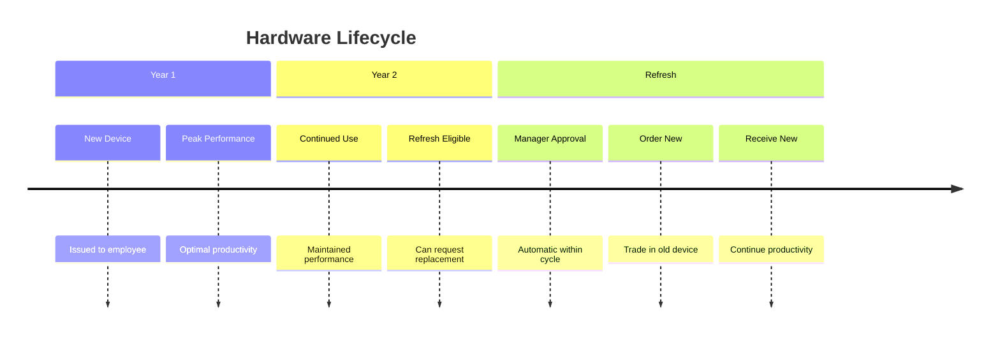
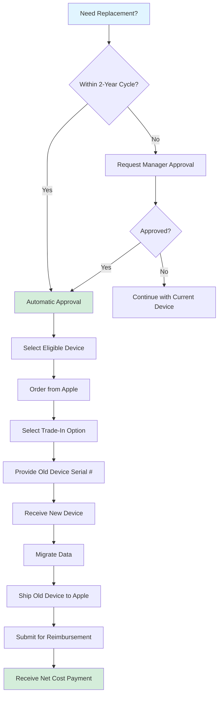
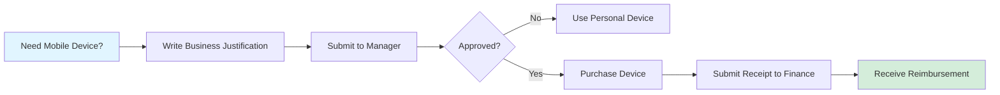
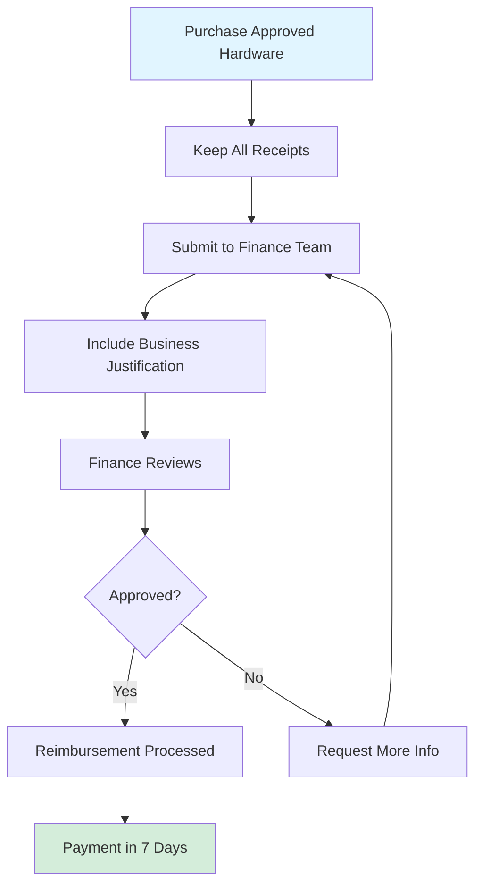

# Hardware Policy 💻

## Purpose and Scope

This policy outlines the provisioning, management, and security of all hardware used by Ultralytics employees. Its purpose is to ensure everyone has the necessary tools to perform their roles effectively while protecting the company's assets and data. This policy applies to all full-time, part-time, and contract employees.

## Hardware Refresh Cycle 🔄

!!! success "2-Year Refresh Cycle"

    **All employees are eligible for a hardware refresh every two years.**

    This ensures our team is equipped with modern and efficient tools.

!!! warning "Outside Standard Cycle"

    Replacement requests outside the 2-year cycle require **direct manager approval** based on performance needs or hardware failure.

## Standard Computer Equipment 🖥️

- :material-laptop: **MacBook Air**

    ***

    [13", M4, 16GB RAM, 256GB Storage](https://www.apple.com/macbook-air/)

    **Default for all employees**

    Balances performance and portability

- :material-laptop: **MacBook Pro**

    ***

    [14", M5, 16GB RAM, 512GB Storage](https://www.apple.com/macbook-pro/)

    **For technical/developer roles**

    Additional processing power

**Note:** The MacBook Pro is heavier than the MacBook Air and may be less suitable for employees who travel frequently.

!!! warning "Keyboard Language"

    **Ensure you order the correct keyboard layout** for your language when requesting equipment.

### Custom Configurations

!!! danger "Requires Manager Approval"

    Any hardware configuration other than the two standards listed above is considered an **exception** and requires:

    - Direct manager approval
    - Clear business justification
    - Written approval before ordering

## New Hire Equipment Process 📦

!!! info "Standard Process - Onsite Positions"

    Most Ultralytics positions are **onsite** (5 days/week) at our London, Madrid, or Shenzhen offices.

**Your manager will coordinate with IT to have equipment ready at your office on your first day.** Equipment includes your computer, all accessories, and a fully set up workspace ready when you arrive - just plug in and start working!

??? note "Exception: Remote Employees"

    For the rare remote positions:

    1. Order your approved equipment configuration independently
    2. Submit receipts to Finance for reimbursement
    3. Follow standard [reimbursement procedures](../finance/index.md#reimbursements)
    4. Confirm purchase details with manager **before ordering**

### Standard Accessories

- :material-headphones: **AirPods Pro**

    ***

    [Apple AirPods Pro](https://www.apple.com/airpods-pro/)

    For all employees

- :material-monitor: **Studio Display**

    ***

    [Apple Studio Display](https://www.apple.com/studio-display/)

    **Onsite employees only** at office desk

## Hardware Replacements & Upgrades 🔧

This process applies when replacing an existing device with a new one (not for new hires).

### Replacement Process

Begin by requesting replacement approval from your manager, which is automatically granted if you're within the 2-year refresh cycle but requires business justification if outside the standard timeline. Once approved, select your eligible device (MacBook Air or MacBook Pro) based on your role requirements and portability needs. Order the new device directly from Apple, ensuring you select the trade-in option during checkout and provide the serial number of your existing device.

Upon receiving your new device, migrate all data from your old device and test functionality thoroughly before returning the old one. Ship your old device back to Apple using the provided trade-in kit and follow the [Apple Trade In](https://www.apple.com/shop/trade-in) instructions. Finally, submit your purchase for reimbursement through Finance procedures. The reimbursed amount will be the net cost (new device price minus trade-in credit), not the full price of the new device.

!!! warning "Approval and Reimbursement Requirements"

    Your manager and Finance team must see the **full order details** including:

    - New device price
    - Estimated trade-in credit for old device
    - Net cost to be reimbursed

## Mobile Device Policy 📱

!!! info "Not Standard Issue"

    Company-provided mobile devices require **manager approval** and clear business justification.

### Eligibility and Justification

- :material-airplane-takeoff: **Frequent Travel**

    ***

    Constant access to work apps and email required

- :material-phone-alert: **On-Call Duties**

    ***

    Immediate response capabilities necessary

- :material-cellphone-check: **Platform Testing**

    ***

    Need to test on specific mobile platforms

### Approval Process

## Device Management & Security 🔒

### Rippling MDM: Mandatory Requirement

!!! danger "Critical Security Requirement"

    **All devices used for work MUST have Rippling MDM installed**

    This applies to:

    - MacBook Air/Pro
    - iPads
    - iPhones
    - Android devices
    - Personal devices (BYOD)

**Installation Required:**

- Install from **[app.rippling.com/enroll-device](https://app.rippling.com/enroll-device)**
- Must be installed **before** accessing any company data
- Failure to install blocks access to company resources

### Security & Compliance Policies

All devices must adhere to these security requirements enforced via Rippling MDM:

- :material-lock: **Encryption**

    ***

    Full disk encryption (FileVault) enabled

- :material-key: **Strong Passwords**

    ***

    Device protected with complex password

- :material-update: **Auto Updates**

    ***

    Security updates enabled automatically

- :material-shield-check: **Compliance**

    ***

    Regular compliance checks performed

- :material-remote: **Remote Management**

    ***

    IT can remotely lock or wipe if needed

!!! warning "Strict Compliance Enforcement"

    Devices without properly configured Rippling MDM:

    - ❌ Not permitted for work use
    - ❌ Blocked from accessing company resources
    - ❌ Cannot access email, Slack, or internal tools

## Bring Your Own Device (BYOD) Policy 🤝

!!! info "Limited Approval"

    While company-provided hardware is the standard, personal devices may be used in **limited, pre-approved circumstances**.

### Requirements for BYOD

| Requirement                 | Details                                          |
| --------------------------- | ------------------------------------------------ |
| **Approval**                | Explicit approval from manager AND IT department |
| **MDM Installation**        | **Mandatory** Rippling MDM enrollment            |
| **Security Compliance**     | Must meet all security policies                  |
| **Employee Responsibility** | You maintain and care for your device            |

!!! tip "Recommendation"

    **Company-provided hardware is strongly recommended** over BYOD for:

    - Better security and compliance
    - Standardized support experience
    - No personal device risk
    - Clear separation of work/personal

## Care, Maintenance, and Support 🛠️

### Employee Responsibility

- :material-hand-heart: **Professional Use**

    ***

    Use equipment professionally and responsibly

- :material-shield-star: **Physical Protection**

    ***

    Keep devices physically protected and clean

- :material-close-circle: **No DIY Repairs**

    ***

    Don't attempt unauthorized repairs

- :material-update: **Install Updates**

    ***

    Install security updates promptly

### Reporting Damage or Loss

!!! danger "Report Immediately to IT Support"

    **Email:** [helpdesk@ultralytics.com](mailto:helpdesk@ultralytics.com)
    **Slack:** `#it-support` channel

    Report any of the following immediately:

    - [ ] Physical damage to equipment
    - [ ] Lost or stolen device
    - [ ] Hardware malfunction
    - [ ] Suspected security incidents or viruses

## Hardware Ownership and Return 📋

### Ownership

!!! info "Company Property"

    All hardware purchased or reimbursed by Ultralytics is **company property**.

### Return Process Upon Departure

**Coordinate with your manager and IT department to return all equipment on your last day:**

- In-person handoff at office (standard)
- IT provides pre-paid shipping labels if needed
- All equipment must be returned within 3 business days

!!! warning "Equipment Return Checklist"

    Before returning equipment:

    - [ ] Back up personal files (nothing personal should be stored)
    - [ ] Sign out of all accounts
    - [ ] Remove personal data
    - [ ] Factory reset not required (IT will handle)
    - [ ] Include all accessories (chargers, cables, etc.)

## Reimbursement Process 💰

All hardware purchases must follow standard company reimbursement procedures:

!!! tip "Reimbursement Tips"

    - Submit all receipts to Finance team
    - Include clear description of business purpose
    - For detailed procedures, see [Finance Handbook](../finance/index.md)
    - Reimbursements typically processed within 7 business days

---

_This policy ensures consistent, secure, and cost-effective hardware provisioning, empowering our global team to achieve its best work. 🚀_
