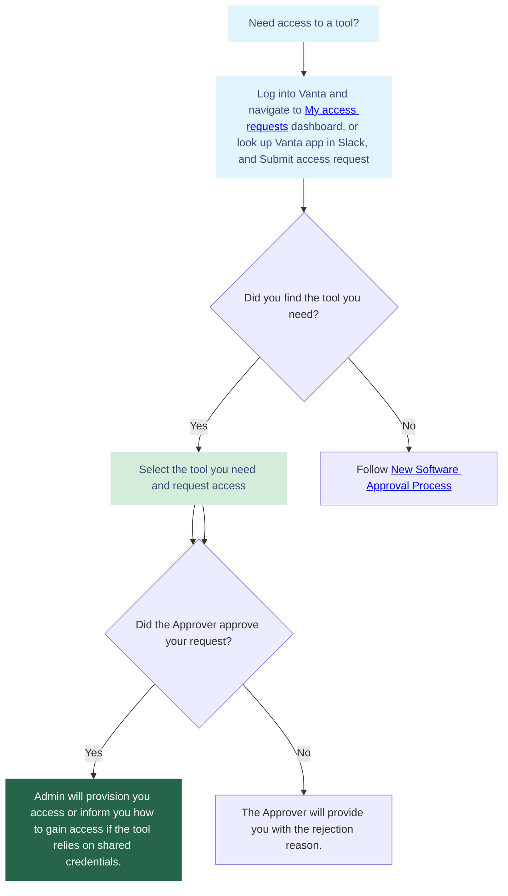

# Software Policy 💾

## 1. Purpose and Guiding Principles

This policy governs the acquisition, installation, and use of all software on company-owned and managed devices. Our goal is to provide employees with the best tools to foster innovation and productivity while maintaining a secure and stable technology environment.

- **Security First:** The integrity of our data and systems is paramount.
- **Legal Compliance:** We use only properly licensed and approved software.
- **Productivity & Collaboration:** We standardize tools to ensure seamless collaboration across our global team.

## 2. Standard Software Suite 💻

All company-provided computers come with a standard suite of pre-installed and approved software to cover core business functions and include the latest security updates.

### Core Application Categories

While the specific application list is maintained by the Security team, the standard suite includes:

- **Operating System:** The latest version of macOS.
- **Productivity Suite:** Core applications for documents, spreadsheets, and presentations (e.g., Google Workspace, Microsoft Office).
- **Communication:** Company-approved tools for email, chat, and video conferencing (e.g., Slack, Google Meet).
- **Security:** Mandatory antivirus, firewall, and device management software (**Rippling**).
- **Web Browsers:** Approved browsers like Google Chrome with required security extensions.
- **Technical Tools:** For developer and technical roles, this includes approved IDEs, code editors, and other development utilities.

## 3. Software Approval & Vendor Lifecycle 📥

To maintain security and compatibility, all software not included in the standard suite must be approved before installation.

!!! note "Team Member Access"

    Some of the links in this section can only be accessed by Ultralytics team members.

### Approval & Installation Process

1. **Manager Approval:** Before you start, check if the vendor already exists in our [Approved Vendor Database](https://www.notion.so/218fe6fef1c3804d9479f0d3dd78ca62?v=218fe6fef1c3819b804e000c8232e2c2&source=copy_link). Once you've confirmed this, send a software request to your direct manager, including a clear business justification and the cost, if any.
2. **Submit Vendor Onboarding Request:** Your manager or any team member on the manager's behalf must submit the request via the [Vendor Onboarding Form](https://www.notion.so/218fe6fef1c38093a6cef5c63000dfaf?pvs=106). This is a mandatory step to understand potential risks from the tools we use.
3. **Multi-Team Review:** The request will be reviewed by Legal and Security teams to ensure comprehensive evaluation before approval.
4. **Final Approval:** Once the Legal and Security teams give their approval, your manager will provide the final sign-off. You can track progress and final sign-off status via this [Tracking Overview](https://www.notion.so/218fe6fef1c3804d9479f0d3dd78ca62?v=218fe6fef1c38004b5d9000c06a69134&source=copy_link).
5. **Purchase & Installation:** For paid software, follow the standard [reimbursement procedures](../finance/index.md#reimbursements).

!!! warning "Prohibition of Unauthorized Software"

    The installation of any software that has not been approved through this process is strictly prohibited. This includes personal software on company devices, unlicensed or "cracked" applications, and any tool that could compromise system security.

### Ongoing Vendor Management

1. **Track Vendor Changes:** Monitor your approved vendors for any significant modifications that could impact security, finance, or compliance requirements.
2. **Submit Change Request:** When updates occur, submit details via the [Vendor Change Form](https://www.notion.so/23ffe6fef1c380ee8e7ad4d73551e188?pvs=106). This ensures our Legal and Security team can assess any new risks. Key changes to report include security incidents, changes in data categories, vendor offboarding, changes in tool ownership, or price changes over $500/year.
3. **Review Process:** The Security, Legal, and Finance teams will evaluate the changes to determine if additional approvals or actions are needed.

## 4. Tool Access Request Process 🛠️

### Requesting Access

Team members can request access to tools through Vanta, either via Slack or the Vanta platform.

### How to Submit a Request

**Via Slack**

- Open Vanta app, navigate to Home tab and select ‘Submit access request’
- See the [Vanta Help Article](https://help.vanta.com/en/articles/11345423-managing-access-requests-in-vanta) for details

**Via Vanta**

- Log into the [Ultralytics Vanta portal](https://app.vanta.com/c/ultralytics/access/systems/request)
- Navigate to ‘My access requests’ from the left-hand menu
- See the [Vanta Help Article](https://help.vanta.com/en/articles/11345423-managing-access-requests-in-vanta) for details

### What to Include in Your Request

When submitting an access request:

1. Select the tool you need
2. Choose the appropriate user role (if applicable)
3. Provide a clear business justification
4. If elevated permissions (e.g. admin, owner) are required, specify this and explain the need
5. Submit the request for approval

Once the **System Approver** approves your request, the **System Admin** will provision access as soon as possible.

### Access Request Workflow

### Best Practice for System Approvers

System Approvers may review access requests via **email, Slack, or directly within Vanta**. Refer to [Vanta guidance for additional information.](https://help.vanta.com/en/articles/11345423-managing-access-requests-in-vanta)

**Approval Guidelines**

- **Respond promptly:** Review requests within one business day
- **Verify necessity:** Ensure the requested access aligns with the team member’s responsibilities
- **Apply least privilege:** Approve only the minimum access level required
- **Confirm justification**: Elevated roles should be approved only with clear, documented business need

### Best Practice for System Admins

System Admins are responsible for provisioning tool access once approved. Provisioning is **not automated** and must be completed manually within each tool.

**Approval Guidelines**

- **Respond promptly:** Provision access within one business day of approval
- **Verify approval:** Confirm approval details before granting access
- **Grant lowest privilege:** Assign the minimum necessary access unless a higher level is explicitly approved
- **Document in Vanta:** Mark the request as ‘Provisioned’ once access is granted
  For assistance, contact the Security & Compliance team in the **#it-support** or **#compliance** Slack channels.

## 5. Acceptable Use Policy 🛡️

### Business vs. Personal Use

Company-provided software and devices are intended primarily for business purposes. However, we permit limited and reasonable personal use provided it:

- Does **not** interfere with your work performance or responsibilities.
- Does **not** compromise the security or integrity of company systems.
- Does **not** violate any other company policies.
- Does **not** incur any additional cost for the company.

### Prohibited Activities

The following activities are strictly forbidden on company devices:

- Using software for any illegal purpose, including copyright infringement.
- Installing or distributing unlicensed, pirated, or unauthorized software.
- Accessing, downloading, or distributing offensive, discriminatory, or pornographic material.
- Circumventing or disabling security measures, including antivirus and MDM software.
- Sharing confidential company information or data through unauthorized platforms.
- Engaging in any activity that could harm the company's reputation or systems.

## 6. Security and Compliance 🔒

Every employee shares the responsibility for protecting our digital assets.

### System & Security Software

- **Antivirus & Malware Protection:** All devices must have company-approved security software installed and running at all times. Tampering with this software is a policy violation.
- **System Updates:** Keep your operating system and all applications updated. Enable automatic updates whenever possible to patch vulnerabilities promptly.
- **Firewall:** The built-in OS firewall must be enabled on all computers.

### Data Security

- **Handling Sensitive Data:** Use only company-approved applications and secure, encrypted channels for storing or transmitting confidential or sensitive information.
- **Backups:** You are responsible for ensuring your critical work files are saved to approved cloud storage solutions (e.g., Google Drive) and not just locally on your device.

### Password Management

- **Password Manager:** Using a company-approved password manager is required. This helps create and store strong, unique passwords for every service.
- **Multi-Factor Authentication (MFA):** MFA must be enabled on all accounts that support it, especially for critical systems like Google Workspace, Slack, and Rippling.

## 7. IT Support 🤝

### How to Get Help

If you have any software-related issues, please reach out in the #it-support Slack channel.

### Service Level Agreements (SLAs)

Our team prioritizes requests to ensure critical issues are handled swiftly.

- **Critical (System-wide outage, security breach):** 1-hour response
- **High (Individual unable to work):** 4-hour response
- **Normal (Minor issue, software request):** 24-hour response

---

_This policy helps us maintain a secure, compliant, and productive software environment. For any questions, please contact your manager or the Security team._
