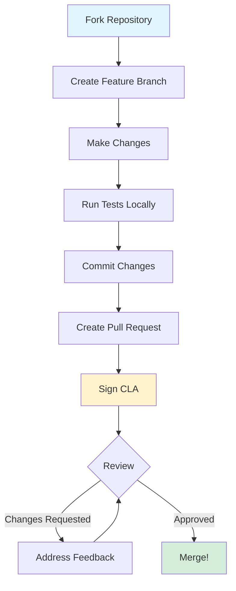

# Development Workflow 💻

This guide covers the development process for contributing to [Ultralytics](https://www.ultralytics.com/) projects, including YOLO11 and related repositories.

## Code of Conduct 🤝

All contributors must adhere to our [Code of Conduct](https://docs.ultralytics.com/help/code-of-conduct/). Respect, kindness, and professionalism are at the heart of our community. For detailed contribution guidelines, see the [Official Contributing Guide](https://docs.ultralytics.com/help/contributing/).

## Pull Request Process 🔄



### 1. Fork the Repository

[Fork](https://docs.github.com/en/pull-requests/collaborating-with-pull-requests/working-with-forks/fork-a-repo) the relevant Ultralytics repository (e.g., [ultralytics/ultralytics](https://github.com/ultralytics/ultralytics)) to your GitHub account.

```bash
# Clone your fork
git clone https://github.com/YOUR_USERNAME/ultralytics.git
cd ultralytics
```

### 2. Create Feature Branch

[Create a branch](https://docs.github.com/en/desktop/making-changes-in-a-branch/managing-branches-in-github-desktop) with a clear, descriptive name:

```bash
git checkout -b fix-issue-123
```

!!! tip "Branch Naming Conventions"

    - `fix-issue-123` for bug fixes
    - `add-feature-xyz` for new features
    - `update-docs-training` for documentation

### 3. Make Your Changes

<div class="grid cards" markdown>

-   :material-check-circle: **Follow Guidelines**

    ---

    Adhere to project style guidelines

-   :material-alert-circle: **Avoid Errors**

    ---

    Don't introduce new warnings

-   :material-target: **Stay Focused**

    ---

    Keep changes minimal and targeted

</div>

### 4. Test Your Changes

!!! warning "Testing Required"

    Test locally before submitting:
    
    ```bash
    pytest tests/
    ```
    
    Add tests for new functionality to prevent regressions.

Learn more: [Testing Requirements](ci-testing.md), [Model Validation](https://docs.ultralytics.com/modes/val/), [CI Workflows](https://docs.ultralytics.com/help/CI/)

### 5. Commit Your Changes

[Commit](https://docs.github.com/en/desktop/making-changes-in-a-branch/committing-and-reviewing-changes-to-your-project-in-github-desktop) with concise, descriptive messages:

```bash
git commit -m "Fix #123: Corrected calculation error"
```

!!! tip "Commit Message Best Practices"
    - Use present tense ("Add feature" not "Added feature")
    - Reference issue numbers when applicable
    - Keep subject line under 72 characters

### 6. Create Pull Request

[Submit PR](https://docs.github.com/en/pull-requests/collaborating-with-pull-requests/proposing-changes-to-your-work-with-pull-requests/creating-a-pull-request) from your branch to `main`:

=== "PR Checklist"

    - [ ] Clear title describing the change
    - [ ] Detailed description of purpose and scope
    - [ ] Link related issues
    - [ ] Include screenshots for UI changes
    - [ ] Tests passing locally

### 7. Sign the CLA

!!! warning "Required Before Merge"

    You must sign our [Contributor License Agreement (CLA)](https://docs.ultralytics.com/help/CLA/) to ensure contributions are properly licensed under the [AGPL-3.0 license](https://www.ultralytics.com/legal/agpl-3-0-software-license).

After submitting your PR, add this comment:

```
I have read the CLA Document and I sign the CLA
```

The CLA bot will guide you through the process. For more details on licensing, see our [contributing guide](https://docs.ultralytics.com/help/contributing/).

### 8. Address Review Feedback

Respond to reviewer comments and push updates.

## Google-Style Docstrings 📝

All functions and classes require [Google-style docstrings](https://google.github.io/styleguide/pyguide.html) with types in parentheses.

### Standard Function

```python
def example_function(arg1, arg2=4):
    """Example function demonstrating Google-style docstrings.

    Args:
        arg1 (int): The first argument.
        arg2 (int): The second argument.

    Returns:
        (bool): True if arguments are equal, False otherwise.

    Examples:
        >>> example_function(4, 4)  # True
        >>> example_function(1, 2)  # False
    """
    return arg1 == arg2
```

### Named Returns

```python
def example_function(arg1, arg2=4):
    """Example function with named return.

    Args:
        arg1 (int): The first argument.
        arg2 (int): The second argument.

    Returns:
        equals (bool): True if arguments are equal, False otherwise.

    Examples:
        >>> example_function(4, 4)  # True
    """
    equals = arg1 == arg2
    return equals
```

### Multiple Returns

```python
def example_function(arg1, arg2=4):
    """Example function with multiple returns.

    Args:
        arg1 (int): The first argument.
        arg2 (int): The second argument.

    Returns:
        equals (bool): True if arguments are equal, False otherwise.
        added (int): Sum of both input arguments.

    Examples:
        >>> equals, added = example_function(2, 2)  # True, 4
    """
    equals = arg1 == arg2
    added = arg1 + arg2
    return equals, added
```

**Important:** Document each return value separately, not as a tuple.

✅ **Good:**

```
Returns:
    (np.ndarray): Predicted masks with shape HxWxN.
    (list): Confidence scores for each instance.
```

❌ **Bad:**

```
Returns:
    (tuple): Tuple containing:
        - (np.ndarray): Predicted masks with shape HxWxN.
        - (list): Confidence scores for each instance.
```

### With Type Hints

```python
def example_function(arg1: int, arg2: int = 4) -> bool:
    """Example function with type hints.

    Args:
        arg1: The first argument.
        arg2: The second argument.

    Returns:
        True if arguments are equal, False otherwise.

    Examples:
        >>> example_function(1, 1)  # True
    """
    return arg1 == arg2
```

### Single-Line Docstrings

```python
def example_small_function(arg1: int, arg2: int = 4) -> bool:
    """Example function with a single-line docstring."""
    return arg1 == arg2
```

## Code Standards 📐

### Python Style

| Standard | Requirement | Example |
|----------|-------------|----------|
| **Line Width** | 120 characters max | Keep lines readable and scannable |
| **Docstrings** | [Google-style](https://google.github.io/styleguide/pyguide.html) | Types in parentheses |
| **Imports** | `pathlib` over `os` | Modern, cross-platform paths |
| **Type Hints** | Use when beneficial | Improves IDE support |
| **Functions** | <50 lines ideally | Keep focused and testable |

### Code Quality

!!! success "Quality Checklist"

    === "Clean Code"
        - [x] No unused imports or variables
        - [x] Consistent naming (`lowercase_with_underscores`)
        - [x] Clear variable names (avoid single letters except loop counters)
    
    === "Formatting"
        - [x] Use f-strings for string formatting
        - [x] Comments only for complex logic
        - [x] [Ruff Formatter](https://github.com/astral-sh/ruff) for consistency

### Best Practices

<div class="grid cards" markdown>

-   :material-content-copy: **Avoid Duplication**

    ---

    Reuse existing code - DRY principle

-   :material-focus-field: **Smaller Changes**

    ---

    Focused modifications > large-scale changes

-   :material-lightbulb-on: **Simplify**

    ---

    Look for simplification opportunities

-   :material-shield-check: **Compatibility**

    ---

    Avoid breaking existing code

-   :material-test-tube: **Add Tests**

    ---

    Include tests for new features

-   :material-format-paint: **Consistent Format**

    ---

    Use [Ruff Formatter](https://github.com/astral-sh/ruff)

</div>

## Testing Requirements ✅

All PRs must pass CI tests:

```bash
# Run tests locally
pytest tests/

# With coverage
pytest --cov=ultralytics tests/
```

See [CI/Testing](ci-testing.md) for CI details.

## Code Review Guidelines 👀

### For Contributors

- Keep PRs focused on single feature/fix
- Respond promptly to feedback
- Don't take feedback personally
- Update PR description if scope changes

### For Reviewers

- Review within 1-2 business days
- Check unit tests for new features
- Review documentation updates
- Evaluate performance impact
- Verify CI tests pass
- Provide constructive, specific feedback
- Recognize author's effort

## Git Best Practices 🌳

### Commits

- Present tense: "Add feature" not "Added feature"
- Clear, descriptive messages
- Focused, logical commits

### Branches

- Pull latest `main` before creating branches
- Rebase on `main` before final submission
- Delete branches after merge

## Reporting Bugs 🐞

Report bugs via [GitHub Issues](https://github.com/ultralytics/ultralytics/issues):

1. **Check existing issues** first
2. **Provide [Minimum Reproducible Example](https://docs.ultralytics.com/help/minimum-reproducible-example/)**
3. **Describe environment**: OS, Python version, library versions, hardware (use `yolo checks` for diagnostics)
4. **Explain expected vs actual behavior** with error messages

For common issues and solutions, see our [troubleshooting guide](https://docs.ultralytics.com/guides/yolo-common-issues/).

## License 📜

Ultralytics uses [AGPL-3.0](https://www.ultralytics.com/legal/agpl-3-0-software-license). If using Ultralytics code in your project, your entire project must be open-sourced under AGPL-3.0. If you prefer not to open-source, obtain an [Enterprise License](https://www.ultralytics.com/license).

## Resources 📚

- [Official Contributing Guide](https://docs.ultralytics.com/help/contributing/) - Complete contribution guidelines
- [CI/Testing](ci-testing.md) - Continuous integration details
- [Documentation](documentation.md) - Writing and maintaining docs
- [Code of Conduct](https://docs.ultralytics.com/help/code-of-conduct/) - Community standards
- [Ultralytics Blog](https://www.ultralytics.com/blog) - Latest updates and tutorials
- [Community Events](https://www.ultralytics.com/events) - Webinars and conferences
