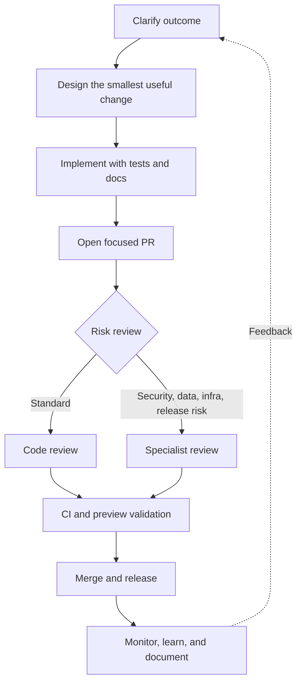

# Engineering Workflow

Ultralytics engineering moves quickly because work is made visible, reviewed by the right people, tested before it reaches users, and documented well enough for the next teammate to build on it. This page defines the operating model for employees shipping code, documentation, infrastructure, models, internal tools, and production changes.

For external contributors, use the [contributing guide](https://docs.ultralytics.com/help/contributing/), [Code of Conduct](https://docs.ultralytics.com/help/code-of-conduct/), and [CLA instructions](https://docs.ultralytics.com/help/CLA/).

## Engineering Principles

- **Protect users first:** Reliability, privacy, security, and licensing constraints are part of the product, not late-stage cleanup.
- **Ship small, useful increments:** Prefer narrow pull requests with clear outcomes over large changes that are hard to review, test, or roll back.
- **Make tradeoffs explicit:** Record the reason for material architecture, data, product, or operational decisions where future maintainers will find them.
- **Review with ownership:** Reviewers are accountable for catching correctness, security, maintainability, and user-impact risks within their area of expertise.
- **Automate repeatable checks:** CI, formatting, tests, dependency scanning, and deployment validation should catch routine failures before humans spend time on them.
- **Leave the system easier to operate:** Every change should improve or preserve observability, documentation, testability, and operational clarity.

## Workflow Overview

```mermaid
flowchart TD
    A[Clarify outcome] --> B[Design the smallest useful change]
    B --> C[Implement with tests and docs]
    C --> D[Open focused PR]
    D --> E{Risk review}
    E -->|Standard| F[Code review]
    E -->|Security, data, infra, release risk| G[Specialist review]
    F --> H[CI and preview validation]
    G --> H
    H --> I[Merge and release]
    I --> J[Monitor, learn, and document]
    J -. Feedback .-> A
```

## Planning

Start with the user or business outcome, then choose the smallest implementation path that can prove the result. Good planning makes later review faster because scope, risk, and success criteria are already visible.

Before implementation, clarify:

- **Owner:** Who is accountable for the change from design through rollout?
- **Outcome:** What user, employee, compliance, reliability, or business problem does this solve?
- **Scope:** What is intentionally included, and what is deferred?
- **Risk:** Could this affect production availability, model behavior, customer data, billing, licenses, security, privacy, or public documentation?
- **Validation:** What tests, previews, metrics, manual checks, or reviewer expertise will prove the change works?
- **Rollback:** How can the change be reverted, disabled, or mitigated if it misbehaves?

Use [Product Development](product-development.md) for product discovery and prioritization, [CI/Testing](ci-testing.md) for validation strategy, and the security handbook pages for security or compliance-sensitive work.

## Execution Standards

### Branches and Commits

- Branch from current `main` and keep branches short-lived.
- Name branches by intent, such as `fix-export-timeout`, `add-training-metrics`, or `docs-release-runbook`.
- Keep commits logically grouped and use present-tense messages, such as `Add deployment health check`.
- Rebase or merge current `main` before final review when the branch has drifted.

### Pull Requests

Every PR should make the reviewer successful quickly:

- Explain the problem, the chosen solution, and any meaningful alternatives rejected.
- Link issues, Linear tasks, incidents, Slack threads, design notes, or customer context when relevant.
- Include screenshots, previews, logs, benchmark output, or API examples for user-visible changes.
- Call out migrations, feature flags, secrets, configuration, release steps, and rollback paths.
- Keep unrelated cleanup out of the PR unless it directly reduces the risk of the requested change.

### Code and Documentation

- Follow the local style of the repository before introducing new abstractions.
- Prefer clear, boring code over cleverness, especially in shared infrastructure and model-serving paths.
- Add type hints, docstrings, comments, and examples where they reduce ambiguity for future maintainers.
- Update user docs, internal runbooks, API examples, or configuration references in the same PR as behavior changes.
- Use [Documentation](documentation.md) when writing or reorganizing handbook and public documentation content.

## Review Model

### Standard Review

All production-bound changes require at least one qualified reviewer who is not the author. The reviewer should evaluate:

- Correctness and edge cases
- Test coverage and failure modes
- Maintainability and fit with existing architecture
- Performance, memory, and dependency impact
- Documentation and operational readiness
- Compatibility with public APIs, saved models, datasets, configs, and user workflows

### Higher-Risk Review

Require additional review when a change touches:

- Authentication, authorization, secrets, encryption, or access control
- Customer data, employee data, analytics, telemetry, or retention behavior
- Payments, licensing, legal, compliance, or business-critical workflows
- Deployment infrastructure, CI/CD, release automation, or production configuration
- Model training, evaluation, export, inference, or benchmark behavior
- Public APIs, model formats, CLI behavior, package metadata, or breaking changes

For higher-risk changes, use at least two independent reviewers when practical, with one reviewer owning domain expertise for the affected system. If urgency prevents the normal review path, document the exception, ship the smallest safe fix, and schedule follow-up review immediately after stabilization.

### Reviewer Expectations

- Review within one business day when tagged as a required reviewer, or redirect quickly.
- Be specific about blocking issues versus suggestions.
- Ask for evidence when correctness depends on tests, benchmarks, logs, screenshots, or rollout checks.
- Check security, privacy, reliability, and user-impact risks directly instead of assuming CI covers them.
- Approve only when the change is understandable, tested for its risk level, and ready to operate.

### Author Expectations

- Self-review before requesting review.
- Respond to every unresolved comment or mark it clearly as deferred with rationale.
- Keep the PR description current if scope changes.
- Avoid force-pushing during active review unless needed to resolve history or conflicts.
- Thank reviewers through fast, clear follow-through rather than by adding social overhead.

## Security and Compliance

Security-sensitive work needs early review, not late approval. Involve the relevant owner before implementation when a change introduces or modifies:

- Authentication, authorization, permissions, or account lifecycle behavior
- Secrets, tokens, encryption keys, credentials, or signing workflows
- Data collection, storage, deletion, sharing, export, or retention
- External integrations, webhooks, network boundaries, or third-party APIs
- File upload, path handling, deserialization, shell execution, or dependency loading
- License enforcement, enterprise controls, or compliance evidence

Minimum expectations:

- Validate and sanitize untrusted input.
- Avoid logging secrets, personal data, customer data, or sensitive model artifacts.
- Use parameterized queries and safe SDK methods for data access.
- Apply least privilege for services, tokens, runners, and cloud resources.
- Keep dependencies current and document exceptions for vulnerable packages.
- Make incident response easier with clear logs, alerts, ownership, and rollback paths.

## Testing and Quality Gates

Testing should match the blast radius of the change. A docs typo does not need the same validation as a model export change, but every PR needs enough evidence for reviewers to trust it.

| Change Type | Expected Validation |
| --- | --- |
| Documentation | Preview build, link checks when practical, screenshots for layout changes |
| UI or website | Preview URL, responsive screenshots, accessibility and interaction checks |
| Python library | Unit tests, integration tests for changed workflows, lint and format checks |
| Model behavior | Before/after metrics, reproducible eval commands, dataset and hardware notes |
| Infrastructure | Plan output, staging validation, rollback path, monitoring checks |
| Security-sensitive | Security review, abuse cases, dependency scan, auditability check |

Quality gates for production-bound work:

- Relevant CI jobs pass.
- New behavior is covered by tests or a documented manual validation path.
- User-facing changes include docs or release notes where appropriate.
- Rollback or mitigation is known before merge.
- Monitoring is available for changes that can affect production reliability.

See [CI/Testing](ci-testing.md) for repository-specific testing guidance.

## Release Readiness

Before merging or deploying, confirm:

- The PR is up to date with `main` or conflicts are intentionally resolved.
- Required reviews are complete and unresolved comments are addressed.
- Feature flags, migrations, config changes, and secrets are ready.
- Backward compatibility has been considered for APIs, CLIs, model files, datasets, and docs links.
- Release notes, changelog entries, or customer communications are prepared if users will notice the change.
- The owner knows what to monitor after release and how to roll back.

For risky rollouts, prefer feature flags, staged deploys, canaries, or limited exposure before broad release.

## Incidents and Operational Learning

When something breaks, stabilize first, then learn without blame.

During an incident:

- Assign an incident owner and a communication owner.
- Keep a concise timeline of symptoms, decisions, mitigations, and customer impact.
- Prefer reversible mitigations before broad refactors.
- Capture commands, dashboards, logs, and deployment identifiers needed for the post-incident review.

After stabilization:

- Write down root causes and contributing factors.
- Identify missing tests, alerts, runbooks, ownership, or review steps.
- Create follow-up tasks with owners and due dates.
- Update documentation so the next responder starts with better context.

## Knowledge Sharing

Engineering work should compound. Share context in places that survive the week:

- Add architecture notes for non-obvious system decisions.
- Keep runbooks close to the systems they operate.
- Use short demos or written summaries for changes that affect multiple teams.
- Pair or record walkthroughs for critical systems with narrow ownership.
- Move repeated Slack answers into docs, examples, tests, or automation.

## Employee Checklist

Use this before requesting review or merging:

- [ ] The outcome and scope are clear.
- [ ] The PR is focused and understandable.
- [ ] Tests, previews, or manual validation evidence are included.
- [ ] Security, privacy, licensing, and compliance risks are considered.
- [ ] Docs, runbooks, examples, or release notes are updated when behavior changes.
- [ ] Required reviewers have the right domain context.
- [ ] Rollback or mitigation is known.
- [ ] Post-release monitoring is clear for production-impacting changes.

## Resources

- [Product Development](product-development.md)
- [CI/Testing](ci-testing.md)
- [Documentation](documentation.md)
- [Security & Compliance Team](../security/team.md)
- [Information Security Management System](../security/isms.md)
- [Employee Security & Compliance Requirements](../security/employee-security-compliance-requirements.md)
- [Ultralytics Contributing Guide](https://docs.ultralytics.com/help/contributing/)
