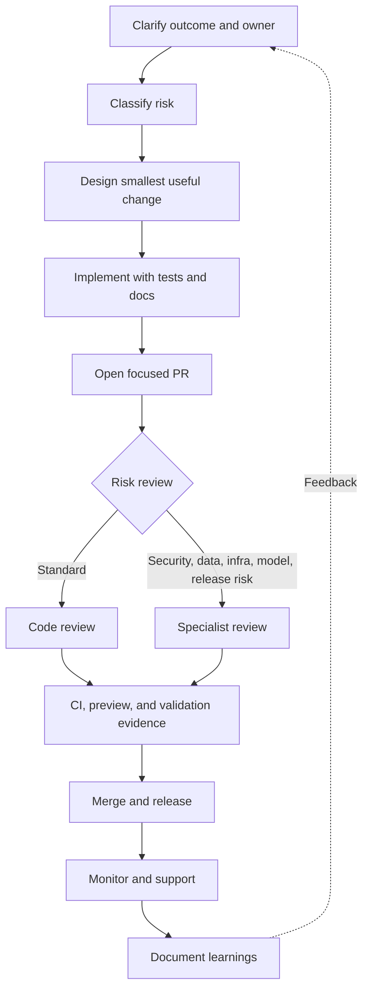
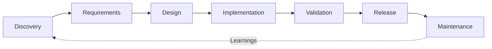
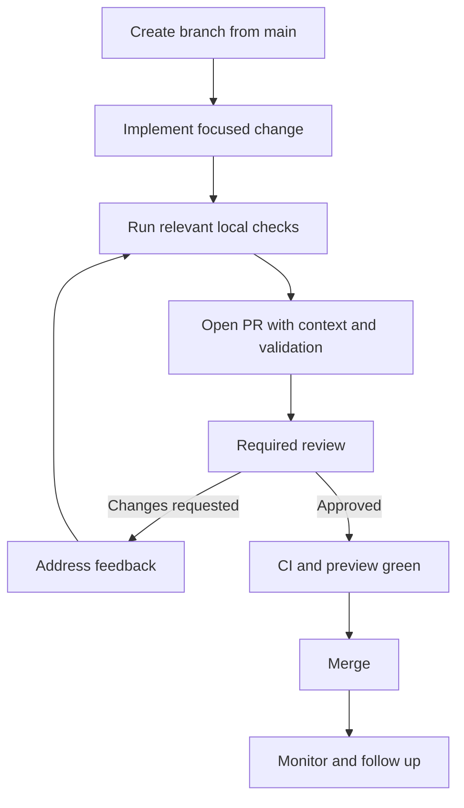

# Engineering Workflow

This page defines how Ultralytics employees turn ideas, issues, customer needs, security requirements, and internal improvements into shipped work. It applies to software, documentation, infrastructure, AI models, datasets, demos, internal tools, public websites, automation, and production operations.

The goal is not process for its own sake. The goal is faster, safer shipping: clear ownership, small changes, strong review, useful tests, simple rollback, and durable documentation.

External contributors should use the [Ultralytics contributing guide](https://docs.ultralytics.com/help/contributing/), [Code of Conduct](https://docs.ultralytics.com/help/code-of-conduct/), and [CLA instructions](https://docs.ultralytics.com/help/CLA/). Employees should use those public standards too, but this handbook page adds internal expectations for planning, ownership, security, release readiness, and operational follow-through.

## What Good Looks Like

A good engineering change at Ultralytics has these properties:

- **Clear outcome:** The PR explains what user, customer, employee, reliability, compliance, or business problem it solves.
- **Small review surface:** The diff is focused enough that reviewers can reason about correctness and risk.
- **Visible risk:** Security, privacy, licensing, API compatibility, model behavior, production reliability, and docs impact are called out directly.
- **Proof:** Tests, screenshots, previews, logs, benchmarks, model metrics, or manual validation steps are included.
- **Ready to operate:** The owner knows how the change will be monitored, rolled back, documented, and supported after merge.
- **Useful record:** Future teammates can understand why the change was made without reconstructing context from private chats.

<div class="grid cards" markdown>

- :material-target: **Outcome**

    ***

    Start with the user, customer, employee, or operational result.

- :material-source-pull: **Focused Diff**

    ***

    Keep the change small enough for real review.

- :material-shield-check: **Risk Visible**

    ***

    Call out security, privacy, licensing, compatibility, and reliability impact.

- :material-test-tube: **Evidence**

    ***

    Attach tests, previews, screenshots, logs, or metrics.

- :material-rocket-launch: **Release Ready**

    ***

    Know the rollout, monitor, support, and rollback path.

- :material-book-open-page-variant: **Durable Context**

    ***

    Leave decisions where future teammates can find them.

</div>

## Operating Principles

- **Protect users first:** Reliability, privacy, security, licensing, and trust are product features.
- **Prefer boring code:** Clear, conventional code is easier to review, debug, benchmark, and maintain.
- **Ship in useful increments:** A small change that reaches users safely beats a large branch that stays private for weeks.
- **Design for review:** Structure work so the right expert can review the right part without reading unrelated churn.
- **Automate repeatable checks:** Formatting, linting, tests, link checks, dependency scans, builds, and deploy previews should catch routine failures.
- **Make decisions durable:** Architectural choices, risk exceptions, rollout plans, and incident learnings belong in docs, issues, PRs, or runbooks.
- **Leave the system easier to operate:** Each change should preserve or improve observability, testability, documentation, and ownership.

## Collaboration Cadence

Ultralytics is fast-moving and distributed, so the workflow must support both async depth and high-bandwidth coordination.

- **Anchor Days, Tuesday to Thursday:** Use these days for code reviews, design reviews, architecture debates, debugging sessions, launch readiness, and work that benefits from synchronous discussion.
- **Monday and Friday:** Favor deep work, written updates, PR preparation, documentation, and async decision records.
- **Standups and team syncs:** Keep status lightweight. Escalate blockers, ownership ambiguity, security questions, and cross-team dependencies.
- **Design discussions:** Capture the conclusion in an issue, PR description, decision record, or handbook page. A Slack thread is not enough for durable engineering context.
- **Reviews:** Required reviewers should respond within one business day or redirect quickly to someone better placed to review.

## Workflow Overview


```mermaid
flowchart TD
    A[Clarify outcome and owner] --> B[Classify risk]
    B --> C[Design smallest useful change]
    C --> D[Implement with tests and docs]
    D --> E[Open focused PR]
    E --> F{Risk review}
    F -->|Standard| G[Code review]
    F -->|Security, data, infra, model, release risk| H[Specialist review]
    G --> I[CI, preview, and validation evidence]
    H --> I
    I --> J[Merge and release]
    J --> K[Monitor and support]
    K --> L[Document learnings]
    L -. Feedback .-> A
```

## Work Classification

Classifying work early helps employees choose the right planning, review, and validation path.

| Work Type              | Typical Examples                                            | Minimum Expectation                                        |
| ---------------------- | ----------------------------------------------------------- | ---------------------------------------------------------- |
| Documentation          | Handbook page, public docs, tutorial, changelog             | Preview build, link validation, clear owner                |
| Product feature        | UI, API, CLI, workflow, integration                         | Product context, tests, docs, rollout plan                 |
| Library change         | Python package, SDK, export path, config behavior           | Unit and integration tests, compatibility review           |
| Model or AI behavior   | Training, validation, export, inference, benchmarks         | Reproducible metrics, dataset notes, model behavior review |
| Infrastructure         | CI, deploys, cloud config, secrets, monitoring              | Staging or dry-run validation, rollback path, owner        |
| Security or compliance | Auth, data handling, permissions, licensing, audit evidence | Security review, abuse cases, least-privilege check        |
| Hotfix                 | Production issue, broken release, urgent customer blocker   | Smallest safe patch, expedited review, post-fix follow-up  |

## Planning

Start with a short written plan when work is bigger than a routine fix. The plan can live in a GitHub issue, Linear task, PR description, design note, or project document.

### Planning Questions

- **Owner:** Who is accountable from implementation through rollout?
- **Outcome:** What changes for users, customers, employees, maintainers, or operations?
- **Scope:** What is included, what is explicitly out of scope, and what can ship later?
- **Interfaces:** Does this touch public APIs, CLI behavior, package metadata, docs URLs, model formats, datasets, configs, or integrations?
- **Risk:** Could this affect security, privacy, licensing, production availability, model quality, billing, customer data, employee data, or compliance evidence?
- **Validation:** What tests, previews, benchmarks, screenshots, logs, manual checks, or reviewers will prove it works?
- **Rollout:** Will this be behind a feature flag, staged release, canary, preview, or immediate merge?
- **Rollback:** How can the change be reverted, disabled, mitigated, or communicated if it fails?

### Lightweight Planning Template

Use this structure for medium or high-risk work:

```markdown
## Outcome

What problem are we solving, and for whom?

## Scope

Included:
Deferred:

## Risks

Security:
Privacy or data:
Compatibility:
Reliability:
Model or product behavior:

## Validation

Automated:
Manual:
Benchmarks or metrics:

## Rollout

Owner:
Release path:
Monitoring:
Rollback:
```

## Secure SDLC

Ultralytics uses a lightweight secure software development life cycle. The same phases apply whether the work is a model change, public docs update, internal tool, cloud deployment, or package release. The amount of ceremony should match the risk.


```mermaid
flowchart LR
    A[Discovery] --> B[Requirements]
    B --> C[Design]
    C --> D[Implementation]
    D --> E[Validation]
    E --> F[Release]
    F --> G[Maintenance]
    G -. Learnings .-> A
```

!!! tip "Scale the process to the risk"

    A small docs correction may only need a preview build and one reviewer. A change to authentication, model export, production infrastructure, or license behavior needs earlier design review, stronger validation, and a clearer rollback plan.

### Phase 1: Discovery

Define the problem, user impact, business value, and owner.

- Identify affected users, systems, repositories, data, and stakeholders.
- Confirm whether the work is a bug fix, feature, policy requirement, incident follow-up, security improvement, or operational task.
- Check existing issues, PRs, docs, and customer reports before creating duplicate work.
- Decide whether the change needs product, security, legal, compliance, support, or infrastructure input.

Deliverables for larger work:

- Problem statement
- Owner and reviewers
- Success criteria
- Initial risk classification

### Phase 2: Requirements

Translate the problem into behavior that can be tested and reviewed.

- Define functional requirements.
- Define non-functional requirements: performance, latency, cost, accessibility, reliability, security, privacy, and maintainability.
- Identify datasets, model checkpoints, external services, secrets, feature flags, environments, and user permissions.
- Document compatibility expectations for APIs, CLIs, configs, model formats, docs links, and saved artifacts.

Deliverables for larger work:

- Acceptance criteria
- Data and privacy notes
- Test plan
- Rollout assumptions

### Phase 3: Design

Choose the smallest design that solves the problem without creating hidden operational cost.

- Prefer existing patterns and helpers in the repository.
- Avoid new dependencies unless they reduce meaningful complexity or are standard for the domain.
- Design for observability and rollback where production systems are involved.
- Document tradeoffs for architecture, model behavior, API shape, storage, or security controls.
- Ask for design review before implementation when the change affects multiple systems.

Deliverables for larger work:

- Architecture or data-flow notes
- API or interface examples
- Security and privacy considerations
- Rollout and rollback plan

### Phase 4: Implementation

Implement in focused increments.

- Keep PRs reviewable. Split mechanical refactors from behavior changes when practical.
- Follow local code style and project conventions.
- Add tests with the implementation, not as an afterthought.
- Update docs, examples, configuration references, and runbooks in the same PR as behavior changes.
- Avoid unrelated formatting, renames, dependency upgrades, and cleanup unless they directly reduce risk.

### Phase 5: Validation

Prove the change works at a level that matches its risk.

- Run relevant local tests before requesting review.
- Include CI results, screenshots, preview URLs, logs, benchmark output, or manual validation notes in the PR.
- For model changes, include datasets, commands, hardware, seeds when relevant, and before/after metrics.
- For infrastructure changes, include plan output, staging validation, smoke tests, or monitoring checks.
- For documentation, verify the page builds and links resolve.

### Phase 6: Release

Merge only when the change is reviewed, validated, documented, and ready to operate.

- Confirm required reviews are complete.
- Confirm CI and previews are passing.
- Confirm migrations, feature flags, secrets, config, and deployment steps are ready.
- Confirm release notes, changelog entries, docs updates, or customer communications are ready if users will notice the change.
- Confirm rollback or mitigation is known.

### Phase 7: Maintenance

Support the change after merge.

- Watch the relevant dashboards, errors, support channels, issues, and usage signals.
- Respond quickly to regressions.
- Close follow-up tasks or document why they are deferred.
- Update tests, alerts, docs, and runbooks based on what was learned.

## Branches and Commits

### Branches

- Branch from current `main`.
- Keep branches short-lived and rebase or merge from `main` when the branch drifts.
- Use descriptive names: `fix-export-timeout`, `add-training-metrics`, `docs-release-runbook`, `ci-link-check`.
- Delete branches after merge unless they are maintained release branches.

### Commits

- Use present tense: `Add export validation`, not `Added export validation`.
- Keep commits logically grouped.
- Reference issues when useful.
- Avoid mixing formatting-only changes with behavior changes unless formatting is the entire purpose.
- Do not rewrite shared branch history while others are actively working from it without coordinating.

## Pull Requests

PRs are the main engineering record. A strong PR lets reviewers understand the problem, inspect the solution, validate the risk, and support the release.


```mermaid
flowchart TD
    A[Create branch from main] --> B[Implement focused change]
    B --> C[Run relevant local checks]
    C --> D[Open PR with context and validation]
    D --> E[Required review]
    E -->|Changes requested| F[Address feedback]
    F --> C
    E -->|Approved| G[CI and preview green]
    G --> H[Merge]
    H --> I[Monitor and follow up]
```

### PR Description

Every meaningful PR should include:

- **Summary:** What changed and why.
- **Context:** Issue, customer report, incident, design discussion, or business driver.
- **Validation:** Tests, commands, screenshots, preview URLs, benchmark output, logs, or manual checks.
- **Risk:** Security, privacy, licensing, compatibility, performance, model quality, docs, or release concerns.
- **Rollout:** Feature flags, migrations, release notes, monitoring, and rollback when relevant.

Example:

```markdown
## Summary

- Adds validation for exported ONNX metadata.
- Updates docs with the new warning behavior.

## Context

Fixes customer reports where invalid metadata caused downstream runtime failures.

## Validation

- `pytest tests/export/test_metadata.py`
- Manual export with YOLO11n on macOS and Linux

## Risk

Low. Validation is additive and only rejects malformed metadata.

## Rollout

Ships in the next package release. Revert this PR if downstream integrations fail unexpectedly.
```

### PR Size

Use smaller PRs when:

- The change touches multiple subsystems.
- A refactor is needed before behavior changes.
- Generated files or formatting obscure the important diff.
- The work needs different reviewers for product, model, infrastructure, security, or docs.

Larger PRs are acceptable when:

- The change is mostly generated and easy to verify.
- Splitting would create broken intermediate states.
- The PR includes a migration that must stay atomic.
- Reviewers have enough context and validation evidence to approve confidently.

## Code Standards

Ultralytics repositories may have different tooling, but these expectations are common across engineering work.

### General Code Quality

- Keep functions focused and names specific.
- Prefer structured APIs and parsers over ad hoc string manipulation.
- Use existing helpers before adding new abstractions.
- Make errors actionable and avoid hiding failures behind broad exception handling.
- Avoid logging secrets, tokens, credentials, customer data, personal data, or private model artifacts.
- Keep dependencies minimal, maintained, and justified.
- Preserve backward compatibility unless the breaking change is intentional, documented, and approved.

### Python Guidelines

| Standard   | Expectation                                                                |
| ---------- | -------------------------------------------------------------------------- |
| Formatting | Use the repository formatter and lint settings                             |
| Line width | Follow the repository configuration, commonly 120 characters               |
| Paths      | Prefer `pathlib` over manual path string handling                          |
| Strings    | Prefer f-strings for interpolation                                         |
| Types      | Use type hints where they improve readability, IDE support, or API clarity |
| Imports    | Keep imports ordered, minimal, and free of unused symbols                  |
| Comments   | Explain non-obvious decisions, not obvious syntax                          |

### Google-Style Docstrings

Public functions and classes should use Google-style docstrings where the repository expects them. Keep docstrings accurate, concise, and useful.

```python
def example_function(arg1: int, arg2: int = 4) -> bool:
    """Return whether two integer arguments are equal.

    Args:
        arg1 (int): The first integer.
        arg2 (int): The second integer.

    Returns:
        (bool): True when both arguments are equal.

    Examples:
        >>> example_function(4, 4)
        True
    """
    return arg1 == arg2
```

For multiple return values, document each returned value separately when that is the local project convention:

```python
Returns:
    masks (np.ndarray): Predicted masks with shape HxWxN.
    scores (list[float]): Confidence scores for each instance.
```

## AI and Model Engineering Standards

Ultralytics engineering often changes systems where correctness is not only pass or fail. Model behavior, training reproducibility, export compatibility, and benchmark quality require extra care.

### Model Behavior Changes

When changing training, validation, prediction, export, tracking, benchmarking, or model configuration:

- State what behavior is expected to change.
- Include before/after metrics when practical.
- Name datasets, splits, model variants, hardware, runtime, seeds, and command lines used for validation.
- Check impact on speed, memory, accuracy, exported formats, and downstream tooling.
- Consider whether docs, examples, tutorials, release notes, or migration guidance need updates.

### Dataset and Evaluation Changes

- Document dataset source, version, license, and split assumptions.
- Avoid leaking private, customer, or restricted data into public tests or examples.
- Make evaluation commands reproducible.
- Keep benchmark comparisons fair and clearly scoped.
- Preserve historical comparability unless the metric definition intentionally changes.

### Export and Compatibility

Export changes can affect many downstream users. Validate the relevant formats before merge when touched:

- ONNX
- TensorRT
- CoreML
- OpenVINO
- TensorFlow or TFLite
- TorchScript
- Edge or mobile runtime paths

If full validation is expensive, document which formats were tested and why the remaining risk is acceptable.

## Review Model

### Standard Review

All production-bound changes require at least one qualified reviewer who is not the author. The reviewer should evaluate:

- Correctness and edge cases
- Test coverage and validation evidence
- Maintainability and fit with existing architecture
- Security, privacy, and licensing risk
- Performance, memory, dependency, and operational impact
- Documentation and release readiness
- Compatibility with public APIs, CLIs, configs, saved models, datasets, and user workflows

### Higher-Risk Review

Use additional review when a change touches:

- Authentication, authorization, secrets, encryption, or access control
- Customer data, employee data, telemetry, analytics, retention, or deletion
- Payments, licensing, legal, compliance, or audit evidence
- Deployment infrastructure, CI/CD, runners, release automation, or production config
- Model training, evaluation, export, inference, benchmarks, or default model behavior
- Public APIs, model formats, CLI behavior, package metadata, or breaking changes
- High-traffic docs pages, installation paths, or onboarding-critical workflows

For higher-risk changes, use at least two independent reviewers when practical. At least one reviewer should have domain expertise in the affected system.

### Reviewer Expectations

- Respond within one business day when tagged as required reviewer, or redirect quickly.
- Separate blocking issues from suggestions.
- Ask for evidence when correctness depends on tests, benchmarks, logs, screenshots, or rollout checks.
- Check security, privacy, reliability, and user-impact risks directly.
- Verify docs and examples when behavior changes.
- Approve only when the change is understandable, validated, and ready to operate.

### Author Expectations

- Self-review before requesting review.
- Explain non-obvious design choices in the PR description or comments.
- Respond to every unresolved review thread.
- Keep the PR description current when scope changes.
- Avoid force-pushing during active review unless it is needed to resolve conflicts or clean up history.
- Convert repeated review feedback into tests, docs, helpers, or automation where practical.

## Security and Compliance

Security-sensitive work needs early review, not late approval. Involve the relevant owner before implementation when a change introduces or modifies:

!!! warning "Ask early for security-sensitive changes"

    If a change touches authentication, authorization, secrets, customer data, employee data, license enforcement, file handling, shell execution, or third-party integrations, involve the right reviewer before the implementation is mostly finished.

- Authentication, authorization, permissions, or account lifecycle behavior
- Secrets, tokens, encryption keys, credentials, signing, or certificate workflows
- Data collection, storage, deletion, sharing, export, retention, or anonymization
- External integrations, webhooks, network boundaries, or third-party APIs
- File upload, archive extraction, path handling, deserialization, shell execution, or dependency loading
- License enforcement, enterprise controls, compliance evidence, or audit trails

Minimum expectations:

- Validate and sanitize untrusted input.
- Use safe SDK methods and parameterized queries for data access.
- Apply least privilege for services, tokens, runners, and cloud resources.
- Avoid exposing sensitive information in errors, logs, screenshots, artifacts, or telemetry.
- Pin or constrain dependencies where supply-chain risk is meaningful.
- Document accepted risk and follow-up owners when a vulnerability cannot be fixed immediately.

## Testing and Quality Gates

Testing should match the blast radius of the change. A copy edit does not need the same validation as an export-path change, but every PR needs enough evidence for reviewers to trust it.

| Change Type        | Expected Validation                                                         |
| ------------------ | --------------------------------------------------------------------------- |
| Documentation      | Preview build, link checks when practical, screenshots for layout changes   |
| UI or website      | Preview URL, responsive screenshots, accessibility and interaction checks   |
| Python library     | Unit tests, integration tests for changed workflows, lint and format checks |
| CLI or API         | Tests for success, failure, backward compatibility, and docs examples       |
| Model behavior     | Before/after metrics, reproducible commands, dataset and hardware notes     |
| Export path        | Format-specific smoke tests and downstream compatibility notes              |
| Infrastructure     | Plan output, staging validation, rollback path, monitoring checks           |
| Security-sensitive | Security review, abuse cases, dependency scan, auditability check           |

### Local Validation

Run the checks that are relevant to the repository and change. Common examples:

=== "Documentation"

    ```bash
    python3 docs/build_docs.py
    ```

    Use previews and screenshots for layout changes. Use link checks when editing navigation, resource lists, redirects, or public URLs.

=== "Python"

    ```bash
    ruff check .
    ruff format --check .
    pytest tests/
    ```

    Add focused tests for new behavior and regression tests for bug fixes.

=== "Model Behavior"

    ```bash
    yolo val model=yolo11n.pt data=coco8.yaml
    yolo predict model=yolo11n.pt source=path/to/images
    ```

    Include commands, datasets, hardware, and before/after metrics when model behavior, export, or runtime performance changes.

If a relevant check cannot be run locally, say why in the PR and provide another form of evidence.

### CI Expectations

Before merge:

- Required CI jobs pass.
- Failures are understood and fixed, not ignored.
- Flaky failures are investigated when they affect confidence in the change.
- New tests cover new behavior or the PR documents why manual validation is the right approach.
- Build, link, and preview failures in documentation PRs are resolved.

## Documentation and Knowledge Sharing

Documentation is part of the work when behavior changes.

Update docs when a change affects:

- User behavior, APIs, CLIs, configs, installation, deployment, or troubleshooting
- Employee workflows, runbooks, ownership, support, or incident response
- Security, compliance, legal, licensing, or data handling
- Model behavior, metrics, examples, training, validation, prediction, or export
- Onboarding paths for customers, contributors, or employees

Knowledge should live where future teammates will look:

- Code comments for local implementation choices
- PR descriptions for change history
- Issues or decision records for design tradeoffs
- Runbooks for operational procedures
- Handbook pages for employee workflows
- Public docs for user-facing behavior

## Release Readiness

Before merging or deploying, confirm:

- The PR is up to date with `main` or conflicts are intentionally resolved.
- Required reviews are complete.
- Unresolved comments are addressed or explicitly deferred with owner and rationale.
- CI, preview, and validation evidence are passing.
- Feature flags, migrations, config, secrets, and deploy steps are ready.
- Backward compatibility has been considered for APIs, CLIs, model files, datasets, configs, and docs links.
- Release notes, changelog entries, docs updates, or customer communications are prepared if users will notice the change.
- The owner knows what to monitor after release and how to roll back.

For risky rollouts, prefer:

- Feature flags
- Staged deployment
- Canary release
- Limited beta
- Preview environment
- Fast rollback

## Hotfixes

Hotfixes are for urgent issues where waiting for the normal path would create unacceptable user, customer, security, or operational impact.

!!! danger "Hotfixes still need a paper trail"

    Urgency can compress review timelines, but it should not erase ownership, validation, rollback, or follow-up work. Keep the fix narrow and document the reason for the exception.

Hotfix rules:

- Keep the fix as small as possible.
- Get at least one qualified reviewer unless the system is actively down and no reviewer is available.
- Document the reason for urgency in the PR.
- Prefer reversible mitigation over broad refactor.
- Add follow-up tasks for tests, docs, cleanup, and root-cause work.
- After stabilization, review whether the normal process needs better alerts, tests, runbooks, or ownership.

## Incidents and Operational Learning

When something breaks, stabilize first, then learn without blame.

### During an Incident

- Assign an incident owner.
- Assign a communication owner when users, customers, or multiple teams are affected.
- Keep a concise timeline of symptoms, decisions, mitigations, deployments, and customer impact.
- Capture commands, dashboards, logs, error IDs, deployment IDs, and links needed for analysis.
- Prefer mitigation first, root-cause refactoring later.

### After Stabilization

- Document root causes and contributing factors.
- Identify missing tests, alerts, runbooks, dashboards, review steps, or ownership.
- Create follow-up tasks with owners and due dates.
- Update docs and automation so the next responder starts with better context.
- Share the learning with affected teams.

## Employee Checklists

### Before Opening a PR

- [ ] The outcome is clear.
- [ ] The scope is focused.
- [ ] The risk classification is understood.
- [ ] Tests, docs, and validation evidence are planned.
- [ ] Security, privacy, licensing, model, and compatibility risks are considered.
- [ ] The PR description explains context and validation.

### Before Requesting Review

- [ ] The diff has been self-reviewed.
- [ ] Local checks relevant to the change have been run.
- [ ] Generated files and formatting changes are intentional.
- [ ] Screenshots, previews, logs, metrics, or benchmark evidence are attached when useful.
- [ ] Docs, examples, runbooks, or release notes are updated when behavior changes.
- [ ] Required reviewers have the right domain context.

### Before Merge

- [ ] Required reviews are complete.
- [ ] CI and previews pass.
- [ ] Unresolved review comments are addressed or explicitly deferred.
- [ ] Rollout and rollback are clear.
- [ ] Monitoring is clear for production-impacting changes.
- [ ] Follow-up tasks have owners.

## License and Contributor Requirements

Ultralytics repositories may combine open-source, commercial, employee-only, and customer-facing work. Employees are responsible for respecting the licensing and contributor requirements of the repository they are changing.

- Public contributions should follow the [Ultralytics contributing guide](https://docs.ultralytics.com/help/contributing/).
- External contributors must sign the [Contributor License Agreement](https://docs.ultralytics.com/help/CLA/) before merge.
- Code distributed under the [AGPL-3.0 license](https://www.ultralytics.com/legal/agpl-3-0-software-license) has obligations that must be understood before reuse.
- Commercial or closed-source use may require an [Ultralytics Enterprise License](https://www.ultralytics.com/license).
- Ask the legal or security owner before changing license headers, package metadata, attribution, third-party dependency licensing, or enterprise controls.

## Resources

- [Product Development](product-development.md)
- [CI/Testing](ci-testing.md)
- [Documentation](documentation.md)
- [Security & Compliance Team](../security/team.md)
- [Information Security Management System](../security/isms.md)
- [Employee Security & Compliance Requirements](../security/employee-security-compliance-requirements.md)
- [Ultralytics Contributing Guide](https://docs.ultralytics.com/help/contributing/)
- [Ultralytics Code of Conduct](https://docs.ultralytics.com/help/code-of-conduct/)
- [Ultralytics CLA](https://docs.ultralytics.com/help/CLA/)
- [Minimum Reproducible Example Guide](https://docs.ultralytics.com/help/minimum-reproducible-example/)
- [Model Validation](https://docs.ultralytics.com/modes/val/)
- [CI Workflows](https://docs.ultralytics.com/help/CI/)
- [GitHub Pull Request Documentation](https://docs.github.com/en/pull-requests)
- [GitHub Branch Documentation](https://docs.github.com/en/desktop/making-changes-in-a-branch/managing-branches-in-github-desktop)
- [Ultralytics Blog](https://www.ultralytics.com/blog)
- [Ultralytics Events](https://www.ultralytics.com/events)
