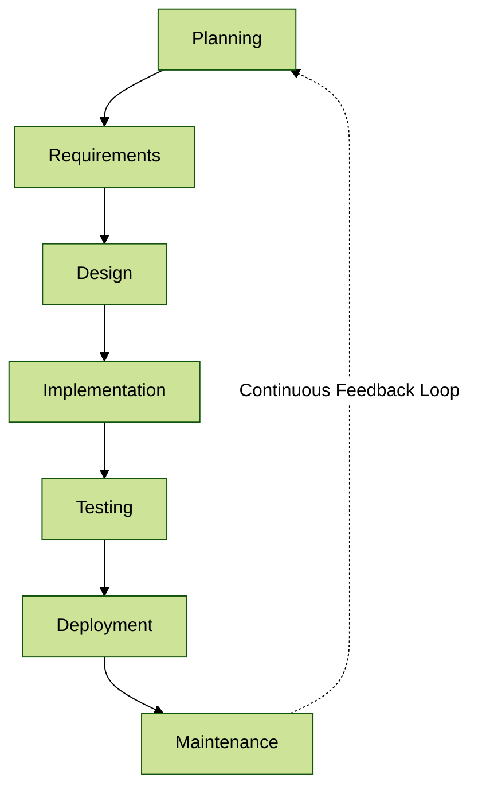

# Ultralytics Engineering Workflows

## Our Mission

Ultralytics engineers, contributors, and maintainers build robust, secure, and useful systems that advance computer vision and artificial intelligence. Our engineering practices prioritize code quality, security, collaboration, and operational reliability so our products remain trustworthy for users, customers, and teammates.

This page defines the engineering standards employees should use when planning, implementing, reviewing, testing, documenting, deploying, and maintaining changes across Ultralytics repositories and systems. External contributors should also follow the [Ultralytics contributing guide](https://docs.ultralytics.com/help/contributing/), [Code of Conduct](https://docs.ultralytics.com/help/code-of-conduct/), and [CLA instructions](https://docs.ultralytics.com/help/CLA/).

## Core Engineering Principles

Our engineering culture is built on a small set of practical principles:

<div class="grid cards" markdown>

- :material-code-braces: **Code Quality**

    ***

    Write clear, maintainable, well-tested code that future teammates can understand and extend.

- :material-shield-check: **Security First**

    ***

    Consider security, privacy, licensing, and abuse cases throughout design, implementation, review, and release.

- :material-account-group: **Collaborative Development**

    ***

    Use review, documentation, and shared ownership to improve quality and spread context.

- :material-school: **Continuous Learning**

    ***

    Adopt better tools and practices when they improve reliability, velocity, or user outcomes.

- :material-file-document-outline: **Transparency**

    ***

    Capture important engineering decisions in issues, PRs, docs, runbooks, or decision records.

- :material-clipboard-check: **Accountability**

    ***

    Own the impact of your changes from implementation through rollout, support, and follow-up.

</div>

## Collaboration Cadence

Ultralytics moves quickly, so the development workflow should make it easy to combine deep work with fast review.

- **Anchor Days (Tuesday to Thursday):** Use these days for design reviews, architecture discussions, debugging, release readiness, and code reviews that benefit from synchronous discussion.
- **Monday and Friday:** Favor deep work, written updates, PR preparation, documentation, and async decision-making.
- **Standups and reviews:** Keep status updates concise. Escalate blockers, ambiguous ownership, customer impact, and security-sensitive work early.
- **Durable decisions:** Capture important decisions in the PR, issue, design note, runbook, or handbook. Do not leave critical engineering context only in chat.

## Code Review Standards

### Mandatory Code Review Policy

All code changes to production branches must undergo review before merging. This policy protects users, improves quality, spreads knowledge, and reduces operational and security risk.

#### One Reviewer Requirement

**Policy:** Every production-bound pull request must receive approval from at least one qualified reviewer who is not the author.

**Rationale:** Independent review mitigates undetected bugs, security vulnerabilities, compatibility issues, and architecture drift. No individual, regardless of experience or role, should routinely merge production changes without another qualified person reviewing the change.

**Implementation:**

- Configure GitHub branch protection rules to require approving review where appropriate.
- Do not rely on PR authors to approve their own changes.
- Choose reviewers with relevant context for the affected code, model, docs, infrastructure, or operational path.
- Keep PRs focused enough that reviewers can reason about correctness and risk.

#### Multiple Reviewer Policy

**Policy:** Critical systems, security-sensitive changes, infrastructure changes, release automation, model behavior changes, and major feature implementations should receive at least two independent reviews when practical.

**Rationale:** Multiple reviewers improve:

- **Continuity:** Reduces dependency on a single person for review coverage.
- **Quality assurance:** Different perspectives catch different classes of defects.
- **Knowledge distribution:** Spreads understanding of systems and decisions.
- **Risk mitigation:** Adds separation of duties for sensitive or high-impact changes.
- **Delivery reliability:** Prevents releases from depending on one unavailable reviewer.

**Implementation:**

- Require deeper review for core algorithms, security features, data-handling paths, deployment infrastructure, release tooling, and public API changes.
- Include at least one reviewer with domain expertise for the affected system.
- Establish a clear escalation path when the right reviewers are unavailable.
- Document exceptions for urgent fixes and schedule follow-up review after stabilization.

### Pull Request Preparation

Every meaningful PR should make review easier by explaining the problem, the solution, and the proof that the change works.

=== "Author Checklist"

    - [ ] Explain what changed and why.
    - [ ] Link relevant issues, incidents, customer reports, design notes, or discussion threads.
    - [ ] Include tests, commands, screenshots, previews, logs, benchmark output, or manual validation notes.
    - [ ] Call out security, privacy, licensing, model, compatibility, release, or rollback concerns.
    - [ ] Update docs, examples, runbooks, or release notes when behavior changes.

=== "Review Checklist"

    - [ ] Confirm the change solves the stated problem.
    - [ ] Check edge cases, failure modes, compatibility, and operational impact.
    - [ ] Review tests and validation evidence.
    - [ ] Check security, privacy, licensing, dependency, and data-handling risks.
    - [ ] Verify docs or examples are updated when user-visible behavior changes.

### Review Guidelines

#### For Reviewers

**Technical Review Focus:**

- Verify functionality, logic correctness, and edge cases.
- Assess performance, memory, runtime, and dependency impact.
- Check for security vulnerabilities and abuse paths.
- Evaluate maintainability, readability, and fit with established patterns.
- Ensure tests, documentation, and operational notes match the risk of the change.
- Consider compatibility with public APIs, CLIs, model formats, configs, datasets, and user workflows.

**Review Process:**

- Provide constructive, specific feedback with clear rationale.
- Distinguish blockers from suggestions.
- Ask for evidence when correctness depends on tests, logs, screenshots, benchmarks, or rollout checks.
- Test critical changes locally when needed.
- Approve only when the change meets the expected quality bar and is ready to operate.

#### For Authors

**Pre-Review Preparation:**

- Write a clear PR description explaining purpose, scope, validation, and risks.
- Include relevant tests and documentation updates.
- Perform a self-review before requesting review.
- Ensure relevant CI jobs pass or explain any known failures.
- Break large changes into smaller, reviewable pieces when practical.

**During Review:**

- Respond promptly to reviewer feedback and questions.
- Provide additional context or evidence when requested.
- Address unresolved feedback before requesting re-review.
- Keep the PR description current if scope changes.
- Maintain professional, direct communication focused on the quality of the work.

## Security Standards

### Security Review Requirements

Code changes involving any of the following require additional security consideration and may require specialist review:

- Authentication and authorization mechanisms
- Permissions, roles, access control, and account lifecycle behavior
- Secrets, credentials, tokens, signing keys, or certificates
- Data encryption and decryption
- Customer data, employee data, telemetry, analytics, retention, export, or deletion
- External API integrations, webhooks, and data exchanges
- Database queries and data access patterns
- File upload, archive extraction, path handling, deserialization, and storage
- Network communications and protocols
- Input validation and sanitization
- License enforcement, enterprise controls, compliance evidence, or audit trails

!!! warning "Ask for security input early"

    Security-sensitive changes should not wait until the end of implementation for review. Involve the relevant owner during planning or design when the change affects access control, data handling, secrets, file handling, shell execution, external integrations, licensing, or compliance evidence.

### Security Best Practices

- Validate and sanitize all untrusted input.
- Use parameterized queries and safe SDK methods for data access.
- Apply least privilege for users, services, runners, tokens, and cloud resources.
- Keep dependencies current and document temporary exceptions for vulnerable packages.
- Avoid logging secrets, personal data, customer data, credentials, or sensitive model artifacts.
- Implement error handling that helps operators debug without exposing sensitive information.
- Use secure coding practices for cryptographic operations.
- Make incident response easier with clear logs, alerts, ownership, and rollback paths.

## Documentation Standards

Documentation is part of the engineering workflow. If behavior changes, the relevant documentation should usually change in the same PR.

### Code Documentation

- Include clear, concise docstrings for public functions, classes, and modules where the repository expects them.
- Document complex algorithms, non-obvious business logic, and security-sensitive decisions with focused comments.
- Maintain up-to-date README files for project components.
- Document API endpoints, CLI behavior, configuration options, and examples where relevant.
- Keep docs close to the code or workflow they explain when practical.

### Architecture Documentation

- Maintain system architecture diagrams and design documents for significant systems.
- Document integration patterns and data flow between components.
- Keep deployment, configuration, and rollback documentation current.
- Create troubleshooting guides and runbooks for common operational issues.
- Record material design tradeoffs where future maintainers can find them.

### Public and Handbook Documentation

- Use [Documentation](documentation.md) for handbook and docs contribution guidance.
- Update public docs when users, customers, contributors, or integrations will notice a change.
- Use screenshots or preview links for visual changes.
- Verify links and navigation when moving or renaming pages.

## Testing Requirements

Testing should match the blast radius of the change. A typo fix does not need the same validation as a model export change, but every PR needs enough evidence for reviewers to trust it.

### Automated Testing

- Write unit tests for new functionality and regression tests for bug fixes.
- Add integration tests for critical user workflows and cross-component behavior.
- Maintain end-to-end tests for core product paths where practical.
- Ensure relevant tests pass in CI before merging.
- Prefer focused tests that clearly explain the behavior being protected.

### Manual Testing

- Perform manual testing for user interface and documentation layout changes.
- Conduct security testing for authentication, authorization, file handling, and data access changes.
- Test performance under expected load when performance could be affected.
- Verify compatibility across supported platforms, runtimes, formats, and environments.
- Capture screenshots, preview URLs, logs, commands, or metrics in the PR when useful.

### Validation Examples

=== "Documentation"

    ```bash
    python3 docs/build_docs.py
    ```

    Use preview builds and screenshots for layout changes. Check links when editing navigation, redirects, resource lists, or public URLs.

=== "Python"

    ```bash
    ruff check .
    ruff format --check .
    pytest tests/
    ```

    Use the repository's actual commands when they differ from these examples.

=== "Model Behavior"

    ```bash
    yolo val model=yolo11n.pt data=coco8.yaml
    yolo predict model=yolo11n.pt source=path/to/images
    ```

    Include datasets, commands, model variants, hardware, and before/after metrics when training, validation, export, inference, or benchmark behavior changes.

## Secure Software Development Life Cycle (SDLC)

Ultralytics follows a structured, security-focused SDLC that supports consistent quality across software, infrastructure, documentation, and AI model development. The process should scale with risk: simple changes can move quickly, while security-sensitive or production-critical changes need deeper planning, validation, and review.

### SDLC Framework Overview

Our SDLC consists of seven phases, each with defined deliverables, security checkpoints, and quality gates:


```mermaid
%%{init: {'theme': 'forest', 'themeVariables': {'primaryColor': '#01579b', 'edgeLabelBackground':'#ffffff', 'tertiaryColor': '#e1f5fe'}}}%%

flowchart TD
    A[Planning] --> B[Requirements]
    B --> C[Design]
    C --> D[Implementation]
    D --> E[Testing]
    E --> F[Deployment]
    F --> G[Maintenance]
    G -.->|Continuous Feedback Loop| A
```

### Phase 1: Planning

**Objective:** Establish project scope, ownership, timeline, validation strategy, and security considerations from the outset.

**Key Activities:**

- Define project objectives and success criteria.
- Identify the owner, stakeholders, reviewers, and affected systems.
- Conduct initial threat modeling and risk assessment when applicable.
- Establish security, privacy, licensing, and compliance needs.
- Create a project timeline with review and validation milestones.
- Plan for model performance benchmarks and evaluation metrics when AI behavior is affected.

**Security Checkpoints:**

- Security impact assessment
- Data privacy and compliance review
- Infrastructure security planning
- Third-party dependency evaluation

**Deliverables:**

- Project brief or issue with owner and scope
- Risk assessment notes
- Resource and reviewer plan
- Security or compliance checklist when needed

### Phase 2: Requirements Gathering

**Objective:** Define functional and non-functional requirements, including security, performance, reliability, and scalability.

**Key Activities:**

- Gather and document functional requirements.
- Define non-functional requirements such as performance, scalability, reliability, accessibility, privacy, and security.
- Establish data requirements, sources, retention, and access patterns.
- Define model accuracy, latency, export, and performance benchmarks when applicable.
- Create user stories, acceptance criteria, and rollback expectations.
- Document regulatory, legal, licensing, and compliance requirements when relevant.

**Security Checkpoints:**

- Data classification and handling requirements
- Authentication and authorization requirements
- Input validation and sanitization requirements
- Encryption and data protection standards

**Deliverables:**

- Requirements notes or specification
- Security requirements matrix for sensitive changes
- Data handling and privacy requirements
- Performance and scalability criteria

### Phase 3: Design

**Objective:** Create an architecture and implementation plan that incorporates security, maintainability, and operational readiness.

**Key Activities:**

- Design system architecture and component interactions.
- Create model architecture, training, evaluation, or inference pipeline design when relevant.
- Design data flow and processing workflows.
- Plan API specifications and integration points.
- Design security controls and access management.
- Create database, storage, deployment, and rollback designs.

**Security Checkpoints:**

- Architecture security review
- Threat modeling and attack surface analysis
- Security control design validation
- Data flow security assessment

**Deliverables:**

- System architecture diagrams or notes
- Model architecture or pipeline specifications
- API design documentation
- Security architecture notes
- Database design or data model notes

### Phase 4: Implementation

**Objective:** Develop secure, high-quality changes following established coding standards and repository conventions.

**Key Activities:**

- Implement features according to design specifications.
- Develop model training, validation, export, or inference changes with reproducible validation.
- Create automated tests for new behavior and regressions.
- Implement security controls and validation.
- Update documentation, examples, and code comments.
- Conduct regular code reviews.

**Security Checkpoints:**

- Secure coding practices enforcement
- Security-focused code review
- Static Application Security Testing (SAST) where available
- Dependency vulnerability scanning

**Deliverables:**

- Production-ready code with relevant documentation
- Trained models or model behavior changes with performance metrics when applicable
- Unit, integration, or end-to-end tests
- Security implementation notes for sensitive changes

### Phase 5: Testing

**Objective:** Ensure comprehensive validation of functionality, performance, security, compatibility, and model quality.

#### Automated Testing Protocols

**Unit Testing:**

- Focused tests for new functionality.
- Regression tests for fixed bugs.
- Automated test execution in CI/CD pipelines.
- Performance regression tests for performance-sensitive paths.

**Integration Testing:**

- API endpoint testing with expected and unexpected inputs.
- Database integration and data consistency testing.
- Model inference and export pipeline testing.
- Third-party service integration validation.

**Security Testing:**

- Dynamic Application Security Testing (DAST) where applicable.
- Penetration testing for high-risk web interfaces.
- Input validation and boundary testing.
- Authentication and authorization testing.

**Model Testing:**

- Model accuracy and performance benchmarking.
- Export compatibility checks for affected formats.
- Robustness testing for representative edge cases.
- Bias, fairness, interpretability, or privacy evaluation when relevant.

**Security Checkpoints:**

- Vulnerability assessment and remediation plan
- Security test case execution
- Compliance testing against security standards
- Model security and privacy validation

**Deliverables:**

- Test execution results and metrics
- Security testing results and remediation plan
- Model performance and accuracy reports
- Test automation updates and documentation

### Phase 6: Deployment

**Objective:** Deploy applications, models, documentation, or infrastructure safely with monitoring and rollback capability.

**Key Activities:**

- Prepare production environments with appropriate security hardening.
- Execute deployment using repeatable processes or Infrastructure as Code when applicable.
- Configure monitoring, logging, alerting, and ownership.
- Implement model versioning, feature flags, staged rollout, or A/B testing when appropriate.
- Validate deployment through automated health checks and smoke tests.
- Create or update operational runbooks and procedures.

**Security Checkpoints:**

- Production environment security validation
- Secrets management and credential rotation
- Network security and firewall configuration
- Monitoring and incident response setup

**Deliverables:**

- Production deployment with monitoring
- Operational procedures and runbooks
- Security configuration documentation
- Rollback and disaster recovery procedures

### Phase 7: Maintenance

**Objective:** Ensure ongoing security, performance, and functionality through continuous monitoring, updates, and learning.

#### Version Control and Change Management

**Version Control Standards:**

- Use Git with a feature branch workflow.
- Keep branches focused and short-lived.
- Maintain clear commit messages with issue references when useful.
- Tag releases with useful release notes where applicable.
- Use branch protection rules and merge policies for important branches.

**Change Management Process:**

- Route production-bound changes through the established review process.
- Categorize changes by risk level: low, medium, high, or emergency.
- Maintain approval workflows for sensitive or high-impact changes.
- Document important changes in PRs, changelogs, runbooks, or release notes.
- Implement automated change validation and testing where practical.

**Ongoing Activities:**

- Regular security updates and patch management.
- Performance monitoring and optimization.
- Model retraining and accuracy monitoring where applicable.
- User feedback collection and analysis.
- Incident response and issue resolution.
- Documentation updates and maintenance.

**Security Checkpoints:**

- Regular security assessments and audits
- Vulnerability scanning and remediation
- Access review and privilege management
- Compliance monitoring and reporting

**Deliverables:**

- Maintenance reports or issue updates
- Security assessment results
- Performance optimization recommendations
- Updated documentation and procedures

## Continuous Integration and Deployment

### CI/CD Pipeline Standards

Our CI/CD pipelines integrate security testing and quality assurance throughout development.

**Automated Pipeline Stages:**

1. **Source Code Analysis:** Static code analysis, formatting, linting, and security scanning.
2. **Build and Test:** Automated build and test execution.
3. **Security Scanning:** SAST, dependency scanning, and container scanning where applicable.
4. **Quality Gates:** Code coverage, performance, link checks, and security thresholds.
5. **Preview or Staging Deployment:** Automated preview, staging, or documentation deployment.
6. **Integration Testing:** End-to-end validation in an environment close to production.
7. **Security Validation:** DAST, penetration testing, or targeted checks for higher-risk changes.
8. **Production Deployment:** Automated or reviewed deployment with monitoring.

**Quality Gates:**

- Relevant tests passing.
- No unresolved high-severity security vulnerabilities.
- Performance benchmarks within acceptable thresholds.
- Documentation and changelog updates where needed.
- Rollback or mitigation path understood for production-impacting changes.

### Deployment Practices

- Use feature flags for gradual rollout of risky or user-visible functionality.
- Use staged, canary, or blue-green deployment when appropriate.
- Maintain monitoring and alerting for production deployments.
- Implement rollback procedures for quick recovery.
- Document deployment procedures, owners, and emergency contacts.
- Use Infrastructure as Code for consistent environment provisioning where practical.

## Knowledge Sharing

### Technical Communication

- Share knowledge through documentation, demos, design reviews, and code review discussions.
- Maintain decision logs for architectural and technical choices.
- Move repeated chat answers into docs, examples, tests, or automation.
- Contribute to engineering blog posts and external presentations when appropriate.
- Keep onboarding-critical knowledge in durable, discoverable places.

### Mentorship and Growth

- Provide useful guidance during code reviews.
- Share expertise through pair programming, walkthroughs, and design reviews.
- Encourage experimentation with new technologies when it has a clear purpose.
- Support professional development through conferences, training, writing, and internal knowledge sharing.

## Incident Response

### Bug Reporting and Resolution

- Use standardized bug reports with clear reproduction steps.
- Prioritize security vulnerabilities and production incidents for immediate attention.
- Maintain incident response procedures for production issues.
- Conduct post-incident reviews to prevent repeat failures.
- Add tests, alerts, runbooks, or docs based on what the incident revealed.

### Emergency Procedures

- Establish a clear incident owner and communication owner.
- Maintain escalation paths for critical issues.
- Document rollback procedures for emergency deployments.
- Implement monitoring and alerting for early issue detection.
- Capture a timeline of symptoms, decisions, mitigations, deployments, and customer impact.

## Compliance and Governance

### Regulatory Compliance

- Ensure changes comply with relevant industry standards and internal policies.
- Maintain audit trails for security-sensitive modifications.
- Implement data protection measures according to privacy requirements.
- Document compliance procedures and review them regularly.
- Ask legal, security, or compliance owners before changing license headers, attribution, data handling, or enterprise controls.

### Change Management

- Follow established change management processes for production systems.
- Maintain version control and release documentation.
- Implement approval workflows for significant architectural or security changes.
- Regularly review and update engineering policies and procedures.

## FAQ

### Why do we require multiple reviewers for some code changes?

Multiple reviewers improve quality by bringing different perspectives and expertise to the review process. This helps catch bugs, security vulnerabilities, design issues, compatibility problems, and operational risks that a single reviewer might miss. It also spreads knowledge and reduces bottlenecks when individual reviewers are unavailable.

### How do we handle urgent hotfixes that need immediate deployment?

Even urgent fixes should preserve the core review standard with an expedited timeline. Critical hotfixes should receive at least one qualified reviewer when possible. If an emergency requires a narrower path, document the reason, ship the smallest safe fix, and schedule follow-up review, tests, docs, or cleanup immediately after stabilization.

### What happens if reviewers disagree on a code change?

Reviewer disagreement should focus on technical merits, user impact, risk, and alignment with engineering principles. If consensus cannot be reached, escalate to the relevant owner, senior engineer, or architect for a final decision. Document the rationale so future teammates understand the tradeoff.

### How do we ensure reviewer expertise matches the code being reviewed?

Match reviewer selection to the affected system. Rotate reviewers to reduce knowledge silos, but ensure at least one reviewer has enough familiarity with the area to evaluate correctness and risk. For security, model behavior, infrastructure, legal, compliance, or public API changes, include the relevant domain owner.

### What tools and resources support our engineering practices?

Our practices are supported by:

- GitHub branch protection rules and review requirements
- Automated testing and CI/CD pipelines
- Code quality analysis tools and security scanners
- Documentation platforms and handbook pages
- Monitoring and alerting systems for production environments
- Internal runbooks, decision records, and team communication channels

## Resources

- [Product Development](product-development.md)
- [CI/Testing](ci-testing.md)
- [Documentation](documentation.md)
- [Security & Compliance Team](../security/team.md)
- [Information Security Management System](../security/isms.md)
- [Employee Security & Compliance Requirements](../security/employee-security-compliance-requirements.md)
- [Ultralytics Contributing Guide](https://docs.ultralytics.com/help/contributing/)
- [Ultralytics Code of Conduct](https://docs.ultralytics.com/help/code-of-conduct/)
- [Ultralytics CLA](https://docs.ultralytics.com/help/CLA/)
- [Minimum Reproducible Example Guide](https://docs.ultralytics.com/help/minimum-reproducible-example/)
- [Model Validation](https://docs.ultralytics.com/modes/val/)
- [CI Workflows](https://docs.ultralytics.com/help/CI/)
- [Ultralytics AGPL-3.0 License](https://www.ultralytics.com/legal/agpl-3-0-software-license)
- [Ultralytics Enterprise License](https://www.ultralytics.com/license)

---

This handbook is a living document that evolves with Ultralytics engineering practices. For suggestions or questions, open a PR or raise the topic with the relevant engineering owner.
