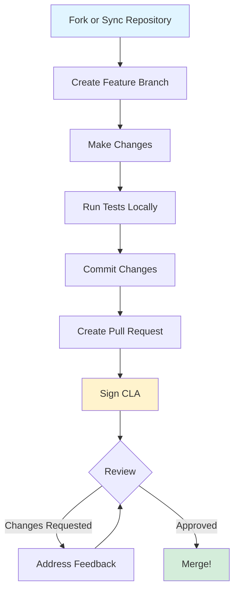

# Development Workflow 💻

This guide covers how Ultralytics employees and contributors plan, implement, review, test, and merge changes across [Ultralytics](https://www.ultralytics.com/) projects, including YOLO and related repositories.

The workflow is intentionally lightweight: keep changes focused, make review easy, run the right checks, and leave enough context for teammates to understand the decision later.

## Code of Conduct 🤝

All contributors must follow the [Code of Conduct](https://docs.ultralytics.com/help/code-of-conduct/). Respect, clarity, and professionalism are expected in issues, PRs, reviews, internal discussions, and public community spaces. For public contribution requirements, see the [Official Contributing Guide](https://docs.ultralytics.com/help/contributing/).

## Collaboration Cadence 🛰️

- **Anchor Days (Tue/Wed/Thu):** Use these days for code reviews, design discussions, debugging sessions, and decisions that benefit from synchronous collaboration.
- **Mon/Fri:** Favor deep work, written updates, PR preparation, and async review. Move critical blockers to the next Anchor Day when synchronous alignment is needed.
- **Standups & Reviews:** Timebox standups to 15 minutes. Schedule design and architecture reviews on Anchor Days when possible.
- **Decision Records:** Capture important decisions in PR descriptions, issues, docs, or runbooks so context does not disappear in chat.

## Scope and Ownership 🧭

This workflow applies to Ultralytics engineering work across product, platform, YOLO, HUB, infrastructure, documentation, automation, and security-sensitive systems. Individual repositories may add stricter requirements, but they should not weaken the baseline expectations in this page.

Every work item should have a clear owner:

- **Author:** Implements the change, keeps the PR current, and provides validation evidence.
- **Reviewer:** Confirms correctness, maintainability, risk, and documentation impact.
- **Domain owner:** Reviews changes affecting a specialized area such as model behavior, infrastructure, security, privacy, licensing, or customer-facing workflows.
- **Triage owner:** Assigns incoming issues, incidents, vulnerability reports, and maintenance work to the right owner.

!!! tip "Triage expectations"

    New engineering work should be triaged for impact, priority, ownership, and risk. Security, production, customer-impacting, and compliance-related work should receive an explicit owner and follow-up path instead of staying as an unassigned issue or chat thread.

## Pull Request Process 🔄


```mermaid
flowchart TD
    A[Fork or Sync Repository] --> B[Create Feature Branch]
    B --> C[Make Changes]
    C --> D[Run Tests Locally]
    D --> E[Commit Changes]
    E --> F[Create Pull Request]
    F --> G[Sign CLA]
    G --> H{Review}
    H -->|Changes Requested| I[Address Feedback]
    I --> H
    H -->|Approved| J[Merge!]

    style A fill:#e1f5ff
    style J fill:#d4edda
    style G fill:#fff3cd
```

### 1. Fork or Sync the Repository

External contributors should [fork](https://docs.github.com/en/pull-requests/collaborating-with-pull-requests/working-with-forks/fork-a-repo) the relevant Ultralytics repository, such as [ultralytics/ultralytics](https://github.com/ultralytics/ultralytics), to their GitHub account.

Employees with write access should sync `main` before branching:

```bash
# External contributors
git clone https://github.com/YOUR_USERNAME/ultralytics.git
cd ultralytics

# Employees with write access
git checkout main
git pull origin main
```

### 2. Create a Feature Branch

[Create a branch](https://docs.github.com/en/desktop/making-changes-in-a-branch/managing-branches-in-github-desktop) with a clear, descriptive name that reflects the work:

```bash
git checkout -b fix-issue-123
```

!!! tip "Branch Naming Conventions"

    - `fix-export-timeout` for bug fixes
    - `add-training-metrics` for features
    - `update-docs-training` for documentation
    - `ci-link-check` for automation or infrastructure

### 3. Make Your Changes

<div class="grid cards" markdown>

- :material-check-circle: **Follow Guidelines**

    ***

    Follow the repository's existing patterns and style

- :material-alert-circle: **Avoid Errors**

    ***

    Avoid new warnings, regressions, or unrelated churn

- :material-target: **Stay Focused**

    ***

    Keep the PR scoped to one clear outcome

</div>

### 4. Test Your Changes

!!! warning "Testing Required"

    Run the checks that match the risk of your change before requesting review:

    ```bash
    pytest tests/
    ```

    Add tests for new functionality and regression tests for bug fixes. If a relevant check cannot be run locally, explain why in the PR and include manual validation notes.

Learn more: [Testing Requirements](ci-testing.md), [Model Validation](https://docs.ultralytics.com/modes/val/), [CI Workflows](https://docs.ultralytics.com/help/CI/)

### 5. Commit Your Changes

[Commit](https://docs.github.com/en/desktop/making-changes-in-a-branch/committing-and-reviewing-changes-to-your-project-in-github-desktop) with concise, descriptive messages:

```bash
git commit -m "Fix #123: Corrected calculation error"
```

!!! tip "Commit Message Best Practices"

    - Use present tense ("Add feature" not "Added feature")
    - Reference issue numbers when applicable
    - Keep subject line under 72 characters

### 6. Create Pull Request

[Submit PR](https://docs.github.com/en/pull-requests/collaborating-with-pull-requests/proposing-changes-to-your-work-with-pull-requests/creating-a-pull-request) from your branch to `main`:

=== "PR Checklist"

    - [ ] Clear title describing the change
    - [ ] Description covering purpose, scope, and validation
    - [ ] Link related issues
    - [ ] Owner and required reviewers are clear
    - [ ] Note risks, compatibility concerns, or rollout steps
    - [ ] Include screenshots for UI changes
    - [ ] Tests passing locally

### 7. Sign the CLA

!!! warning "Required Before Merge"

    External contributors must sign the [Contributor License Agreement (CLA)](https://docs.ultralytics.com/help/CLA/) so contributions are properly licensed under the [AGPL-3.0 license](https://www.ultralytics.com/legal/agpl-3-0-software-license).

After submitting your PR, add this comment:

```
I have read the CLA Document and I sign the CLA
```

The CLA bot will guide you through the process. For more details on licensing, see our [contributing guide](https://docs.ultralytics.com/help/contributing/).

### 8. Address Review Feedback

Respond to reviewer comments, push updates, and keep the PR description current if the scope changes. Resolve all blocking feedback before requesting re-review.

## Google-Style Docstrings 📝

Public functions and classes should use [Google-style docstrings](https://google.github.io/styleguide/pyguide.html) where the repository expects them. Keep docstrings accurate, concise, and useful for future maintainers.

### Standard Function

```python
def example_function(arg1, arg2=4):
    """Example function demonstrating Google-style docstrings.

    Args:
        arg1 (int): The first argument.
        arg2 (int): The second argument.

    Returns:
        (bool): True if arguments are equal, False otherwise.

    Examples:
        >>> example_function(4, 4)  # True
        >>> example_function(1, 2)  # False
    """
    return arg1 == arg2
```

### Named Returns

```python
def example_function(arg1, arg2=4):
    """Example function with named return.

    Args:
        arg1 (int): The first argument.
        arg2 (int): The second argument.

    Returns:
        equals (bool): True if arguments are equal, False otherwise.

    Examples:
        >>> example_function(4, 4)  # True
    """
    equals = arg1 == arg2
    return equals
```

### Multiple Returns

```python
def example_function(arg1, arg2=4):
    """Example function with multiple returns.

    Args:
        arg1 (int): The first argument.
        arg2 (int): The second argument.

    Returns:
        equals (bool): True if arguments are equal, False otherwise.
        added (int): Sum of both input arguments.

    Examples:
        >>> equals, added = example_function(2, 2)  # True, 4
    """
    equals = arg1 == arg2
    added = arg1 + arg2
    return equals, added
```

**Important:** When a function returns multiple values, document each return value separately instead of hiding important details inside a generic tuple description.

✅ **Good:**

```
Returns:
    (np.ndarray): Predicted masks with shape HxWxN.
    (list): Confidence scores for each instance.
```

❌ **Bad:**

```
Returns:
    (tuple): Tuple containing:
        - (np.ndarray): Predicted masks with shape HxWxN.
        - (list): Confidence scores for each instance.
```

### With Type Hints

```python
def example_function(arg1: int, arg2: int = 4) -> bool:
    """Example function with type hints.

    Args:
        arg1: The first argument.
        arg2: The second argument.

    Returns:
        True if arguments are equal, False otherwise.

    Examples:
        >>> example_function(1, 1)  # True
    """
    return arg1 == arg2
```

### Single-Line Docstrings

```python
def example_small_function(arg1: int, arg2: int = 4) -> bool:
    """Example function with a single-line docstring."""
    return arg1 == arg2
```

## Code Standards 📐

### Python Style

| Standard       | Requirement                                                      | Example                                      |
| -------------- | ---------------------------------------------------------------- | -------------------------------------------- |
| **Line Width** | Follow the repository configuration, commonly 120 characters     | Keep lines readable and scannable            |
| **Docstrings** | [Google-style](https://google.github.io/styleguide/pyguide.html) | Use types and examples where helpful         |
| **Imports**    | Prefer `pathlib` over manual path string handling                | Modern, cross-platform paths                 |
| **Type Hints** | Use when they improve clarity                                    | Public APIs, complex structures, return data |
| **Functions**  | Keep focused and testable                                        | Split complex logic into named helpers       |

### Code Quality

!!! success "Quality Checklist"

    === "Clean Code"
        - [x] No unused imports or variables
        - [x] Consistent naming (`lowercase_with_underscores`)
        - [x] Clear variable names; avoid single letters except loop counters

    === "Formatting"
        - [x] Use f-strings for string formatting
        - [x] Comments explain non-obvious decisions, not obvious syntax
        - [x] Use [Ruff Formatter](https://github.com/astral-sh/ruff) where configured

### Best Practices

<div class="grid cards" markdown>

- :material-content-copy: **Avoid Duplication**

    ***

    Reuse existing helpers and patterns

- :material-focus-field: **Smaller Changes**

    ***

    Prefer focused PRs over broad mixed changes

- :material-lightbulb-on: **Simplify**

    ***

    Remove complexity when it improves clarity

- :material-shield-check: **Compatibility**

    ***

    Preserve public APIs and user workflows

- :material-test-tube: **Add Tests**

    ***

    Cover new behavior and regressions

- :material-format-paint: **Consistent Format**

    ***

    Follow repository formatting tools

</div>

## Security Frameworks 🛡️

Ultralytics engineering practices should align with recognized secure development guidance, including [OWASP Secure Software Development Lifecycle](https://owasp.org/www-project-samm/), [OWASP Application Security Verification Standard](https://owasp.org/www-project-application-security-verification-standard/), and [OWASP Top 10](https://owasp.org/www-project-top-ten/). Teams should use these references when planning secure design, review, testing, and remediation work.

## Asset Management 🗂️

Engineering assets should have a clear owner and a reliable source of truth. This includes repositories, services, cloud resources, CI/CD runners, domains, datasets, model artifacts, API keys, secrets, deployment environments, and third-party integrations.

When creating, changing, or retiring an asset:

- Assign an owner and maintenance contact.
- Record purpose, environment, access requirements, and lifecycle state.
- Review access and least-privilege permissions.
- Keep secrets and credentials out of code, logs, screenshots, and documentation.
- Update runbooks, diagrams, inventories, or documentation when ownership or behavior changes.
- Retire unused assets to reduce security, cost, and maintenance risk.

## Documentation Review 📝

Documentation should stay aligned with current roles, ownership, workflows, and security expectations. When a process changes, update the relevant handbook page, public docs, runbook, or README in the same PR where practical.

Documentation reviewers should check:

- Role names, ownership, and escalation paths are current.
- Security, compliance, and licensing language matches current policy.
- Links, diagrams, commands, and screenshots still reflect the product or workflow.
- New or changed processes include a clear owner and review cadence.
- Public documentation does not expose internal-only information, secrets, customer data, or sensitive operational details.

## Testing Requirements ✅

All PRs should include validation that matches the risk of the change:

```bash
pytest tests/

# When coverage is relevant
pytest --cov=ultralytics tests/
```

For model behavior changes, include the dataset, model, command, hardware, and before/after metrics where practical. For documentation changes, build the docs locally and include screenshots or preview links for layout changes. See [CI/Testing](ci-testing.md) for CI details.

## Code Review Guidelines 👀

### For Contributors

- Keep PRs focused on one feature, fix, or documentation update.
- Explain the problem, solution, validation, and risks.
- Respond promptly to feedback.
- Treat review as part of the work, not a personal judgment.
- Update the PR description if scope changes.

### For Reviewers

- Review within one to two business days or redirect quickly.
- Check tests and validation evidence for new behavior.
- Review documentation updates for user-visible changes.
- Evaluate performance, compatibility, security, privacy, and maintainability impact.
- Verify relevant CI checks pass.
- Provide constructive, specific feedback.
- Distinguish blocking issues from suggestions.

## Git Best Practices 🌳

### Commits

- Use present tense: "Add feature" not "Added feature".
- Write clear, descriptive messages.
- Keep commits focused and logical.
- Avoid mixing formatting-only churn with behavior changes.

### Branches

- Pull latest `main` before creating branches.
- Rebase or merge `main` before final submission when the branch has drifted.
- Delete branches after merge.

## Reporting Bugs 🐞

Report bugs via [GitHub Issues](https://github.com/ultralytics/ultralytics/issues):

1. **Check existing issues** first
2. **Provide [Minimum Reproducible Example](https://docs.ultralytics.com/help/minimum-reproducible-example/)**
3. **Describe environment**: OS, Python version, library versions, hardware (use `yolo checks` for diagnostics)
4. **Explain expected vs actual behavior** with error messages

For common issues and solutions, see our [troubleshooting guide](https://docs.ultralytics.com/guides/yolo-common-issues/).

## License 📜

Many Ultralytics repositories use the [AGPL-3.0 license](https://www.ultralytics.com/legal/agpl-3-0-software-license). If you use AGPL-licensed Ultralytics code in your project, your project may also need to be open-sourced under AGPL-3.0. If you need closed-source or commercial use, review the [Enterprise License](https://www.ultralytics.com/license).

## Resources 📚

- [Official Contributing Guide](https://docs.ultralytics.com/help/contributing/) - Complete contribution guidelines
- [CI/Testing](ci-testing.md) - Continuous integration details
- [Documentation](documentation.md) - Writing and maintaining docs
- [Code of Conduct](https://docs.ultralytics.com/help/code-of-conduct/) - Community standards
- [CLA Instructions](https://docs.ultralytics.com/help/CLA/) - Contributor License Agreement guidance
- [Minimum Reproducible Example](https://docs.ultralytics.com/help/minimum-reproducible-example/) - Bug report examples
- [Ultralytics Blog](https://www.ultralytics.com/blog) - Latest updates and tutorials
- [Community Events](https://www.ultralytics.com/events) - Webinars and conferences
